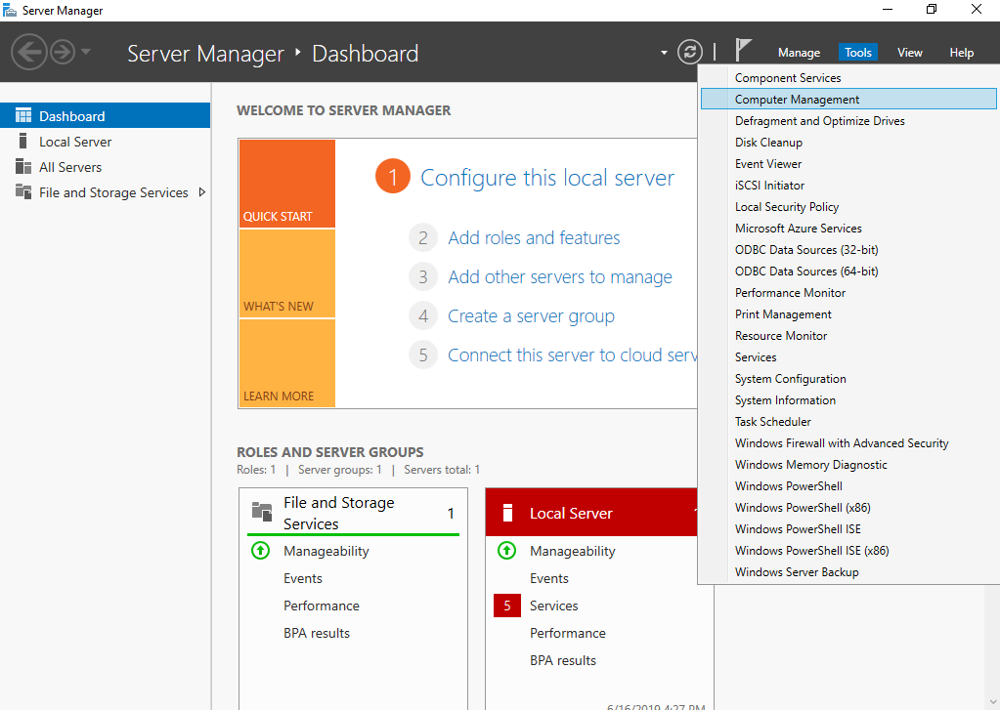
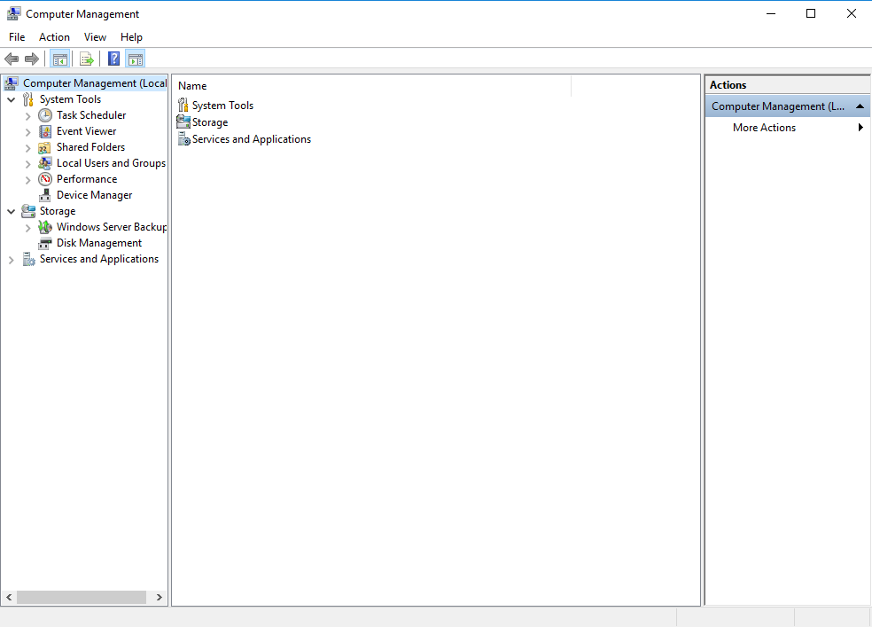
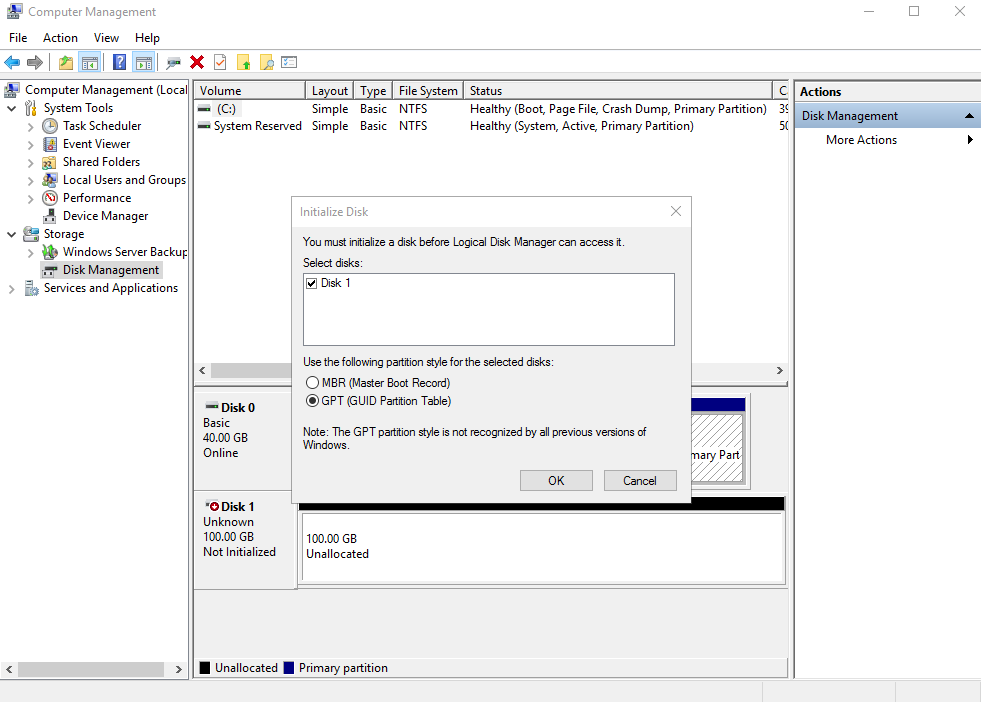

# Initializing a Windows Data Disk \(Windows Server 2016\)

## Scenarios

This topic uses Windows Server 2016 Standard 64bit to describe how to initialize a data disk attached to a server running Windows.

The method for initializing a disk varies depending on the OS running on the server. This document is used for reference only. For the detailed operations and differences, see the product documents of the corresponding OS.

## Prerequisites

-   A data disk has been attached to a server and has not been initialized.
-   You have logged in to the server.
    -   For how to log in to an ECS, see the  _Elastic Cloud Server User Guide_.
    -   For how to log in to a BMS, see the  _Bare Metal Server User Guide_.

## Procedure

1.  On the desktop of the server, click the start icon in the lower left corner.

    The  **Windows Server**  window is displayed.

2.  Click  **Server Manager**.

    The  **Server Manager**  window is displayed.

    **Figure  1**  Server Manager  
    

3.  In the upper right corner, choose  **Tools**  \>  **Computer Management**.

    The  **Computer Management**  window is displayed.

    **Figure  2**  Computer Management  
    

4.  Choose  **Storage**  \>  **Disk Management**.

    Disks are displayed in the right pane. If there is a disk that is not initialized, the system will prompt you with the  **Initialize Disk**  dialog box.

    **Figure  3**  Disk list  
    

5.  In the  **Initialize Disk**  dialog box, the to-be-initialized disk is selected. Select a disk partition style and click  **OK**. In this example,  **GPT \(GUID Partition Table\)**  is selected.

    The  **Computer Management**  window is displayed.

    **Figure  4**  Computer Management \(Windows Server 2016\)  
    .png "computer-management-(windows-server-2016)")

    > **NOTICE:**   
    >The maximum disk capacity supported by MBR is 2 TB, and that supported by GPT is 18 EB. Because a data disk currently supports up to 32 TB, use the GPT partition style if your disk capacity is larger than 2 TB.  
    >If you change the disk partition style after the disk has been used, the data on the disk will be cleared. Therefore, select a proper disk partition style when initializing the disk.  

6.  Right-click at the unallocated disk space and choose  **New Simple Volume**  from the shortcut menu.

    The  **New Simple Volume Wizard**  window is displayed.

    **Figure  5**  New Simple Volume Wizard \(Windows Server 2016\)  
    .png "new-simple-volume-wizard-(windows-server-2016)")

7.  Follow the prompts and click  **Next**.

    The  **Specify Volume Size**  page is displayed.

    **Figure  6**  Specify Volume Size \(Windows Server 2016\)  
    .png "specify-volume-size-(windows-server-2016)")

8.  Specify the volume size and click  **Next**. The system selects the maximum volume size by default. You can specify the volume size as required. In this example, the default setting is used.

    The  **Assign Drive Letter or Path**  page is displayed.

    **Figure  7**  Assign Driver Letter or Path \(Windows Server 2016\)  
    .png "assign-driver-letter-or-path-(windows-server-2016)")

9.  Assign a drive letter or path to your partition and click  **Next**. The system assigns drive letter D by default. In this example, the default setting is used.

    The  **Format Partition**  page is displayed.

    **Figure  8**  Format Partition \(Windows Server 2016\)  
    .png "format-partition-(windows-server-2016)")

10. Specify format settings and click  **Next**. The system selects the NTFS file system by default. You can specify the file system type as required. In this example, the default setting is used.

    The  **Completing the New Simple Volume Wizard**  page is displayed.

    **Figure  9**  Completing the New Simple Volume Wizard \(Windows Server 2016\)  
    .png "completing-the-new-simple-volume-wizard-(windows-server-2016)")

    > **NOTICE:**   
    >The partition sizes supported by file systems vary. Therefore, you are advised to choose an appropriate file system based on your service requirements.  

11. Click  **Finish**.

    Wait for the initialization to complete. When the volume status changes to  **Healthy**, the initialization has finished successfully, as shown in  [Figure 10](#fig14464150329).

    **Figure  10**  Disk initialization succeeded \(Windows Server 2016\)  
    .png "disk-initialization-succeeded-(windows-server-2016)")

12. After the volume is created, click    on the task bar and check whether a new volume appears in  **This PC**. In this example, New Volume \(D:\) is the new volume.

    If New Volume \(D:\) appears, the disk is successfully initialized and no further action is required.

    **Figure  11**  This PC \(Windows Server 2016\)  
    .png "this-pc-(windows-server-2016)")

