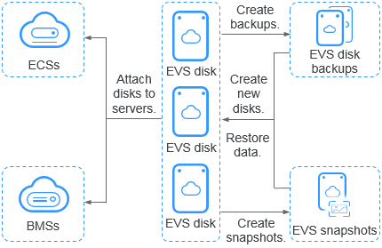

# What Is Elastic Volume Service?

## Overview

Elastic Volume Service \(EVS\) offers scalable block storage for cloud servers. With high reliability, high performance, and rich specifications, EVS disks can be used for distributed file systems, development and testing environments, data warehouse applications, and high-performance computing \(HPC\) scenarios to meet diverse service requirements. Servers that EVS supports include Elastic Cloud Servers \(ECSs\) and Bare Metal Servers \(BMSs\).

EVS disks are sometimes just referred to as disks in this document.

**Figure  1**  EVS architecture  

## EVS Advantages

EVS provides disk resources for servers, and its characteristics are as follows:

-   Various disk types

    EVS provides various disk types for to choose from, and EVS disks can be used as data disks and system disks for servers. You may select the disk type based on your budget and service requirements.

-   Elastic scalability

    The capacity of an EVS disk you can create ranges from 10 GB to 32 TB. Expand the disk capacity when it no longer meets your needs. The minimum expansion increment is 1 GB, and a disk can be expanded to up to 32 TB. EVS also supports smooth capacity expansion without interrupting services.

    Besides the disk capacity limit, the additional space you can add during an expansion is also affected by the capacity quota. The system will prompt you with the remaining quota, and the space added cannot exceed that. You may increase the quota if you want to expand your disk but the remaining quota is insufficient.

-   High security and reliability
    -   Both system disks and data disks support data encryption to ensure data security.
    -   Data protection functions, such as backups and snapshots, safeguard the disk data, preventing incorrect data caused by application exceptions or attacks.

-   Real-time monitoring

    Working with Cloud Eye, EVS allows you to monitor the disk health and operating status at any time.

## Differences Among EVS, SFS, and OBS

Currently, there are three data storage services available for your choice: EVS, Scalable File Service \(SFS\), and Object Storage Service \(OBS\). The differences are described in the following table.

**Table  1**  Differences among EVS, SFS, and OBS

<table><thead align="left"><tr id="row732685175810"><th class="cellrowborder" valign="top" width="12.121212121212121%" id="mcps1.2.5.1.1">
Service

</th>
<th class="cellrowborder" valign="top" width="27.272727272727277%" id="mcps1.2.5.1.2">
Overall Introduction

</th>
<th class="cellrowborder" valign="top" width="30.303030303030305%" id="mcps1.2.5.1.3">
Typical Application Scenarios

</th>
<th class="cellrowborder" valign="top" width="30.303030303030305%" id="mcps1.2.5.1.4">
Storage Capacity

</th>
</tr>
</thead>
<tbody><tr id="row432613514586"><td class="cellrowborder" valign="top" width="12.121212121212121%" headers="mcps1.2.5.1.1 ">
EVS

</td>
<td class="cellrowborder" valign="top" width="27.272727272727277%" headers="mcps1.2.5.1.2 ">
EVS provides scalable block storage that features high reliability, high performance, and rich specifications for servers.

</td>
<td class="cellrowborder" valign="top" width="30.303030303030305%" headers="mcps1.2.5.1.3 "><ul id="ul164276131815"><li>Enterprise office applications</li><li>Development and testing</li><li>Enterprise applications, including SAP, Microsoft Exchange, and Microsoft SharePoint</li><li>Distributed file systems</li><li>Various databases, including MongoDB, Oracle, SQL Server, MySQL, and PostgreSQL</li></ul>
</td>
<td class="cellrowborder" valign="top" width="30.303030303030305%" headers="mcps1.2.5.1.4 ">
EVS disks start at 10 GB and can be expanded as required in 1 GB increments to up to 32 TB.

</td>
</tr>
<tr id="row153268519589"><td class="cellrowborder" valign="top" width="12.121212121212121%" headers="mcps1.2.5.1.1 ">
SFS

</td>
<td class="cellrowborder" valign="top" width="27.272727272727277%" headers="mcps1.2.5.1.2 ">
SFS provides completely hosted sharable file storage for ECSs. Compatible with the Network File System (NFS) protocol, SFS is expandable to petabytes and seamlessly handles data-intensive and bandwidth-intensive applications.

</td>
<td class="cellrowborder" valign="top" width="30.303030303030305%" headers="mcps1.2.5.1.3 "><ul id="ul95941207219"><li>HPC scenarios, such as gene sequencing, animation rendering, and CAD/CAE</li><li>File sharing</li><li>Media processing</li><li>Content management and web services</li><li>Offline file backup</li></ul>
</td>
<td class="cellrowborder" valign="top" width="30.303030303030305%" headers="mcps1.2.5.1.4 ">
SFS storage capacity is available on demand and can be expanded to 10 PB at most.

</td>
</tr>
<tr id="row93265515815"><td class="cellrowborder" valign="top" width="12.121212121212121%" headers="mcps1.2.5.1.1 ">
OBS

</td>
<td class="cellrowborder" valign="top" width="27.272727272727277%" headers="mcps1.2.5.1.2 ">
OBS provides cloud storage for unstructured data, such as files, pictures, and videos. With multiple options for migration to the cloud, OBS provides low-cost, reliable storage access for massive data and supports online multimedia processing.

</td>
<td class="cellrowborder" valign="top" width="30.303030303030305%" headers="mcps1.2.5.1.3 "><ul id="ul19707131919259"><li>Enterprise backup and archive</li><li>Big data analysis</li><li>Enterprise cloud box</li><li>Static website hosting</li><li>Native cloud applications</li></ul>
</td>
<td class="cellrowborder" valign="top" width="30.303030303030305%" headers="mcps1.2.5.1.4 ">
OBS provides limitless storage capacity, and storage resources are available for linear and nearly infinite expansion.

</td>
</tr>
</tbody>
</table>

## User Permissions

Users with resource management permissions can control the operations performed on cloud service resources. For EVS, a user with the Server Administrator permission can perform operations on EVS resources, including creating disks, deleting disks, and creating snapshots.

For details about user permissions, see  [Permissions](https://docs.otc.t-systems.com/en-us/permissions/index.html).

## Project

A project is used to group and isolate OpenStack resources, including compute, storage, and network resources. A project can be a department or a project team. You can access IAM with a security administrator to create projects in a region and perform isolated management of resources. For details about projects, see  [Managing Projects](https://docs.otc.t-systems.com/en-us/usermanual/iam/en-us_topic_0066738518.html).

