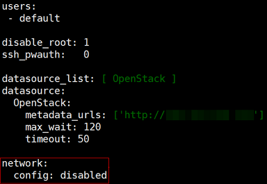
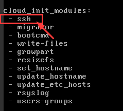

# Configuring Cloud-Init<a name="EN-US_TOPIC_0122876047"></a>

## Scenarios<a name="section3973140152118"></a>

You need to configure  Cloud-Init  after it is installed.

## Prerequisites<a name="en-us_topic_0029124518_section49653222162416"></a>

-   Cloud-Init has been installed.
-   An EIP has been bound to the ECS.
-   You have logged in to the ECS.
-   The IP address obtaining mode of the ECS is DHCP.

## Procedure<a name="section62254326101255"></a>

The following operations are required:

1.  Configure Cloud-Init.

    For details, see  [Configuring Cloud-Init](#en-us_topic_0029124518_section5756595193936).

2.  Check whether Cloud-Init is successfully configured.

    For details, see  [Checking the Cloud-Init Configuration](#section56956574101031).


## Configuring Cloud-Init<a name="en-us_topic_0029124518_section5756595193936"></a>

1.  Configure the user permissions for logging in to the ECS. If you use a common account \(not user  **root**\) to log in to the ECS, disable the SSH permissions of user  **root**  and remote login using a password to improve the ECS security.

    -   You can remotely log in to the ECS using SSH and a key pair injected into your account. \(It is recommended that you only enable the key pair login mode when creating an ECS.\)
    -   You can also use a random password to log in to the ECS on noVNC.

    Run the following command to open the  **sshd\_config**  file using the vi editor:

    **vi /etc/ssh/sshd\_config**

2.  Change the value of  **PasswordAuthentication**  in the  **sshd\_config**  file to  **no**.

    > **NOTE:**   
    >For SUSE and openSUSE, change the values of the following parameters in the  **sshd\_config**  file to  **no**:  
    >-   PasswordAuthentication  
    >-   ChallengeResponseAuthentication  

3.  Run the following command to open the  **cloud.cfg**  file using the vi editor:

    **vi /etc/cloud/cloud.cfg**

4.  Disable the SSH permissions of user  **root**  in  **/etc/cloud/cloud.cfg**, add a common user \(which is used for logging in to the ECS using VNC\), and configure a password for the added user and assign the sudo permissions to it.

    > **NOTE:**   
    >For Ubuntu and Debian, set the value of  **manage\_etc\_hosts**  in the  **/etc/cloud/cloud.cfg**  file to  **localhost**. Otherwise, switching to user  **root**  from a user other than  **root**  may time out.  

    Take Ubuntu as an example.

    -   Run the following command to create script  **/etc/cloud/set\_linux\_random\_password.sh**, which is executable and can be used to generate random passwords:

        **cat /etc/cloud/set\_linux\_random\_password.sh**

        The file content is as follows:

        ```
        #!/bin/bash
        
        password=$(cat /dev/urandom | tr -dc 'A-Za-z0-9!@#$%&+=' | head -c 9)
        
        echo "linux:$password" | chpasswd
        sed -i -e '/^Login/d' /etc/issue
        sed -i -e '/^Initial/d' /etc/issue
        sed -i -c -e '/^$/d' /etc/issue
        echo -e "\nInitial login with linux:$password\n" >> /etc/issue
        ```

        > **NOTICE:**   
        >You can run the  **chmod +x /etc/cloud/set\_linux\_random\_password.sh**  command to add execute permissions of  **set\_linux\_random\_password.sh**.  

    -   After you log in to the ECS, run the following commands to add a user-friendly prompt "Please change password for user linux after first login."

        **echo -e '\\e\[1;31m\#\#\#\#\#\#\#\#\#\#\#\#\#\#\#\#\#\#\#\#\#\#\#\#\#\#\#\#\#\#\#\#\#\\\\e\[0m' \> /etc/motd**

        **echo -e '\\e\[1;31m\# Important !!! \#\\e\[0m' \>\> /etc/motd**

        **echo -e '\\e\[1;31m\# Please change password for user linux after first login. \#\\e\[0m' \>\> /etc/motd**

        **echo -e '\\e\[1;31m\#\#\#\#\#\#\#\#\#\#\#\#\#\#\#\#\#\#\#\#\#\#\#\#\#\#\#\#\#\#\#\#\#\\e\[0m' \>\> /etc/motd**

        **echo -e '' \>\> /etc/motd**

5.  Add a common login user, set its password, and assign sudo permissions to it and use bootcmd to create a script used for generating a random password for each created ECS.

    > **NOTICE:**   
    >Ensure that the configuration file format \(such as alignment and spaces\) is consistent with the provided example.  

    ```
    system_info: 
        # This will affect which distro class gets used 
        distro: rhel 
        # Default user name + that default users groups (if added/used) 
        default_user: 
          name: linux  //Username for login
          lock_passwd: False  //Login using a password is enabled. Note that some OSs use value 0 to enable the password login.
          gecos: Cloud User 
          groups: users  //Optional. Add users to other groups that have been configured in /etc/group.
          passwd: $6$I63DBVKK$Zh4lchiJR7NuZvtJHsYBQJIg5RoQCRLS1X2Hsgj2s5JwXI7KUO1we8WYcwbzeaS2VNpRmNo28vmxxCyU6LwoD0
          sudo: ["ALL=(ALL) NOPASSWD:ALL"]  //Grant user sudo all root rights.
          shell: /bin/bash  //Execute shell in bash mode.
        # Other config here will be given to the distro class and/or path classes 
        paths: 
           cloud_dir: /var/lib/cloud/ 
           templates_dir: /etc/cloud/templates/ 
        ssh_svcname: sshd
    
    bootcmd:
    - [cloud-init-per, instance, password, bash, 
    /etc/cloud/set_linux_random_password.sh] 
    ```

    > **NOTICE:**   
    >The value of  **passwd**  is encrypted using SHA512 \(which is used as an example\). For more details, see  [https://cloudinit.readthedocs.io/en/latest/topics/examples.html](https://cloudinit.readthedocs.io/en/latest/topics/examples.html).  
    >For how to encrypt a password and generate ciphertext, see the following \(encrypting password  **cloud.1234**  is used as an example\):  
    >```  
    >[root@** ~]# python -c "import crypt, getpass, pwd; print crypt.mksalt()"  
    >$6$I63DBVKK  
    >[root@** ~]# python -c "import crypt, getpass, pwd; print crypt.crypt('cloud.1234', '\$6\$I63DBVKK')"  
    >$6$I63DBVKK$Zh4lchiJR7NuZvtJHsYBQJIg5RoQCRLS1X2Hsgj2s5JwXI7KUO1we8WYcwbzeaS2VNpRmNo28vmxxCyU6LwoD0  
    >```  

6.  Enable the agent to access the IaaS OpenStack data source.

    Add the following information to the last row of  **/etc/cloud/cloud.cfg**:

    ```
    datasource_list: [ OpenStack ]
    datasource:
      OpenStack:
        metadata_urls: ['http://169.254.169.254']
        max_wait: 120
        timeout: 5
    ```

    > **NOTE:**   
    >-   You can decide whether to set  **max\_wait**  and  **timeout**. The values of  **max\_wait**  and  **timeout**  in the preceding example are only for reference.  
    >-   If the OS version is earlier than Debian 8 or CentOS 5, you cannot enable the agent to access the IaaS OpenStack data source.  
    >-   The default zeroconf route must be disabled for CentOS and EulerOS ECSs for accurate access to the IaaS OpenStack data source.  
    >    **echo "NOZEROCONF=yes" \>\> /etc/sysconfig/network**  

7.  Prevent Cloud-Init from taking over the network in  **/etc/cloud/cloud.cfg**.

    If the Cloud-Init version is 0.7.9 or later, add the following content to  **/etc/cloud/cloud.cfg**:

    ```
    network:
      config: disabled
    ```

    > **NOTE:**   
    >The added content must be in the YAML format.  

    **Figure  1**  Preventing Cloud-Init from taking over the network<a name="en-us_topic_0029124465_fig29429713194459"></a>  
    

8.  Modify the  **cloud\_init\_modules**  configuration file.

    Move  **ssh**  from the bottom to the top to speed up the SSH login.

    **Figure  2**  Speeding up the SSH login to the ECS<a name="fig13129356171"></a>  
    

9.  Modify the configuration so that the hostname of the ECS created from the image does not contain the  **.novalocal**  suffix and can contain a dot \(.\).
    1.  Run the following command to modify the  **\_\_init\_\_.py**  file:

        **vi /usr/lib/python2.7/site-packages/cloudinit/sources/\_\_init\_\_.py**

        Press  **i**  to enter editing mode. Search for  **toks**. The following information is displayed:

        ```
        if toks:
            toks = str(toks).split('.')
        else:
            toks = ["ip-%s" % lhost.replace(".", "-")]
        else:
            toks = lhost.split(".novalocal")
        
        if len(toks) > 1:
            hostname = toks[0]
            #domain = '.'.join(toks[1:])
        else:
            hostname = toks[0]
        
        if fqdn and domain != defdomain:
            return "%s.%s" % (hostname, domain)
        else:
            return hostname
        ```

        After the modification is complete, press  **Esc**  to exit editing mode and enter  **:wq!**  to save the settings and exit.

        **Figure  3**  Modifying the  **\_\_init\_\_.py**  file<a name="fig19153219195017"></a>  
        

    2.  Run the following command to switch to the  **cloudinit/sources**  folder:

        **cd /usr/lib/python2.7/site-packages/cloudinit/sources/**

    3.  Run the following commands to delete the  **\_\_init\_\_.pyc**  file and the optimized  **\_\_init\_\_.pyo**  file:

        **rm -rf \_\_init\_\_.pyc**

        **rm -rf \_\_init\_\_.pyo**

    4.  Run the following commands to clear the logs:

        **rm -rf /var/lib/cloud/\***

        **rm -rf /var/log/cloud-init\***

10. Run the following command to edit the  **/etc/cloud/cloud.cfg.d/05\_logging.cfg**  file to use cloudLogHandler to process logs:

    **vim /etc/cloud/cloud.cfg.d/05\_logging.cfg**

    **Figure  4**  Setting the parameter value to  **cloudLogHandler**<a name="fig105971433389"></a>  
    


## Checking the Cloud-Init Configuration<a name="section56956574101031"></a>

Run the following command to check whether Cloud-Init has been properly configured:

**cloud-init init --local**

If Cloud-Init has been properly installed, the version information is displayed and no error occurs. For example, messages indicating lack of files will not be displayed.

> **NOTE:**   
>\(Optional\) Run the following command to set the password validity period to the maximum:  
>**chage -M 99999 $user\_name**  
>_user\_name_  is a system user, such as user  **root**.  
>You are advised to set the password validity period to  **99999**.  

