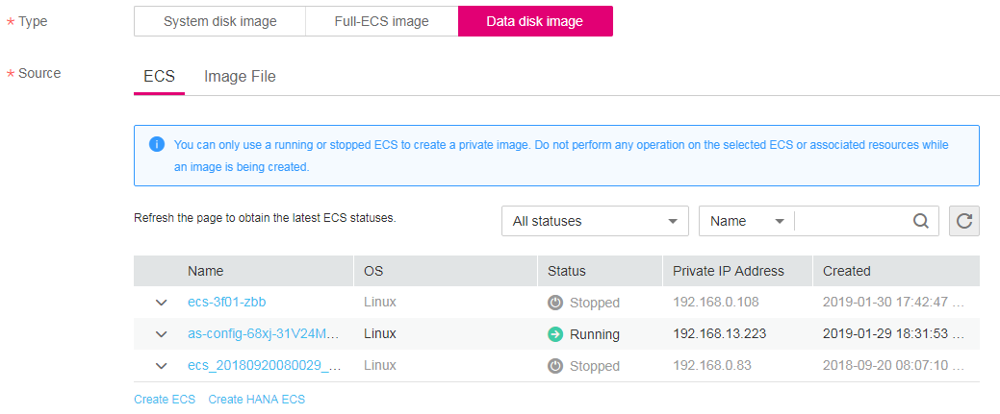

# Creating a Data Disk Image from an ECS Data Disk

## Scenarios

A  data disk image  only contains user service data. You can export service data on data disks of an ECS by creating a data disk image. A data disk image can be used to create EVS disks to migrate user service data.

## Prerequisites

A data disk has been attached to the ECS, and the ECS is running or stopped. For how to attach an EVS disk to the ECS, see  _Elastic Cloud Server User Guide_.

## Procedure

1.  Log in to the management console.
2.  Under  **Computing**, click  **Image Management Service**.

    The IMS console is displayed.

3.  In the upper right corner, click  **Create Image**.
4.  In the  **Image Type and Source**  area, select  **Data disk image**  for  **Type**.
5.  Select  **ECS**  for  **Source**  and then select a data disk of the ECS.

    **Figure  1**  Creating a data disk image  
    

6.  In the  **Image Information**  area, set  **Name**,  **Tag**, and  **Description**.
7.  Click  **Create Now**.
8.  Confirm the parameters and click  **Submit**.

## Follow-up Operations

If you want to use the created data disk image to create an EVS disk and attach it to an ECS, you can perform either of the following operations:

-   Locate the row that contains the created data disk image and click  **Apply for Data Disk**  to create a data disk. Then attach the data disk to an ECS.
-   On the page for creating ECSs, click  **Create Disk from Data Disk Image**  and select the data disk image.

    > **NOTE:**   
    >A data disk image can be used to create a data disk only once.   

