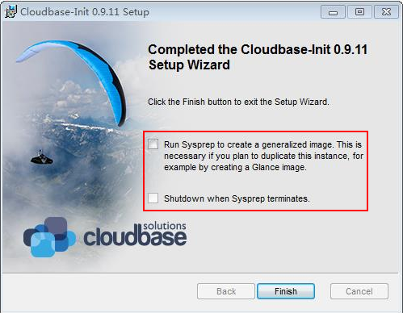

# Installing and Configuring Cloudbase-Init<a name="EN-US_TOPIC_0030730602"></a>

## Scenarios<a name="en-us_topic_0029124575_section21661076191949"></a>

To ensure that you can use the user data injection function to inject initial custom information into ECSs created from a private image \(such as setting the ECS login password\), install  Cloudbase-Init  on the ECS used to create the image.

-   If Cloudbase-Init is not installed, you cannot configure an ECS. As a result, you can only use the password in the image file to log in to the ECS.
-   By default, ECSs created from a public image have Cloudbase-Init installed. You do not need to install and configure Cloudbase-Init on such ECSs.
-   For ECSs created from external image files, install and configure Cloudbase-Init by performing the operations in this section.

## Prerequisites<a name="en-us_topic_0029124575_section31429961161037"></a>

-   An EIP has been bound to the ECS.
-   You have logged in to the ECS.
-   The IP address obtaining mode of the ECS is DHCP.

## Install Cloudbase-Init<a name="en-us_topic_0029124575_section54473519191017"></a>

1.  On the Windows  **Start**  menu, choose  **Control Panel**  \>  **Programs**  \>  **Programs and Features**  and check whether Cloudbase-Init is installed.
    -   If yes, go to  [Configure Cloudbase-Init](#section67455211370).
    -   If no, go to the next step.

2.  Check whether the version of the OS is Windows desktop.
    -   If yes, go to  [3](#li5127112791712).
    -   If the OS is Windows Server, go to  [4](#en-us_topic_0029124575_li6098361192920).

3.  <a name="li5127112791712"></a>Enable the administrator account \(Windows 7 is used as an example\).
    1.  Click  **Start**  and choose  **Control Panel**  \>  **System and Security**  \>  **Administrative Tools**.
    2.  Double-click  **Computer Management**.
    3.  Choose  **System Tools**  \>  **Local Users and Groups**  \>  **Users**.
    4.  Right-click  **Administrator**  and select  **Properties**.
    5.  Deselect  **Account is disabled**.

4.  <a name="en-us_topic_0029124575_li6098361192920"></a>Download the Cloudbase-Init installation package.

    Download the Cloudbase-Init installation package of the appropriate version based on the OS architecture from the Cloudbase-Init official website \([http://www.cloudbase.it/cloud-init-for-windows-instances/](http://www.cloudbase.it/cloud-init-for-windows-instances/)\).

    Cloudbase-Init has two versions: stable and beta.

    To obtain the stable version, visit the following paths:

    -   64-bit:  [https://www.cloudbase.it/downloads/CloudbaseInitSetup\_Stable\_x64.msi](https://www.cloudbase.it/downloads/CloudbaseInitSetup_Stable_x64.msi)
    -   32-bit:  [https://www.cloudbase.it/downloads/CloudbaseInitSetup\_Stable\_x86.msi](https://www.cloudbase.it/downloads/CloudbaseInitSetup_Stable_x86.msi)

    To obtain the beta version, visit the following paths:

    -   64-bit:  [https://www.cloudbase.it/downloads/CloudbaseInitSetup\_x64.msi](https://www.cloudbase.it/downloads/CloudbaseInitSetup_x64.msi)
    -   32-bit:  [https://www.cloudbase.it/downloads/CloudbaseInitSetup\_x86.msi](https://www.cloudbase.it/downloads/CloudbaseInitSetup_x86.msi)

5.  Double-click the Cloudbase-Init installation package.
6.  Click  **Next**.
7.  Select  **I accept the terms in the License Agreement**  and click  **Next**.
8.  Retain the default path and click  **Next**.
9.  In the  **Configuration options**  window, enter  **Administrator**  for  **Username**, select  **COM1**  for  **Serial port for logging**, and ensure that  **Run Cloudbase-Init service as LocalSystem**  is not selected.

    > **NOTE:**   
    >The version number shown in the figure is for reference only.  

    **Figure  1**  Configuring parameters<a name="fig416499174516"></a>  
    

10. Click  **Next**.
11. Click  **Install**.
12. In the  **Files in Use**  dialog box, select  **Close the application and attempt to restart them**  and click  **OK**.
13. Check whether the version of the OS is Windows desktop.
    -   If yes, go to  [15](#li8450150161333).
    -   If no, go to  [14](#li208441311639).

14. <a name="li208441311639"></a>In the  **Completed the Cloudbase-Init Setup Wizard**  window, ensure that neither option is selected.

    **Figure  2**  Completing the Cloudbase-Init installation<a name="fig515010583213"></a>  
    

    > **NOTE:**   
    >The version number shown in the figure is for reference only.  

15. <a name="li8450150161333"></a>Click  **Finish**.

## Configure Cloudbase-Init<a name="section67455211370"></a>

1.  Edit configuration file  **C:\\Program Files\\Cloudbase Solutions\\Cloudbase-Init\\conf\\cloudbase-init.conf**  in the Cloudbase-Init installation path.
    1.  Add  **netbios\_host\_name\_compatibility=false**  to the last line of the file so that the hostname supports a maximum of 63 characters.

        > **NOTE:**   
        >NetBIOS contains no more than 15 characters due to Windows system restrictions.  

    2.  Add  **metadata\_services=cloudbaseinit.metadata.services.httpservice.HttpService**  to enable the agent to access the IaaS OpenStack data source.
    3.  Add the following configuration items to configure the number of retry times and interval for obtaining metadata:

        ```
        retry_count=40
        retry_count_interval=5
        ```

    4.  Add the following configuration item to prevent metadata network disconnections caused by the default route added by Windows:

        ```
        [openstack]
        add_metadata_private_ip_route=False
        ```

    5.  **\(Optional\)**  When the Cloudbase-Init version is 0.9.12 or later, you can customize the length of the password.

        Change the value of  **user\_password\_length**  to customize the password length.

2.  Release the current DHCP address so that the created ECS can obtain the correct addresses.

    In the Windows command line, run the following command to release the current DHCP address:

    **ipconfig /release**

    > **NOTE:**   
    >This operation will interrupt network connection and adversely affect ECS use. The network will automatically recover after the ECS is started again.  

3.  When creating an image using a Windows ECS, you need to change the SAN policy of the ECS to OnlineAll. Otherwise, EVS disks attached to the ECSs created using the image may be offline.

    Windows has three types of SAN policies:  **OnlineAll**,  **OfflineShared**, and  **OfflineInternal**.

    **Table  1**  SAN policies

    <a name="table01861238133815"></a>
    <table><thead align="left"><tr id="row81963383381"><th class="cellrowborder" valign="top" width="15%" id="mcps1.2.3.1.1"><p id="p420114385381"><a name="p420114385381"></a><a name="p420114385381"></a><strong id="b842352706201211"><a name="b842352706201211"></a><a name="b842352706201211"></a>Type</strong></p>
    </th>
    <th class="cellrowborder" valign="top" width="85%" id="mcps1.2.3.1.2"><p id="p9201838153816"><a name="p9201838153816"></a><a name="p9201838153816"></a><strong id="b84235270695939"><a name="b84235270695939"></a><a name="b84235270695939"></a>Description</strong></p>
    </th>
    </tr>
    </thead>
    <tbody><tr id="row12204113873819"><td class="cellrowborder" valign="top" width="15%" headers="mcps1.2.3.1.1 "><p id="p220511386388"><a name="p220511386388"></a><a name="p220511386388"></a>OnlineAll</p>
    </td>
    <td class="cellrowborder" valign="top" width="85%" headers="mcps1.2.3.1.2 "><p id="p320719385384"><a name="p320719385384"></a><a name="p320719385384"></a>Indicates that all disks are automatically brought online.</p>
    </td>
    </tr>
    <tr id="row1420833823819"><td class="cellrowborder" valign="top" width="15%" headers="mcps1.2.3.1.1 "><p id="p17209183853811"><a name="p17209183853811"></a><a name="p17209183853811"></a>OfflineShared</p>
    </td>
    <td class="cellrowborder" valign="top" width="85%" headers="mcps1.2.3.1.2 "><p id="p1621083893810"><a name="p1621083893810"></a><a name="p1621083893810"></a>Indicates that all disks on sharable buses, such as iSCSI and FC, are left offline by default, while disks on non-sharable buses are kept online.</p>
    </td>
    </tr>
    <tr id="row1621043819381"><td class="cellrowborder" valign="top" width="15%" headers="mcps1.2.3.1.1 "><p id="p12212238153815"><a name="p12212238153815"></a><a name="p12212238153815"></a>OfflineInternal</p>
    </td>
    <td class="cellrowborder" valign="top" width="85%" headers="mcps1.2.3.1.2 "><p id="p2217138133815"><a name="p2217138133815"></a><a name="p2217138133815"></a>Indicates that all disks on buses that are detected as internal are left offline by default.</p>
    </td>
    </tr>
    </tbody>
    </table>

    1.  Execute  **cmd.exe**  and run the following command to query the current SAN policy of the ECS using DiskPart:

        **diskpart**

    2.  Run the following command to view the SAN policy of the ECS:

        **san**

        -   If the SAN policy is  **OnlineAll**, run the  **exit**  command to exit DiskPart.

        -   If the SAN policy is not  **OnlineAll**, go to  [3.c](#li1823793883810).

    3.  <a name="li1823793883810"></a>Run the following command to change the SAN policy of the ECS to OnlineAll:

        **san policy=onlineall**


