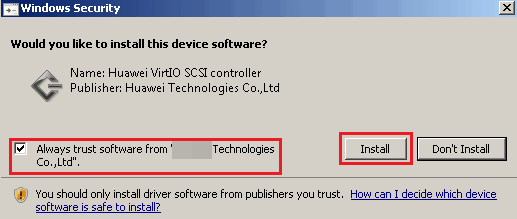

# Installing UVP VMTools

## Scenarios

Before using an ECS or external image file to create a private image, ensure that  UVP VMTools  has been installed in the OS to enable subsequently created ECSs to support  KVM virtualization  and improve network performance.

> **NOTICE:**   
>If you do not install UVP VMTools, NICs of the ECS may not be detected and the ECS cannot communicate with other resources.  

UVP VMTools has been installed by default when you use a public image to create ECSs. You can perform the following operations to verify the installation:

Open the  **version**  configuration file to check whether  UVP VMTools  is the latest:

**C:\\Program Files \(x86\)\\virtio\\bin\\version**

If the version is 2.5.0 or later, the current UVP VMTools can be used. Otherwise, perform operations in  [Installing UVP VMTools](#en-us_topic_0036684065_section12153337)  to install UVP VMTools.

## Prerequisites

-   An EIP has been bound to the ECS.
-   The UVP VMTools installation package has been downloaded on the ECS. For how to obtain the installation package, see  [Obtaining Required Software Packages](obtaining-required-software-packages.md).
-   Ensure that the ECS has at least 50 MB disk space.
-   To avoid an installation failure, perform the following operations before starting the installation:
    -   Uninstall third-party virtualization platform tools, such as Citrix Xen Tools and VMware Tools. For how to uninstall the tools provided by a third-party virtualization platform, see the corresponding documents of the cloud platform.
    -   Disable your antivirus and intrusion detection software. You can enable the software after UVP VMTools is installed.

## Installing UVP VMTools

The following operations describe how to install UVP VMTools.  **vmtools-WIN2008R2-x64.exe**  extracted from  **vmtools-WIN2008R2-x64.zip**  is used as an example.

1.  Log in to the Windows ECS using VNC.

    For details about how to log in to the ECS, see  _Elastic Cloud Server User Guide_.

    > **NOTE:**   
    >You must log in to the ECS using VNC. Remote desktop connection is not allowed because the NIC driver needs to be updated during the installation but the NIC is in use for the remote desktop connection. As a result, the installation will fail.  

2.  Download the required UVP VMTools based on the ECS OS and  [Obtaining Required Software Packages](obtaining-required-software-packages.md).
3.  Decompress the UVP Tools software package. This section uses  **vmtools-WIN2008R2-x64.exe**  extracted from  **vmtools-WIN2008R2-x64.zip**  as an example to describe how to decompress the UVP Tools software package.
4.  Right-click  **vmtools-WIN2008R2-x64.exe**, select  **Run as administrator**  from the shortcut menu, and complete the installation as prompted.
5.  In the displayed dialog box, select  **I accept the terms in the License Agreement**  and click  **Install**.

    **Figure  1**  Installing UVP VMTools  
    

6.  Install UVP VMTools as prompted.
7.  Perform the following operations to install UVP VMTools on an ECS running Windows Server 2008:
    1.  The  **Windows Security**  dialog box shown in  [Figure 2](#fig47401118184018)  may be displayed during installation. In the dialog box, select  **Always trust...**  and click  **Install**. Otherwise, the installation will fail.

        **Figure  2**  Windows Security  
        

    2.  Click  **Finish**.

8.  Perform the operations in  [Verifying the Installation](#en-us_topic_0036684065_section42271171)  to check whether UVP VMTools is successfully installed.

## Verifying the Installation

Perform the following steps to verify the installation of UVP VMTools:

1.  Click  **Start**. Choose  **Control Panel**  \>  **Programs and Features**.
2.  Locate UVP VMTools for Windows.

    If UVP VMTools for Windows exists, the installation is successful, as shown in  [Figure 3](#fig6404346182112).

    **Figure  3**  Verifying the installation  
    

