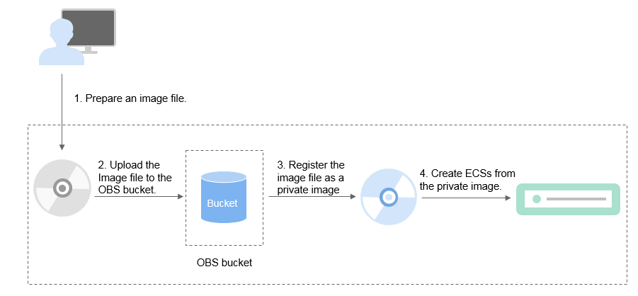

# Overview

You can import a local image or a system disk image from another cloud platform to the current cloud system. After the image is imported, you can use it to create ECSs or reinstall the OSs of existing ECSs.

## Creation Process

[Figure 1](#fig178711229102512)  shows the process of creating a private image.

**Figure  1**  Creating a Linux system disk image  

The procedure is as follows:

1.  Prepare an external image file that meets the platform requirements. For details, see  [Preparing an Image File](preparing-an-image-file-(linux).md).
2.  Upload the external image file to your OBS bucket. For details, see  [Uploading an External Image File](uploading-an-external-image-file-(linux).md).
3.  On the management console, select the uploaded image file and register it as a private image. For details, see  [Registering an External Image File as a Private Image](registering-an-external-image-file-as-a-private-image-(linux).md).
4.  After the private image is registered, you can use it to create ECSs. For details, see  [Creating a Linux ECS from an Image](creating-a-linux-ecs-from-an-image.md).

