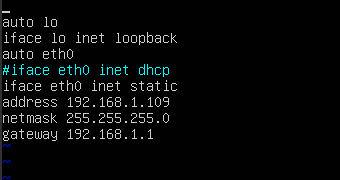
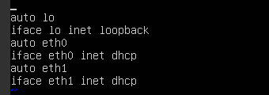

# Setting the NIC to DHCP \(Linux\)

## Scenarios

If a private image is created from an ECS or external image file and the VM where the ECS or external image file is located is configured with a static IP address, you need to change the NIC attribute to DHCP so that the new ECSs created from the private image can dynamically obtain an IP address.

The configuration method varies depending on OSs.

> **NOTE:**   
>When registering an external image file as a private image, configure DHCP on the VM where the external image file is located. You are advised to configure DHCP on the VM and then export the image file.  

## Prerequisites

You have logged in to the ECS used to create a Windows private image.

For details about how to log in to the ECS, see  _Elastic Cloud Server User Guide_.

## Procedure

This section uses Ubuntu 14.04 as an example to describe how to query and configure NIC attributes of the ECS.

1.  Run the following command on the ECS to open the  **/etc/network/interfaces**  file using the vi editor and query the IP address assignment mode:

    **vi /etc/network/interfaces**

    -   If DHCP has been configured on all NICs, enter  **:q**  to exit the vi editor.

        **Figure  1**  DHCP IP address obtaining mode  
        

    -   If static IP addresses are set on the NICs, go to  [2](#en-us_topic_0029124465_li47654828194142).

        **Figure  2**  Static IP address obtaining mode  
        

2.  Press  **i**  to enter editing mode.
3.  Delete the static IP address configuration and configure DHCP for the NICs.

    You can insert a number sign \(\#\) in front of each line of static IP address configuration to comment it out.

    **Figure  3**  Configuring DHCP on one NIC  
    

    If the ECS has multiple NICs, you must configure DHCP for all the NICs.

    **Figure  4**  Configuring DHCP on multiple NICs  
    

4.  Press  **Esc**, enter  **:wq**, and press  **Enter**.

    The system saves the configuration and exits the vi editor.

## Related Operations

Configure DHCP to enable the ECS to obtain the IP address continuously.

-   For CentOS and EulerOS, use the vi editor to add  **PERSISTENT\_DHCLIENT="y"**  to configuration file  **/etc/sysconfig/network-scripts/ifcfg-ethX**.
-   For SUSE Linux Enterprise, use the vi editor to set  **DHCLIENT\_USE\_LAST\_LEASE**  to  **no**  in the configuration file  **/etc/sysconfig/network/dhcp**.
-   For Ubuntu 12.04, upgrade dhclient to ISC dhclient 4.2.4 so that the NIC can consistently obtain IP addresses from the DHCP server. For the detailed upgrade method, see the OS documentation.

