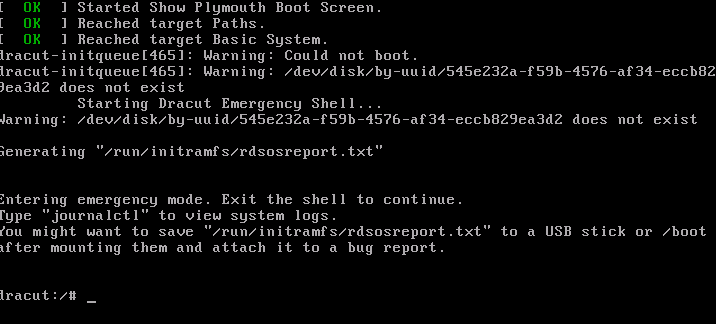

# What Do I Do If the Disks of an ECS Created from a CentOS Image Cannot Be Found?<a name="EN-US_TOPIC_0030713219"></a>

## Symptom<a name="section18306114420920"></a>

Generally, this is because the xen-blkfront.ko module is not loaded during the startup. You need to modify OS kernel startup parameters.  [Figure 1](#en-us_topic_0029124532_fb625ead0fbca4936a8a0b147e6719b71)  shows the startup screen after the login to the ECS.

**Figure  1**  Startup screen<a name="en-us_topic_0029124532_fb625ead0fbca4936a8a0b147e6719b71"></a>  


## Solution<a name="section1946018361020"></a>

Perform the following operations to modify OS kernel boot parameters:

> **NOTE:**   
>These operations must be performed after the OS starts. You are advised to modify kernel boot parameters in the ECS used for creating the image.  

1.  Run the following command to log in to the OS:

    **lsinitrd /boot/initramfs-_\`_**_uname_**_ _-r_\`_.img |grep -i xen**

    -   If the command output contains  **xen-blkfront.ko**, contact the customer service.
    -   If no command output is displayed, go to  [2](#li155801950404).

2.  <a name="li155801950404"></a>Back up the GRUB configuration file.
    -   If the ECS runs CentOS 6, run the following command:

        **cp /boot/grub/grub.conf /boot/grub/grub.conf.bak**

    -   If the ECS runs CentOS 7, run the following command:

        **cp /boot/grub2/grub.cfg /boot/grub2/grub.cfg.bak**

3.  Use the vi editor to open the GRUB configuration file. Run the following command \(using CentOS 7 as an example\):

    **vi /boot/grub2/grub.cfg**

4.  Add  **xen\_emul\_unplug=all**  to the default boot kernel.

    > **NOTE:**   
    >Search for the line that contains  **root=UUID=**  and add  **xen\_emul\_unplug=all**  to the end of the line.  

    ```
    menuentry 'CentOS Linux (3.10.0-229.el7.x86_64) 7 (Core) with debugging' --class centos --class gnu-linux --class gnu --class os --unrestricted $menuentry_id_option 'gnulinux-3.10.0-229.el7.x86_64-advanced-bf3cc825-7638-48d8-8222-cd2f412dd0de' {
            load_video
            set gfxpayload=keep
            insmod gzio
            insmod part_msdos
            insmod ext2
            set root='hd0,msdos1'
            if [ x$feature_platform_search_hint = xy ]; then
              search --no-floppy --fs-uuid --set=root --hint='hd0,msdos1'  bf3cc825-7638-48d8-8222-cd2f412dd0de
            else
              search --no-floppy --fs-uuid --set=root bf3cc825-7638-48d8-8222-cd2f412dd0de
            fi
            linux16 /boot/vmlinuz-3.10.0-229.el7.x86_64 root=UUID=bf3cc825-7638-48d8-8222-cd2f412dd0de xen_emul_unplug=all ro crashkernel=auto rhgb quiet  systemd.log_level=debug systemd.log_target=kmsg
            initrd16 /boot/initramfs-3.10.0-229.el7.x86_64.img
    }
    ```

5.  Press  **Esc**, enter  **:wq**, and press  **Enter**  to exit the vi editor.
6.  Create an image using the ECS, upload and register the image on the cloud platform.

