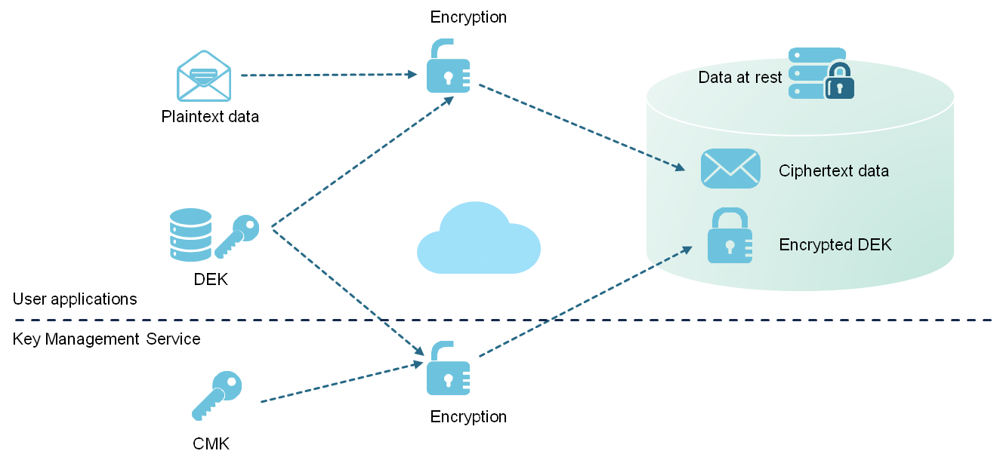

# Application Scenarios

KMS provides central management and control capabilities of CMKs for Object Storage Service \(OBS\), Elastic Volume Service \(EVS\), Image Management Service \(IMS\), Scalable File Service \(SFS\), Relational Database Service \(RDS\), and user applications. It is perfectly suited for data encryption and decryption scenarios.

-   For OBS, KMS applies to object encryption on OBS.

    > **NOTE:**   
    >OBS is an object-based storage service that provides customers with massive, secure, reliable, and cost-effective data storage capabilities, including but not limited to bucket creation, modification, deletion, and management, as well as object upload, download, deletion, and general management. OBS can store all file types, and is suitable for individual subscribers, websites, enterprises, and developers. For more information about OBS, see the  _Object Storage Service User Guide_.  

-   For EVS, KMS applies to data encryption in EVS disks.

    > **NOTE:**   
    >Based on a distributed architecture, an EVS disk is a virtual block storage device that can be elastically scaled up and down. EVS disks can be operated online. Using them is the same as using common server hard disks. Compared with traditional hard disks, EVS disks have higher data reliability and I/O throughput and are easier to use. EVS disks can be used in file systems, databases, and system software applications that require block storage devices. For more information about EVS, see the  _Elastic Volume Service User Guide_.  

-   For IMS, KMS applies to the creation of encrypted private images.

    > **NOTE:**   
    >IMS provides easy-to-use self-service image management functions. You can apply for an Elastic Cloud Server \(ECS\) using either a private image or a public image. You can also create a private image using an existing ECS or an external image file. For more information about IMS, see the  _Image Management Service User Guide_.  

-   For SFS, KMS applies to data encryption for files in SFS.

    > **NOTE:**   
    >SFS provides high-performance file storage that is scalable on demand. It can be shared with multiple cloud servers. For more information, see the  _Scalable File Service User Guide_.  

-   For RDS, KMS applies to disk encryption in RDS database instances.

    > **NOTE:**   
    >RDS is an online relational database service based on the cloud computing platform. RDS is out-of-box, reliable, scalable, and easy to manage. For more information about RDS, see the  _Relational Database Service User Guide_.  

-   For user applications

    To encrypt plaintext data, a user application can call the necessary KMS API to generate a DEK, which can then be used to encrypt the plaintext data. Then the application can store the encrypted data. In addition, the user application can call the necessary KMS APIs to create CMKs. DEKs can be stored in ciphertext after being encrypted with the CMKs.  [Figure 1](#fig30019918195516)  shows envelope encryption working principles.

    To ensure the security of the user's encrypted data, KMS does not save DEKs in plaintext or ciphertext. Instead, it manages the CMKs of users to enable users to obtain and use DEKs securely.

    **Figure  1**  Envelope encryption working principles  
    

