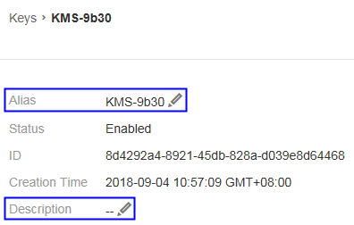

# Changing the Alias and Description of a CMK

## Scenario

The alias of a CMK is a user-friendly name designed to help you locate the CMK easier.

This section describes how to change the alias and description of a CMK on the KMS management console.

> **NOTICE:**   
>-   A Default Master Key \(the alias suffix of which is  **/default**\) does not allow alias and description changes.  
>-   The alias and description of a CMK cannot be changed if the CMK is in  **Pending deletion**  status.  

## Prerequisites

-   You have obtained an account and its password for logging in to the management console.
-   The CMK is in  **Enabled**,  **Disabled**, or  **Pending import**  status.

## Procedure

1.  Log in to the management console.
2.  Click    in the upper left corner of the management console and select a region or project.
3.  Choose  **Security**  \>  **Key Management Service**. The  **Key Management Service**  page is displayed.
4.  Click the alias of the desired CMK. Details about the CMK are displayed.
5.  Click    in the  **Alias**  or  **Description**  line to change the alias or description of the CMK,  [Figure 1](#fig12770609173123)  highlights these options.

    **Figure  1**  CMK details  
    

    > **NOTE:**   
    >-   The alias must be 1 to 255 characters in length. Only digits, letters, underscores \(\_\), hyphens \(-\), colons \(:\), and forward slashes \(/\) are allowed.  
    >-   Length of the description cannot exceed 255 characters.  

6.  Click    to save the changes.

