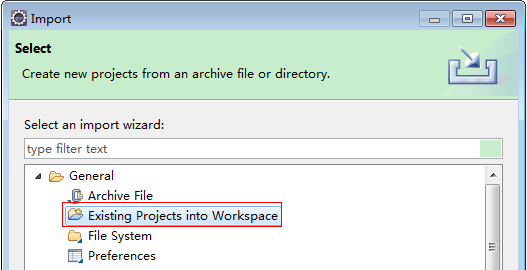
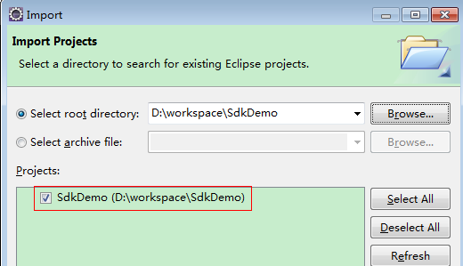
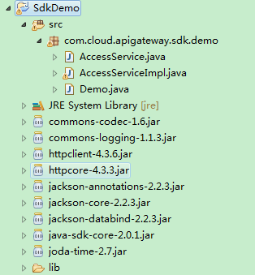

# Authentication<a name="EN-US_TOPIC_0172602524"></a>

Requests for calling an API can be authenticated using either of the following methods:

-   Token-based authentication: Requests are authenticated using a token.
-   AK/SK-based authentication: Requests are authenticated by encrypting the request body using an AK/SK pair. AK/SK-based authentication is recommended because it is more secure than token-based authentication.

## Token-based Authentication<a name="en-us_topic_0121671869_section2417768214391"></a>

> **NOTE:**   
>The validity period of a token is 24 hours. When using a token for authentication, cache it to prevent frequently calling the IAM API used to obtain a user token.  

A token specifies temporary permissions in a computer system. During API authentication using a token, the token is added to requests to get permissions for calling the API.

In  [Making an API Request](making-an-api-request.md), the process of calling the API used to  [obtain a user token](https://docs.otc.t-systems.com/en-us/api/iam/en-us_topic_0057845583.html)  is described. After a token is obtained, the  **X-Auth-Token**  header field must be added to requests to specify the token when calling other APIs. For example, if the token is  **ABCDEFJ....**,  **X-Auth-Token: ABCDEFJ....**  can be added to a request as follows:

```
Content-Type: application/json
X-Auth-Token: ABCDEFJ....
```

## AK/SK-based Authentication<a name="section139965017532"></a>

An AK/SK is used to verify the identity of a request sender. In AK/SK-based authentication, a signature needs to be obtained and then added to requests.

> **NOTE:**   
>AK: access key ID, which is a unique identifier used in conjunction with a secret access key to sign requests cryptographically.  
>SK: secret access key used in conjunction with an AK to sign requests cryptographically. It identifies a request sender and prevents the request from being modified.  

The following uses a demo project to show how to sign a request and use an HTTP client to send an HTTPS request.

Download the demo project at  [https://docs.otc.t-systems.com/en-us/api/apiug/apig-en-api-180328008.html](https://docs.otc.t-systems.com/en-us/api/apiug/apig-en-api-180328008.html).

1.  Generate an AK/SK. \(If an AK/SK file has already been obtained, skip this step and locate the downloaded AK/SK file. Generally, the file name will be  **credentials.csv**.\)
    1.  Log in to the management console.
    2.  Click the username and choose  **My Credentials**  from the drop-down list.

    1.  On the  **My Credentials**  page, click the  **Access Keys**  tab.
    2.  Click  **Add Access Key**.
    3.  Enter the login password.
    4.  Enter the verification code received by email.
    5.  Click  **OK**  to download the access key.

        > **NOTE:**   
        >Keep the access key secure.  


2.  Download and decompress the demo project.
3.  <a name="en-us_topic_0121671869_li19564155663214"></a>Import the demo project to Eclipse.

    **Figure  1**  Selecting Existing Projects into Workspace<a name="en-us_topic_0121671869_fig16546145205014"></a>  
    

    **Figure  2**  Selecting the demo project<a name="en-us_topic_0121671869_fig767232218519"></a>  
    

    **Figure  3**  Structure of the demo project<a name="en-us_topic_0121671869_fig159778103242"></a>  
    

4.  Sign the request.

    The request signing method is integrated in the JAR files imported in  [3](#en-us_topic_0121671869_li19564155663214). The request needs to be signed before it is sent. The signature will then be added as part of the HTTP header to the request.

    The demo code is classified into the following classes to demonstrate signing and sending the HTTP request:

    -   **AccessService**: An abstract class that merges the GET, POST, PUT, and DELETE methods into the access method.
    -   **Demo**: Execution entry used to simulate the sending of GET, POST, PUT, and DELETE requests.
    -   **AccessServiceImpl**: Implements the access method, which contains the code required for communication with API Gateway.

    1.  Edit the main\(\) method in the  **Demo.java**  file, and replace the bold text with actual values.

        As shown in the following code, if you use other methods such as POST, PUT, and DELETE, see the corresponding comment.

        Specify  **region**,  **serviceName**,  **ak/sk**, and  **url**  as the actual values. In this demo, the URLs for accessing VPC resources are used.

        To obtain the project ID in the URLs, see  [Obtaining a Project ID](obtaining-a-project-id.md).

        To obtain the endpoint, see  [Regions and Endpoints](https://docs.otc.t-systems.com/en-us/endpoint/index.html).

        ```
        //TODO: Replace region with the name of the region in which the service to be accessed is located. 
        private static final String region = "";
        
        //TODO: Replace vpc with the name of the service you want to access. For example, ecs, vpc, iam, and elb.
        private static final String serviceName = "";
        
        public static void main(String[] args) throws UnsupportedEncodingException
        {
        //TODO: Replace the AK and SK with those obtained on the My Credential page.
        String ak = "ZIRRKMTWP******1WKNKB";
        String sk = "Us0mdMNHk******YrRCnW0ecfzl";
        
        //TODO: To specify a project ID (multi-project scenarios), add the X-Project-Id header.
        //TODO: To access a global service, such as IAM, DNS, CDN, and TMS, add the X-Domain-Id header to specify an account ID.
        //TODO: To add a header, find "Add special headers" in the AccessServiceImple.java file.
        
        //TODO: Test the API
        String url = "https://{Endpoint}/v1/{project_id}/vpcs";
        get(ak, sk, url);
        
        //TODO: When creating a VPC, replace {project_id} in postUrl with the actual value.
        //String postUrl = "https://serviceEndpoint/v1/{project_id}/cloudservers";
        //String postbody ="{\"vpc\": {\"name\": \"vpc\",\"cidr\": \"192.168.0.0/16\"}}";
        //post(ak, sk, postUrl, postbody);
        
        //TODO: When querying a VPC, replace {project_id} in url with the actual value.
        //String url = "https://serviceEndpoint/v1/{project_id}/vpcs/{vpc_id}";
        //get(ak, sk, url);
        
        //TODO: When updating a VPC, replace {project_id} and {vpc_id} in putUrl with the actual values.
        //String putUrl = "https://serviceEndpoint/v1/{project_id}/vpcs/{vpc_id}";
        //String putbody ="{\"vpc\":{\"name\": \"vpc1\",\"cidr\": \"192.168.0.0/16\"}}";
        //put(ak, sk, putUrl, putbody);
        
        //TODO: When deleting a VPC, replace {project_id} and {vpc_id} in deleteUrl with the actual values.
        //String deleteUrl = "https://serviceEndpoint/v1/{project_id}/vpcs/{vpc_id}";
        //delete(ak, sk, deleteUrl);
        }
        ```

    2.  Compile the code and call the API.

        In the  **Package Explorer**  area on the left, right-click  **Demo.java**, choose  **Run AS**  \>  **Java Application**  from the shortcut menu to run the demo code.

        You can view the API call logs on the console.


