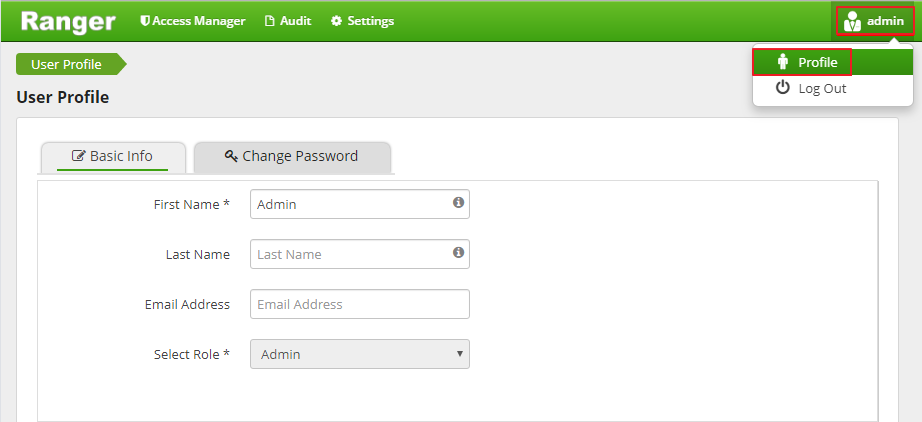
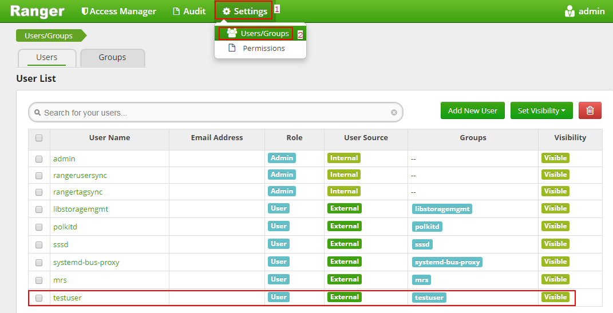

# Accessing the Ranger Web UI and Synchronizing Unix users to the Ranger Web UI

You can manage Ranger on the Ranger web UI.

## Accessing the Ranger Admin Web UI

1.  Log in to MRS Manager.
2.  Choose  **Services**  \>  **Ranger**. In  **Ranger Summary**, click  **RangerAdmin**  corresponding to  **Ranger Web UI**.
3.  On the Ranger web UI login page, the default username and password are  **admin**  and  **admin@12345**, respectively.

    After logging in to the Ranger Web UI for the first time, change the password and keep it secure.

4.  Click the username in the upper right corner, choose  **Profile**  from the drop-down list, and click  **Change Password**  to change the password.

    **Figure  1**  Changing the Ranger web UI login password  
    

5.  After changing the password, click the username in the upper right corner, choose  **Log Out**  from the drop-down list, and use the new password to log in to the web UI again.

## Using Ranger UserSync to Synchronize Unix OS Users on Cluster Nodes

Ranger UserSync is an important component of Ranger. It can synchronize Unix system users or LDAP users to the Ranger web UI. Currently, MRS can synchronize only Unix users on the node where the Ranger UserSync process resides.

1.  Log in to the node where the Ranger UserSync process is located.
2.  Run the  **useradd**  command to add a system user, for example,  **testuser**.

    **Figure  2**  Adding the  **testuser**  system user  
    

3.  After the user is added, wait for about 1 minute and log in to the Ranger web UI. Then, you can see that the user is synchronized.

    **Figure  3**  User synchronization completed  
    

