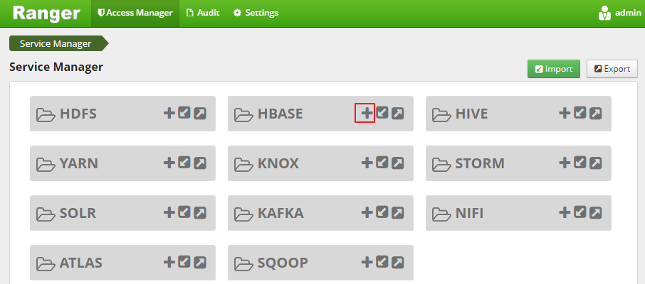
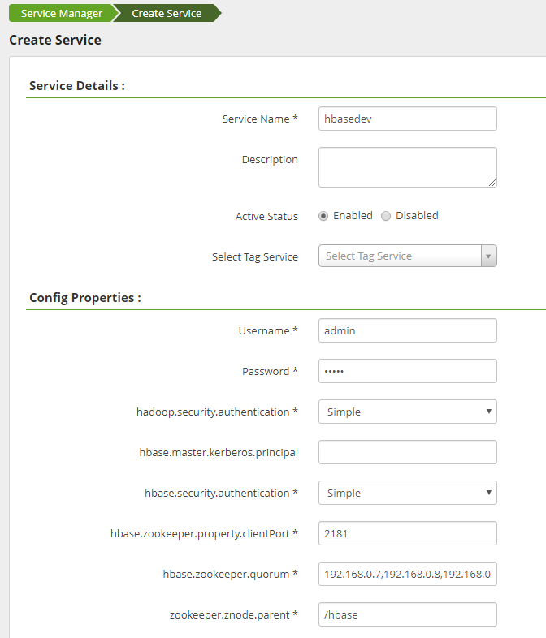
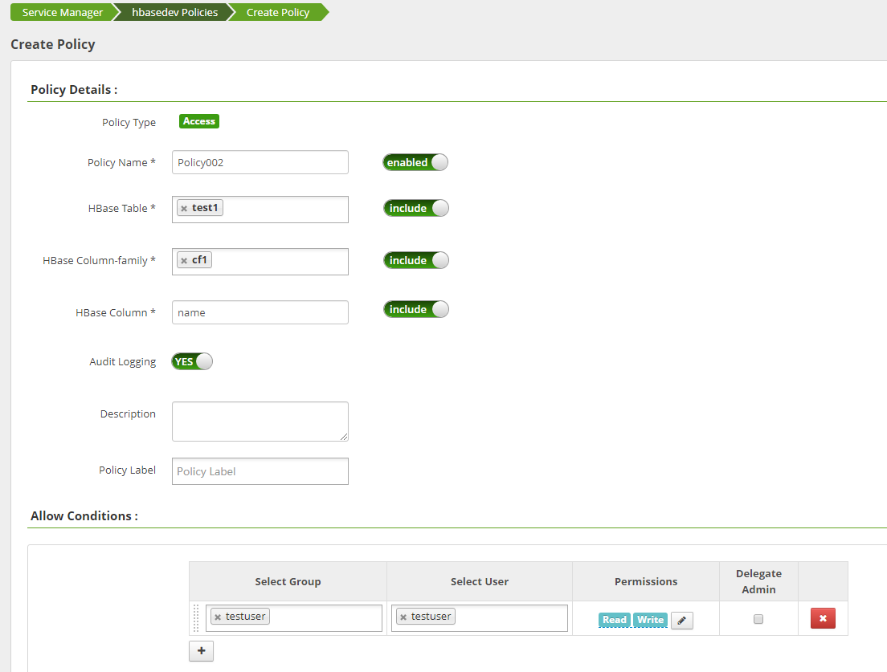

# Configuring HBase Access Permissions in Ranger

After an MRS cluster with Ranger installed is created, HBase access control is not integrated into Ranger. This section describes how to integrate HBase into Ranger.

1.  Log in to the Ranger web UI.
2.  In the  **Service Manager**  area, click    next to  **HBASE**  to add an HBase service.

    **Figure  1**  Adding an HBase service  
    

3.  Set the parameters for adding an HBase service according to  [Table 1](#table74220350178). Use the default values for the parameters that are not listed in the table.

    **Table  1**  Parameter description

    
    <table><thead align="left"><tr id="row1743935151719"><th class="cellrowborder" valign="top" width="33.33333333333333%" id="mcps1.2.4.1.1">
Parameter

    </th>
    <th class="cellrowborder" valign="top" width="33.33333333333333%" id="mcps1.2.4.1.2">
Description

    </th>
    <th class="cellrowborder" valign="top" width="33.33333333333333%" id="mcps1.2.4.1.3">
Example Value

    </th>
    </tr>
    </thead>
    <tbody><tr id="row94373551718"><td class="cellrowborder" valign="top" width="33.33333333333333%" headers="mcps1.2.4.1.1 ">
Service Name

    </td>
    <td class="cellrowborder" valign="top" width="33.33333333333333%" headers="mcps1.2.4.1.2 ">
Name of the service to be created. The value is fixed to <strong id="b6341155601315">hbasedev</strong>.

    </td>
    <td class="cellrowborder" valign="top" width="33.33333333333333%" headers="mcps1.2.4.1.3 ">
hbasedev

    </td>
    </tr>
    <tr id="row154353515177"><td class="cellrowborder" valign="top" width="33.33333333333333%" headers="mcps1.2.4.1.1 ">
Username

    </td>
    <td class="cellrowborder" valign="top" width="33.33333333333333%" headers="mcps1.2.4.1.2 ">
You can set this parameter to any value.

    </td>
    <td class="cellrowborder" valign="top" width="33.33333333333333%" headers="mcps1.2.4.1.3 ">
admin

    </td>
    </tr>
    <tr id="row243143511179"><td class="cellrowborder" valign="top" width="33.33333333333333%" headers="mcps1.2.4.1.1 ">
Password

    </td>
    <td class="cellrowborder" valign="top" width="33.33333333333333%" headers="mcps1.2.4.1.2 ">
You can set this parameter to any value.

    </td>
    <td class="cellrowborder" valign="top" width="33.33333333333333%" headers="mcps1.2.4.1.3 ">
-

    </td>
    </tr>
    <tr id="row343153551716"><td class="cellrowborder" valign="top" width="33.33333333333333%" headers="mcps1.2.4.1.1 ">
hadoop.security.authentication

    </td>
    <td class="cellrowborder" valign="top" width="33.33333333333333%" headers="mcps1.2.4.1.2 ">
Hadoop authentication mode. The value is fixed to <strong id="b137387313142">Simple</strong>.

    </td>
    <td class="cellrowborder" valign="top" width="33.33333333333333%" headers="mcps1.2.4.1.3 ">
Simple

    </td>
    </tr>
    <tr id="row174315352174"><td class="cellrowborder" valign="top" width="33.33333333333333%" headers="mcps1.2.4.1.1 ">
hbase.security.authentication

    </td>
    <td class="cellrowborder" valign="top" width="33.33333333333333%" headers="mcps1.2.4.1.2 ">
HBase authentication mode. The value is fixed to <strong id="b10695349144">Simple</strong>.

    </td>
    <td class="cellrowborder" valign="top" width="33.33333333333333%" headers="mcps1.2.4.1.3 ">
Simple

    </td>
    </tr>
    <tr id="row174314357170"><td class="cellrowborder" valign="top" width="33.33333333333333%" headers="mcps1.2.4.1.1 ">
hbase.zookeeper.property.clientPort

    </td>
    <td class="cellrowborder" valign="top" width="33.33333333333333%" headers="mcps1.2.4.1.2 ">
Port number of ZooKeeper in the HBase cluster

    </td>
    <td class="cellrowborder" valign="top" width="33.33333333333333%" headers="mcps1.2.4.1.3 ">
2181

    </td>
    </tr>
    <tr id="row1043335111715"><td class="cellrowborder" valign="top" width="33.33333333333333%" headers="mcps1.2.4.1.1 ">
hbase.zookeeper.quorum

    </td>
    <td class="cellrowborder" valign="top" width="33.33333333333333%" headers="mcps1.2.4.1.2 ">
ZooKeeper address in the HBase cluster

    </td>
    <td class="cellrowborder" valign="top" width="33.33333333333333%" headers="mcps1.2.4.1.3 ">
192.168.0.7,192.168.0.8,192.168.0.9

    </td>
    </tr>
    <tr id="row19708163015201"><td class="cellrowborder" valign="top" width="33.33333333333333%" headers="mcps1.2.4.1.1 ">
zookeeper.znode.parent

    </td>
    <td class="cellrowborder" valign="top" width="33.33333333333333%" headers="mcps1.2.4.1.2 ">
Path of the root node of HBase in ZooKeeper. The value is fixed to <strong id="b1550684011515">/hbase</strong>.

    </td>
    <td class="cellrowborder" valign="top" width="33.33333333333333%" headers="mcps1.2.4.1.3 ">
/hbase

    </td>
    </tr>
    </tbody>
    </table>

    **Figure  2**  Create an HBase service  
    

4.  Click  **Add**  to add the service.
5.  Start the Ranger HBase plugin to authorize Ranger to manage HBase.
    1.  Log in to MRS Manager.
    2.  Choose  **Services**  \>  **HBase**  \>  **Service Configuration**, and set  **Type**  to  **All**.
    3.  Search for  **hbase.security.authorization**  and change its value to  **true**  \(select the first HBase parameter\).
    4.  Search for  **hbase.coprocessor.master.classes**  and append  **,org.apache.ranger.authorization.hbase.RangerAuthorizationCoprocessor**  to its original value.
    5.  Search for  **hbase.coprocessor.region.classes**  and append  **,org.apache.ranger.authorization.hbase.RangerAuthorizationCoprocessor**  to its original value.
    6.  Click  **Save Configuration**  and select  **Restart the affected services or instances**  to restart the HMaster and RegionServer instances.

6.  Create a policy under  **HBase Service hbasedev**.
    1.  Log in to the Ranger web UI.
    2.  In the  **HBASE**  area, click the added service  **hbasedev**.
    3.  Click  **Add New Policy**  to add an access control policy.
    4.  Set the parameters according to  [Table 2](#table116322231534). Use the default values for the parameters that are not listed in the table.

        **Table  2**  Parameter description

        
        <table><thead align="left"><tr id="row11633152314316"><th class="cellrowborder" valign="top" width="33.33333333333333%" id="mcps1.2.4.1.1">
Parameter

        </th>
        <th class="cellrowborder" valign="top" width="33.33333333333333%" id="mcps1.2.4.1.2">
Description

        </th>
        <th class="cellrowborder" valign="top" width="33.33333333333333%" id="mcps1.2.4.1.3">
Example Value

        </th>
        </tr>
        </thead>
        <tbody><tr id="row1163310231234"><td class="cellrowborder" valign="top" width="33.33333333333333%" headers="mcps1.2.4.1.1 ">
Policy Name

        </td>
        <td class="cellrowborder" valign="top" width="33.33333333333333%" headers="mcps1.2.4.1.2 ">
Policy name

        </td>
        <td class="cellrowborder" valign="top" width="33.33333333333333%" headers="mcps1.2.4.1.3 ">
Policy002

        </td>
        </tr>
        <tr id="row9633142318314"><td class="cellrowborder" valign="top" width="33.33333333333333%" headers="mcps1.2.4.1.1 ">
HBase Table

        </td>
        <td class="cellrowborder" valign="top" width="33.33333333333333%" headers="mcps1.2.4.1.2 ">
Name of the HBase table that the policy allows to access

        </td>
        <td class="cellrowborder" valign="top" width="33.33333333333333%" headers="mcps1.2.4.1.3 ">
test1

        </td>
        </tr>
        <tr id="row863372320317"><td class="cellrowborder" valign="top" width="33.33333333333333%" headers="mcps1.2.4.1.1 ">
HBase Column-family

        </td>
        <td class="cellrowborder" valign="top" width="33.33333333333333%" headers="mcps1.2.4.1.2 ">
Column family of the HBase table that the policy allows to access

        </td>
        <td class="cellrowborder" valign="top" width="33.33333333333333%" headers="mcps1.2.4.1.3 ">
cf1

        </td>
        </tr>
        <tr id="row1663420237318"><td class="cellrowborder" valign="top" width="33.33333333333333%" headers="mcps1.2.4.1.1 ">
HBase Column

        </td>
        <td class="cellrowborder" valign="top" width="33.33333333333333%" headers="mcps1.2.4.1.2 ">
Column name of the table corresponding to the HBase table that the policy allows to access

        </td>
        <td class="cellrowborder" valign="top" width="33.33333333333333%" headers="mcps1.2.4.1.3 ">
name

        </td>
        </tr>
        <tr id="row463413231318"><td class="cellrowborder" valign="top" width="33.33333333333333%" headers="mcps1.2.4.1.1 ">
Allow Conditions

        </td>
        <td class="cellrowborder" valign="top" width="33.33333333333333%" headers="mcps1.2.4.1.2 "><ul id="ul291972075620"><li><strong id="b1804939152017">Select Group</strong>: user group that the policy allows to access</li><li><strong id="b106013419203">Select User</strong>: user in the user group that the policy allows to access</li><li><strong id="b18863104282018">Permissions</strong>: permissions that the policy allows the user to use</li></ul>
        </td>
        <td class="cellrowborder" valign="top" width="33.33333333333333%" headers="mcps1.2.4.1.3 "><ul id="ul11428874228"><li>Select Group: <strong id="b21006446206">testuser</strong></li><li>Select User: <strong id="b1437524511209">testuser</strong></li><li>Permissions: <strong id="b17345104615201">Create</strong> and <strong id="b183461146132016">select</strong></li></ul>
        </td>
        </tr>
        </tbody>
        </table>

        **Figure  3**  Adding an access control policy for hbasedev  
        

    5.  Click  **Add**  to add the policy. According to the preceding policy, user  **testuser**  in the  **testuser**  user group has the  **Create**  and  **select**  permissions on the  **cf1:name**  column in the  **test1**  table of the  **default**  namespace in HBase, but no permission to access other columns.

7.  Update and log in to the HBase client by referring to  [Using HBase from Scratch](using-hbase-from-scratch.md), and check whether HBase has been integrated into Ranger.
    1.  Run the following command to access the HBase shell:

        **source /opt/client/bigdata\_env**

        **hbase shell**

        **Figure  4**  Accessing the HBase shell  
        

    2.  Add data and check whether Ranger is integrated.

        1.  Add data to the  **cf1:name**  column in the  **test1**  table.

            **put 'test1','001','cf1:name','tom'**

        2.  Add data to the  **cf1:age**  column in the  **test1**  table. If the user has no permission to access this column, the data fails to be added.

            **put 'test1','001','cf1:age',10**

        **Figure  5**  Verifying whether HBase is integrated in Ranger  
        

