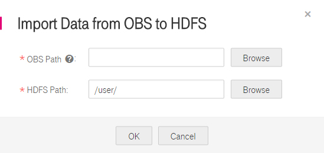

# How Do I Prepare a Data Source for MRS?

MRS can process data in both OBS and HDFS. Before using MRS to analyze data, you are required to prepare the data.

1.  Upload local data to OBS.
    1.  Log in to the OBS management console.
    2.  Create a  **userdata** bucket, and then create the **program**, **input**, **output**, and **log** folders in the **userdata**  bucket.
        1.  Click  **Create Bucket** to create a **userdata**  bucket.
        2.  In the  **userdata** bucket, click **Create Folder** to create the **program**, **input**, **output**, and **log**  folders.

    3.  Upload local data to the  **userdata**  bucket.
        1.  Go to the  **program** folder, choose  **Upload Object**, and click   to select a user program.
        2.  Click  **Upload Object**.
        3.  Repeat preceding steps to upload the data files to the  **input**  folder.

2.  Import OBS data to HDFS.

    This function is available only when Kerberos authentication is disabled and the cluster is running properly.

    1.  Log in to the MRS management console.
    2.  Go to the  **Files** page and select **HDFS File List**.
    3.  Click the data storage directory, for example,  **bd\_app1**.

        **bd\_app1** is just an example. The storage directory can be any directory on the page. You can create a directory by clicking **Create Folder**.

    4.  Click  **Import Data**, and click **Browse** to configure the paths of HDFS and OBS, as shown in [Figure 1](#f16bc9801af0540a1ad9226f552c0c125).

        **Figure  1**  Importing files  
        

    5.  Click  **OK**.

        You can view the file upload progress in  **File Operation Records**.

