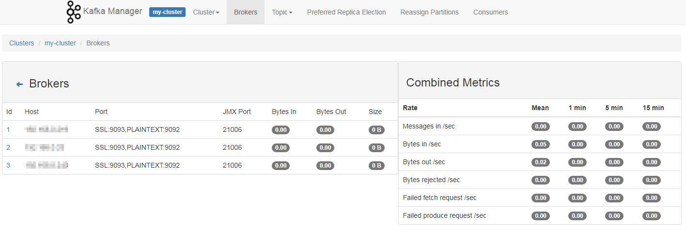
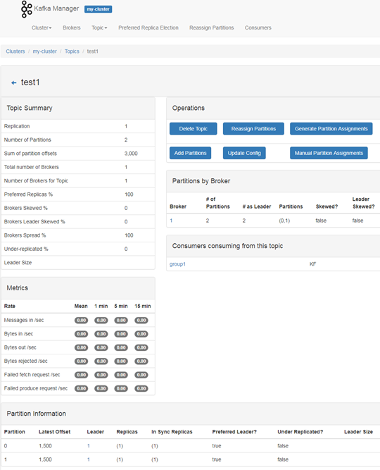
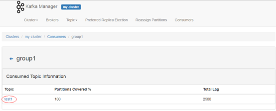
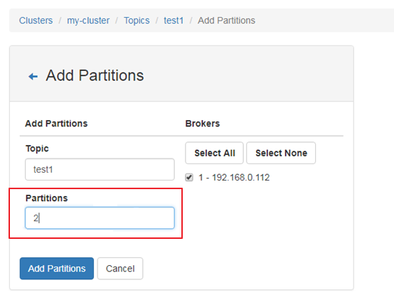
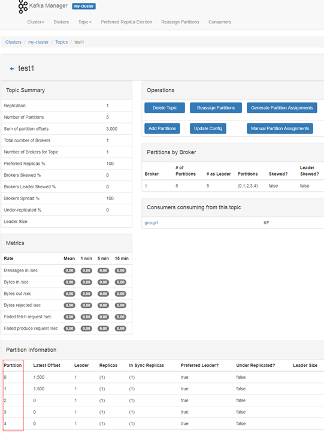

# Kafka Cluster Monitoring Management

The Kafka cluster monitoring management includes the following:

-   [Viewing Broker Information](#section1254019150558)
-   [Viewing Topic Information](#section2384151125912)
-   [Viewing Consumers Information](#section517576022)
-   [Modifying the Partition of a Topic Through KafkaManager](#section195268241735)

## Viewing Broker Information

1.  Log in to the KafkaManager web UI.
2.  On the cluster list page, click a cluster name to access the Summary page of the cluster.

    **Figure  1**  Summary page of the cluster  
    

3.  Click  **Brokers**  to access the Broker monitoring page. The page displays the Broker list and I/O statistics of the Broker nodes.

    **Figure  2**  Broker monitoring page  
    

## Viewing Topic Information

1.  Log in to the KafkaManager web UI.
2.  On the cluster list page, click a cluster name to access the Summary page of the cluster.
3.  Choose  **Topic**  \>  **List**  to view the topic list of the current cluster and information about each topic.

    **Figure  3**  Topic list  
    

4.  Click a topic name to view details about the topic.

    **Figure  4**  Topic details  
    

## Viewing Consumers Information

1.  Log in to the KafkaManager web UI.
2.  On the cluster list page, click a cluster name to access the Summary page of the cluster.
3.  Click  **Consumers**  to view the consumer list of the current cluster and each consumer's consumption information.

    **Figure  5**  Consumer list  
    

4.  Click a consumer name to view the list of the consumed topics.

    **Figure  6**  List of topics consumed by the consumer  
    

5.  Click a topic name in the topic list of the consumer to view consumption information about the topic.

    **Figure  7**  Topic consumption details  
    

## Modifying the Partition of a Topic Through KafkaManager

1.  Log in to the KafkaManager web UI.
2.  On the cluster list page, click a cluster name to access the Summary page of the cluster.
3.  Choose  **Topic**  \>  **List**  to access the topic list page of the current cluster.
4.  Click a topic name to access the  **Topic Summary**  page.
5.  Click  **Add Partitions**. The page for adding partitions is displayed.

    **Figure  8**  Adding partitions  
    

6.  Confirm the topic name and modify the value of the  **Partitions**  parameter and click  **Add Partitions**  to add partitions.

    **Figure  9**  Modifying the number of partitions  
    

7.  After the partitions are added successfully, click  **Go to topic view**  to return to the  **Topic Summary**  page.
8.  Check the number of partitions in  **Partition Information**  in the lower part of the  **Topic Summary**  page.

    **Figure  10**  Partition information  
    

9.  \(Optional\) If you are not satisfied with the assigned partitions, you can use the partition reassignment function to automatically reassign partitions.
    1.  On the  **Topic Summary**  page, click  **Generate Partition Assignments**.
    2.  Select the broker instance and click  **Generate Partition Assignments**  to generate a partition.
    3.  After partition generation, click  **Go to topic view**  to return to the  **Topic Summary**  page.
    4.  On the  **Topic Summary**  page, click  **Reassign Partitions**  to automatically assign partitions to the broker instance of the cluster.
    5.  Click  **Go to reassign partitions**  to view details about the reassigned partitions.

10. \(Optional\) If you are not satisfied with the automatically assigned partitions, you can manually assign the partitions.
    1.  On the  **Topic Summary**  page, click  **Manual Partition Assignments**  to access the page for manually assign partitions.
    2.  Manually assign a broker ID to each partition replica, and click  **Save Partition Assignment**  to save the changes.
    3.  Click  **Go to topic view**  to return to the  **Topic Summary**  page and view the partition details.

