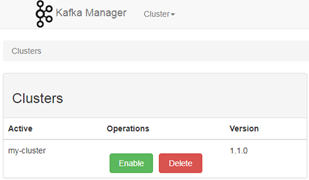

# Managing Kafka Clusters

Kafka cluster management includes the following:

-   [Adding a Cluster on the KafkaManager Web UI](#section8713185103014)
-   [Updating Cluster Parameters](#section776745110472)
-   [Deleting a Cluster on the KafkaManager Web UI](#section656918369521)

## Adding a Cluster on the KafkaManager Web UI

After a Kafka cluster is created for the first time, a default Kafka cluster named  **my-cluster**  is created on the KafkaManager web UI. You can also add Kafka clusters that have been created on the MRS management console on the KafkaManager web UI to manage multiple Kafka clusters.

1.  Log in to the KafkaManager web UI.
2.  In the upper part of the page, choose  **Cluster**  \>  **Add Cluster**.

    **Figure  1**  Adding a cluster  
    

3.  Set the cluster parameters. For the following parameters, refer to their example values. Retain the default values for other parameters.

    **Table  1**  Cluster parameters to be modified

    
    <table><thead align="left"><tr id="row142881620161613"><th class="cellrowborder" valign="top" width="33.33333333333333%" id="mcps1.2.4.1.1">
<strong id="en-us_topic_0043021173_b8423527061470">Parameter</strong>

    </th>
    <th class="cellrowborder" valign="top" width="33.33333333333333%" id="mcps1.2.4.1.2">
Example Value

    </th>
    <th class="cellrowborder" valign="top" width="33.33333333333333%" id="mcps1.2.4.1.3">
<strong id="b842352706134712">Description</strong>

    </th>
    </tr>
    </thead>
    <tbody><tr id="row1328842018161"><td class="cellrowborder" valign="top" width="33.33333333333333%" headers="mcps1.2.4.1.1 ">
Cluster Name

    </td>
    <td class="cellrowborder" valign="top" width="33.33333333333333%" headers="mcps1.2.4.1.2 ">
mrs-demo

    </td>
    <td class="cellrowborder" valign="top" width="33.33333333333333%" headers="mcps1.2.4.1.3 ">
Name of the cluster to be added on the KafkaManager web UI

    </td>
    </tr>
    <tr id="row428816206164"><td class="cellrowborder" valign="top" width="33.33333333333333%" headers="mcps1.2.4.1.1 ">
Cluster Zookeeper Hosts

    </td>
    <td class="cellrowborder" valign="top" width="33.33333333333333%" headers="mcps1.2.4.1.2 ">
zk1_ip:zk1_port, zk2_ip:zk2_port/kafka

    </td>
    <td class="cellrowborder" valign="top" width="33.33333333333333%" headers="mcps1.2.4.1.3 ">
ZooKeeper address of the cluster to be added

    </td>
    </tr>
    <tr id="row192882020131615"><td class="cellrowborder" valign="top" width="33.33333333333333%" headers="mcps1.2.4.1.1 ">
Kafka Version

    </td>
    <td class="cellrowborder" valign="top" width="33.33333333333333%" headers="mcps1.2.4.1.2 ">
1.1.0

    </td>
    <td class="cellrowborder" valign="top" width="33.33333333333333%" headers="mcps1.2.4.1.3 ">
Kafka version of the cluster to be added. The default value is <strong id="b11192144825119">1.1.0</strong>.

    </td>
    </tr>
    <tr id="row1225617469305"><td class="cellrowborder" valign="top" width="33.33333333333333%" headers="mcps1.2.4.1.1 ">
Enable JMX Polling (Set JMX_PORT env variable before starting kafka server)

    </td>
    <td class="cellrowborder" valign="top" width="33.33333333333333%" headers="mcps1.2.4.1.2 ">
Selected

    </td>
    <td class="cellrowborder" valign="top" width="33.33333333333333%" headers="mcps1.2.4.1.3 ">
-

    </td>
    </tr>
    <tr id="row162881620111612"><td class="cellrowborder" valign="top" width="33.33333333333333%" headers="mcps1.2.4.1.1 ">
Poll consumer information (Not recommended for large # of consumers)

    </td>
    <td class="cellrowborder" valign="top" width="33.33333333333333%" headers="mcps1.2.4.1.2 ">
Selected

    </td>
    <td class="cellrowborder" valign="top" width="33.33333333333333%" headers="mcps1.2.4.1.3 ">
-

    </td>
    </tr>
    <tr id="row228922016166"><td class="cellrowborder" valign="top" width="33.33333333333333%" headers="mcps1.2.4.1.1 ">
Enable Active OffsetCache (Not recommended for large # of consumers)

    </td>
    <td class="cellrowborder" valign="top" width="33.33333333333333%" headers="mcps1.2.4.1.2 ">
Selected

    </td>
    <td class="cellrowborder" valign="top" width="33.33333333333333%" headers="mcps1.2.4.1.3 ">
-

    </td>
    </tr>
    <tr id="row79341058112113"><td class="cellrowborder" valign="top" width="33.33333333333333%" headers="mcps1.2.4.1.1 ">
Display Broker and Topic Size (only works after applying this patch)

    </td>
    <td class="cellrowborder" valign="top" width="33.33333333333333%" headers="mcps1.2.4.1.2 ">
Selected

    </td>
    <td class="cellrowborder" valign="top" width="33.33333333333333%" headers="mcps1.2.4.1.3 ">
-

    </td>
    </tr>
    <tr id="row201616212229"><td class="cellrowborder" valign="top" width="33.33333333333333%" headers="mcps1.2.4.1.1 ">
Security Protocol

    </td>
    <td class="cellrowborder" valign="top" width="33.33333333333333%" headers="mcps1.2.4.1.2 ">
PLAINTEXT

    </td>
    <td class="cellrowborder" valign="top" width="33.33333333333333%" headers="mcps1.2.4.1.3 "><ul id="ul1533223923116"><li>For a Kafka cluster with Kerberos authentication enabled, select <strong id="b17110738195410">SASL_PLAINTEXT</strong>.</li><li>For a Kafka cluster with Kerberos authentication disabled, select <strong id="b816372418559">PLAINTEXT</strong>.</li></ul>
    </td>
    </tr>
    </tbody>
    </table>

4.  Click  **Save**.

## Updating Cluster Parameters

1.  Log in to the KafkaManager web UI.
2.  Click  **Modify**  in the  **Operations**  column of the cluster.

    **Figure  2**  Updating cluster parameters  
    

3.  Go to the cluster configuration page and modify cluster parameters.

## Deleting a Cluster on the KafkaManager Web UI

1.  Log in to the KafkaManager web UI.
2.  Click  **Disable**  in the  **Operations**  column of the cluster.

    **Figure  3**  Disabling the cluster  
    

3.  When  **Delete**  or  **Enable**  is displayed in the  **Operations**  column on the cluster list page, click  **Delete**  to delete the cluster. You can also click  **Enable**  to enable the cluster.

    **Figure  4**  Enabling or deleting the cluster  
    

