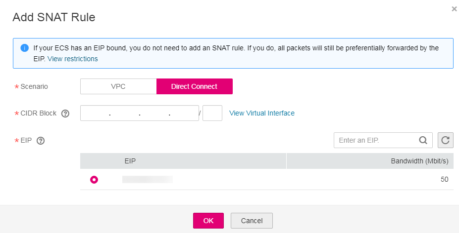

# \(Optional\) Step 4: Add an SNAT Rule

## Scenarios

After a NAT gateway is created, you can add SNAT rules for it. With SNAT rules, servers that are connected to a VPC through a direct connection can access the Internet by using a shared EIP.

An SNAT rule is configured for one CIDR block. If the Direct Connect connection of your side has multiple CIDR blocks, you can create several SNAT rules to make multiple servers share more EIPs.

## Prerequisites

A NAT gateway has been created.

## Procedure

1.  Log in to the management console.
2.  Click    in the upper left corner and select the desired region and project.
3.  Under  **Network**, click  **NAT Gateway**.
4.  On the displayed page, click the name of the NAT gateway for which you want to add the SNAT rule.
5.  On the  **SNAT Rules**  tab, click  **Add SNAT Rule**.

    **Figure  1**  Add SNAT Rule  
    

6.  Specify the parameters as prompted. For details, see  [Table 1](#table4272024117597).

    **Table  1**  Parameter description

    
    <table><thead align="left"><tr id="row3248015417597"><th class="cellrowborder" valign="top" width="34.36%" id="mcps1.2.3.1.1">
<strong id="b16362172412415">Parameter</strong>

    </th>
    <th class="cellrowborder" valign="top" width="65.64%" id="mcps1.2.3.1.2">
<strong id="b13311726172418">Description</strong>

    </th>
    </tr>
    </thead>
    <tbody><tr id="row144002379410"><td class="cellrowborder" valign="top" width="34.36%" headers="mcps1.2.3.1.1 ">
Scenario

    </td>
    <td class="cellrowborder" valign="top" width="65.64%" headers="mcps1.2.3.1.2 ">
Select <strong id="b59414103915">Direct Connect</strong> when servers in your data center need to access the Internet.

    
The servers in your data center that are connected to a VPC through Direct Connect or VPN can provide services for the Internet through the SNAT rule.

    </td>
    </tr>
    <tr id="row3209331417597"><td class="cellrowborder" valign="top" width="34.36%" headers="mcps1.2.3.1.1 ">
CIDR Block

    </td>
    <td class="cellrowborder" valign="top" width="65.64%" headers="mcps1.2.3.1.2 ">
Specifies a CIDR block. Local servers whose IP address in this CIDR block can access the Internet through the SNAT rule.

    </td>
    </tr>
    <tr id="row5801532217597"><td class="cellrowborder" valign="top" width="34.36%" headers="mcps1.2.3.1.1 ">
EIP

    </td>
    <td class="cellrowborder" valign="top" width="65.64%" headers="mcps1.2.3.1.2 ">
Specifies the public IP address used for accessing the Internet.

    
You can only select an EIP that has not been bound, has been bound to a DNAT rule with <strong id="b123425222077">Port Type</strong> set to <strong id="b534318229713">Specific port</strong> of the current NAT gateway, or has been bound to an SNAT rule of the current NAT gateway.

    </td>
    </tr>
    </tbody>
    </table>

7.  Click  **OK**.
8.  View details in the SNAT rule list. If  **Status**  is  **Running**, the rule has been added successfully.

    > **NOTE:**   
    >You can add multiple SNAT rules for a NAT gateway to suite your service requirements.  

