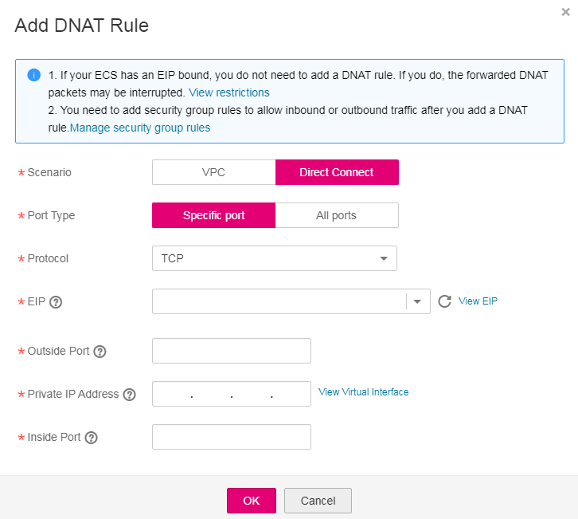

# \(Optional\) Step 5: Add a DNAT Rule

## Scenarios

After a NAT gateway is created, you can add DNAT rules to allow servers in your data center to provide services accessible from the Internet.

You can configure a DNAT rule for each port of a server. If there are multiple servers, you can create several DNAT rules to make servers share EIPs.

## Prerequisites

A NAT gateway has been created.

## Procedure

1.  Log in to the management console.
2.  Click    in the upper left corner and select the desired region and project.
3.  Under  **Network**, click  **NAT Gateway**.
4.  On the displayed page, click the name of the NAT gateway for which you want to add the DNAT rule.
5.  On the NAT gateway details page, click the  **DNAT Rules**  tab.
6.  Click  **Add DNAT Rule**.

    **Figure  1**  Add DNAT Rule  
    

7.  Set the parameters as prompted. For details, see  [Table 1](#table30787259144637).

    **Table  1**  Parameter description

    
    <table><thead align="left"><tr id="row1287982144637"><th class="cellrowborder" valign="top" width="25%" id="mcps1.2.3.1.1">
<strong id="b954171111396">Parameter</strong>

    </th>
    <th class="cellrowborder" valign="top" width="75%" id="mcps1.2.3.1.2">
<strong id="b1744611515396">Description</strong>

    </th>
    </tr>
    </thead>
    <tbody><tr id="row1684913403168"><td class="cellrowborder" valign="top" width="25%" headers="mcps1.2.3.1.1 ">
Scenario

    </td>
    <td class="cellrowborder" valign="top" width="75%" headers="mcps1.2.3.1.2 ">
Select <strong id="b1359354520489">Direct Connect</strong> when servers in your data center need to access the Internet.

    
Servers in your data center connected to a VPC using a Direct Connect or VPN connection can provide services accessible from the Internet through the DNAT rule.

    </td>
    </tr>
    <tr id="row1895714384610"><td class="cellrowborder" valign="top" width="25%" headers="mcps1.2.3.1.1 ">
Port Type

    </td>
    <td class="cellrowborder" valign="top" width="75%" headers="mcps1.2.3.1.2 ">
Specifies the port type, including <strong id="b134254517595">All ports</strong> and <strong id="b342511511590">Specific port</strong>.

    <ul id="ul108491838102519"><li><strong id="b93821147103912">All ports</strong>: indicates the IP mapping method. This method is equivalent to assigning an EIP to a server. Any requests on the EIP will be forwarded by the NAT gateway to your server based on the mapping IP addresses.</li><li><strong id="b384531894018">Specific port</strong>: indicates the port mapping method. The NAT gateway forwards the requests with specific protocol and port on the EIP to the corresponding port of the target server.</li></ul>
    </td>
    </tr>
    <tr id="row13591056167"><td class="cellrowborder" valign="top" width="25%" headers="mcps1.2.3.1.1 ">
Protocol

    </td>
    <td class="cellrowborder" valign="top" width="75%" headers="mcps1.2.3.1.2 ">
The protocol can be TCP or UDP. This parameter is available if you select <strong id="b77461019134716">Specific port</strong> for <strong id="b1674612199478">Port Type</strong>. If you select <strong id="b15746171916477">All ports</strong>, this parameter is <strong id="b1774771917476">All</strong> by default.

    </td>
    </tr>
    <tr id="row43238809144637"><td class="cellrowborder" valign="top" width="25%" headers="mcps1.2.3.1.1 ">
EIP

    

    </td>
    <td class="cellrowborder" valign="top" width="75%" headers="mcps1.2.3.1.2 ">
Specifies the EIP and port.

    
You can only select an EIP that has not been bound, has been bound to a DNAT rule with <strong id="b57001541997">Port Type</strong> set to <strong id="b14701454792">Specific port</strong> of the current NAT gateway, or has been bound to an SNAT rule of the current NAT gateway.

    </td>
    </tr>
    <tr id="row11271163819519"><td class="cellrowborder" valign="top" width="25%" headers="mcps1.2.3.1.1 ">
Outside Port

    </td>
    <td class="cellrowborder" valign="top" width="75%" headers="mcps1.2.3.1.2 ">
Specifies the EIP port. This parameter is available if you select <strong id="b189781016292">Specific port</strong> for <strong id="b14978913295">Port Type</strong>. The port number must range from 1 to 65535.

    
The value is a single port number, for example, 80.

    </td>
    </tr>
    <tr id="row35593477144637"><td class="cellrowborder" valign="top" width="25%" headers="mcps1.2.3.1.1 ">
Private IP Address

    </td>
    <td class="cellrowborder" valign="top" width="75%" headers="mcps1.2.3.1.2 ">
Specifies the IP address of the servers in the local data center or the user's private IP address. With DNAT, servers in your data center that are connected to a VPC through Direct Connect or VPN can provide services for the Internet using this private IP address. Configure the port of <strong id="b19130134917209">Private IP Address</strong> if you select <strong id="b11130849132011">Specific port</strong> for <strong id="b16130449142013">Port Type</strong>.

    
This IP address is used by the server to provide services accessible from the Internet through DNAT.

    </td>
    </tr>
    <tr id="row172121240365"><td class="cellrowborder" valign="top" width="25%" headers="mcps1.2.3.1.1 ">
Inside Port

    </td>
    <td class="cellrowborder" valign="top" width="75%" headers="mcps1.2.3.1.2 ">
Specifies the port of the server that provides services for the Internet through the DNAT rule. This parameter is available if you select <strong>Specific port</strong> for <strong>Port Type</strong>. The port number must range from 1 to 65535.

    
The value is a single port number, for example, 80.

    </td>
    </tr>
    </tbody>
    </table>

8.  Click  **OK**.

