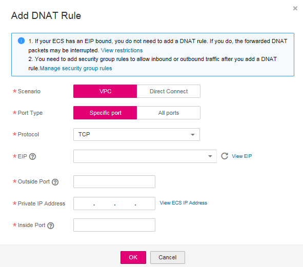

# Step 3: Add a DNAT Rule

## Scenarios

After a NAT gateway is created, you can add DNAT rules to allow servers in your VPC to provide services accessible from the Internet.

You can configure a DNAT rule for each port of a server. If multiple servers need to provide services accessible from the Internet, you need to create multiple DNAT rules.

## Prerequisites

A NAT gateway has been created.

## Procedure

1.  Log in to the management console.
2.  Click    in the upper left corner and select the desired region and project.
3.  Under  **Network**, click  **NAT Gateway**.
4.  On the displayed page, click the name of the NAT gateway for which you want to add the DNAT rule.
5.  On the NAT gateway details page, click the  **DNAT Rules**  tab.
6.  Click  **Add DNAT Rule**.

    **Figure  1**  Add DNAT Rule  
    

7.  Set the parameters as prompted. For details, see  [Table 1](#table30787259144637).

    **Table  1**  Parameter description

    
    <table><thead align="left"><tr id="row1287982144637"><th class="cellrowborder" valign="top" width="25%" id="mcps1.2.3.1.1">
<strong id="b11637162712319">Parameter</strong>

    </th>
    <th class="cellrowborder" valign="top" width="75%" id="mcps1.2.3.1.2">
<strong id="b1249912811318">Description</strong>

    </th>
    </tr>
    </thead>
    <tbody><tr id="row20452749101411"><td class="cellrowborder" valign="top" width="25%" headers="mcps1.2.3.1.1 ">
Scenario

    </td>
    <td class="cellrowborder" valign="top" width="75%" headers="mcps1.2.3.1.2 ">
Select <strong id="b13126164315525">VPC</strong> when your servers use the DNAT rule to provide services accessible from the Internet.

    
Servers in the VPC can share one EIP to provide services accessible from the Internet.

    </td>
    </tr>
    <tr id="row1895714384610"><td class="cellrowborder" valign="top" width="25%" headers="mcps1.2.3.1.1 ">
Port Type

    </td>
    <td class="cellrowborder" valign="top" width="75%" headers="mcps1.2.3.1.2 ">
Specifies the port type, including <strong id="b134254517595">All ports</strong> and <strong id="b342511511590">Specific port</strong>.

    <ul id="ul2946142220261"><li><strong id="b36175279414">All ports</strong>: indicates the IP mapping method. This method is equivalent to assigning an EIP to a server. Any requests on the EIP will be forwarded by the NAT gateway to your server based on the mapping IP addresses.</li><li><strong id="b185517286191">Specific port</strong>: indicates the port mapping method. The NAT gateway forwards the requests with specific protocol and port on the EIP to the corresponding port of the target server.</li></ul>
    </td>
    </tr>
    <tr id="row13591056167"><td class="cellrowborder" valign="top" width="25%" headers="mcps1.2.3.1.1 ">
Protocol

    </td>
    <td class="cellrowborder" valign="top" width="75%" headers="mcps1.2.3.1.2 ">
The protocol can be TCP or UDP. This parameter is available if you select <strong id="b1775485544614">Specific port</strong> for <strong id="b16755255124616">Port Type</strong>. If you select <strong id="b13755155512467">All ports</strong>, this parameter is <strong id="b117551455144617">All</strong> by default.

    </td>
    </tr>
    <tr id="row43238809144637"><td class="cellrowborder" valign="top" width="25%" headers="mcps1.2.3.1.1 ">
EIP

    

    </td>
    <td class="cellrowborder" valign="top" width="75%" headers="mcps1.2.3.1.2 ">
Specifies the EIP and port.

    
You can only select an EIP that has not been bound, has been bound to a DNAT rule with <strong id="b16811155815414">Port Type</strong> set to <strong id="b1381265884112">Specific port</strong> of the current NAT gateway, or has been bound to an SNAT rule of the current NAT gateway.

    </td>
    </tr>
    <tr id="row189841183384"><td class="cellrowborder" valign="top" width="25%" headers="mcps1.2.3.1.1 ">
Outside Port

    </td>
    <td class="cellrowborder" valign="top" width="75%" headers="mcps1.2.3.1.2 ">
Specifies the EIP port. This parameter is available if you select <strong id="b0109471190">Specific port</strong> for <strong id="b9122047171914">Port Type</strong>. The port number must range from 1 to 65535.

    
The value is a single port number, for example, 80.

    </td>
    </tr>
    <tr id="row35593477144637"><td class="cellrowborder" valign="top" width="25%" headers="mcps1.2.3.1.1 ">
Private IP Address

    </td>
    <td class="cellrowborder" valign="top" width="75%" headers="mcps1.2.3.1.2 ">
Specifies the IP address of the server that provides services for the Internet through the DNAT rule.

    
Configure the port of <strong id="b1580810372202">Private IP Address</strong> if you select <strong id="b1280853772014">Specific port</strong> for <strong id="b18087378202">Port Type</strong>.

    </td>
    </tr>
    <tr id="row1423724123219"><td class="cellrowborder" valign="top" width="25%" headers="mcps1.2.3.1.1 ">
Inside Port

    </td>
    <td class="cellrowborder" valign="top" width="75%" headers="mcps1.2.3.1.2 ">
Specifies the port of the server that provides services for the Internet through the DNAT rule. This parameter is available if you select <strong id="b11757104291211">Specific port</strong> for <strong id="b19758742161218">Port Type</strong>. The port number must range from 1 to 65535.

    
The value is a single port number, for example, 80.

    </td>
    </tr>
    </tbody>
    </table>

8.  Click  **OK**.

