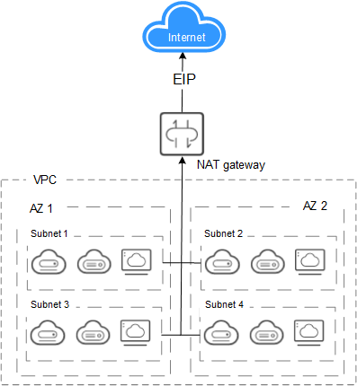
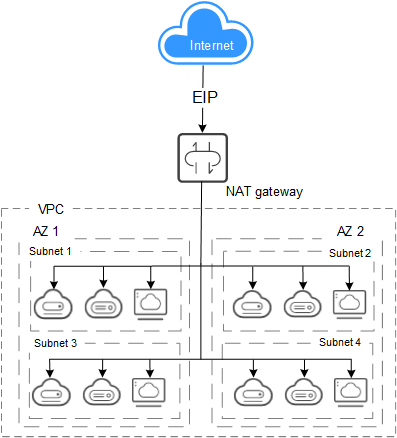

# What Is NAT Gateway?

The NAT Gateway service provides the network address translation \(NAT\) function for servers, such as Elastic Cloud Servers \(ECSs\), Bare Metal Servers \(BMSs\), and Workspace desktops, in a Virtual Private Cloud \(VPC\) or servers that connect to a VPC through Direct Connect or Virtual Private Network \(VPN\) in local data centers, allowing these servers to share elastic IP addresses \(EIPs\) to access the Internet or to provide services accessible from the Internet.

NAT Gateway supports source NAT \(SNAT\) and destination NAT \(DNAT\) functions.

-   The SNAT function translates a private IP address to a public IP address by binding EIPs to servers in a VPC, providing secure and efficient access to the Internet.

    [Figure 1](#fig439218341217)  shows the SNAT architecture.

    **Figure  1**  SNAT architecture  
    

-   The DNAT function enables servers that share the same EIPs in a VPC to provide services accessible from the Internet through the IP address mapping and port mapping.

    [Figure 2](#fig13245644101814)  shows the DNAT architecture.

    **Figure  2**  DNAT architecture  
    

