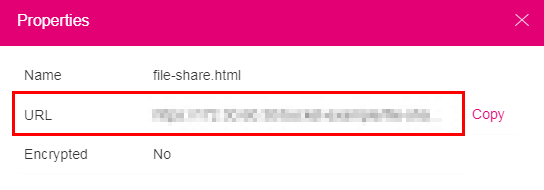

# Accessing an Object Using Its Object URL

The object uniform resource locator \(URL\) \(object sharing\) function allows anonymous users to access object data using object URLs.

## Prerequisites

An anonymous user has been assigned with the permission to read the specified object. For details, see  [Configuring an Object ACL](configuring-an-object-acl.md).

## Procedure

1.  Log in to OBS Browser.
2.  Click the bucket to be operated.
3.  Click the bucket for which you want to configure the object URL function, and click    next to the object to be shared to view the object URL. For details, see  [Figure 1](#fe095887a5e664d6aa0dd30456edda8b1).

    **Figure  1**  Object properties  
    

    -   If you select  **Other object storage services**  when logging in to OBS Browser, the object URL is in the format of https://_storage server IP address_  or  _domain name_/_bucket name_/_directory level_/_object name_. If the object is in the root directory of the bucket, the URL does not contain a  _directory level_.
    -   If you select  **OBS**  when logging in to OBS Browser, the object URL is in the format of https://_bucket name.domain name_/_directory level_/_object name._  If the object is in the root directory of the bucket, the URL does not contain a  _directory level_.

    > **NOTE:** 
    >To allow anonymous users to access objects stored in a bucket of Cold storage class using the URL, ensure that the objects are in the  **Restored**  state.
    >The method of using a browser to access objects varies depending on the object type. You can directly open  **.txt**  and  **.html**  files using a browser. However, when you open  **.exe**  and  **.dat**  files using a browser, the files are automatically downloaded to your local computer.

4.  Click  **Copy**  to copy the URL of the object.
5.  In the displayed dialog box, click  **Close**  to close the dialog box.
6.  Paste the object URL in the address box of a web browser. Press  **Enter**, and then you can access the object.

