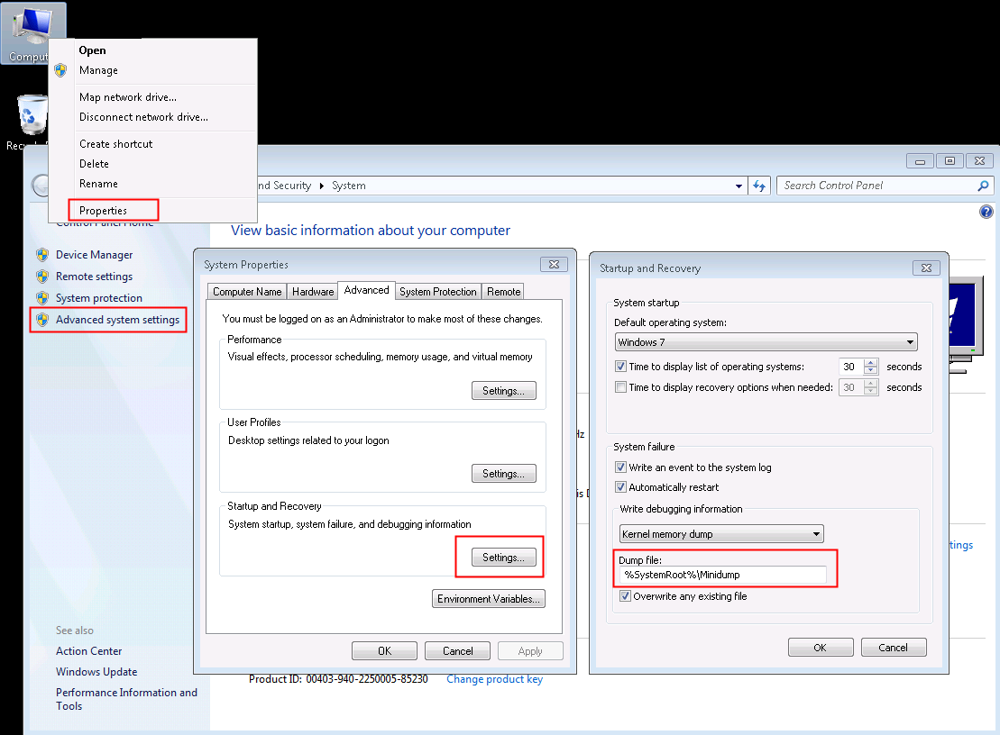

# Blue or Black Screen of Death Occurs During File Upload on OBS Browser

## Question

Why does blue or black screen of death occur when files are uploaded using OBS Browser?

## Answer

When OBS Browser is used to upload a large number of files or a few of big files, most of the memory is used. Check whether the available memory space of the PC is greater than or equal to 512 MB. If the available memory space of the PC is smaller than 512 MB, close some application programs to release the memory, or add new memory or virtual memory to the PC.

If the problem persists after memory is added, collect dump files by performing the following procedure, and contact customer service personnel for locating and solving this problem.

1.  Right-click  **Computer**  and choose  **Properties**  from the shortcut menu. In the dialog box that is displayed, click the  **Advanced**  tab. On the  **Advanced**  tab page, click  **Settings**. In the dialog box that is displayed, view the path under  **Dump file**.

    [Figure 1](#f47717ffaf52748978a29fe06579e969f)  shows a screenshot of the Windows 7 Pro SP1 64-bit operating system, which is used as an example.

    **Figure  1**  Viewing the Dump file path  
    

2.  Go to the path, copy and compress all files of which the extension is  **.dump**, and send the compressed package to customer service personnel for locating and solving this problem.

