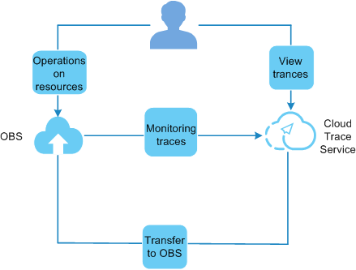

# Cloud Trace Service

Cloud Trace Service \(CTS\) records operations on cloud resources in your account. You can use the records to perform security analysis, track resource changes, audit compliance, and locate faults.

**Figure  1**  CTS  

## Procedure

1.  Log in to the management console.
2.  In the upper left corner of the top navigation menu, click    to select a region and project.
3.  Then choose  **Service List**  \>  **Management & Deployment**  \>  **Cloud Trace Service**. The  **Trace List**  page is displayed.
4.  For details about how to enable CTS, see  [Enabling CTS](https://docs.otc.t-systems.com/en-us/usermanual/cts/en-us_topic_0030598498.html)  in the  _CTS User Guide_.

## Follow-up Procedure

You can click  **Disable**  under the  **Operation**  column on the right of a tracker to disable the tracker. After the tracker is disabled, the system will stop recording operations, but you can still view existing operation records.

You can click  **Delete**  under the  **Operation**  column on the right of a tracker to delete the tracker. Deleting a tracker has no impact on existing operation records. When you enable CTS again, you can view operation records that have been generated.

