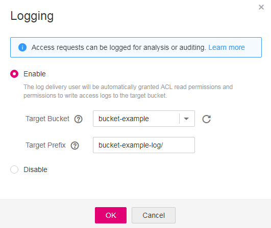

# Configuring Access Logging for a Bucket

After logging is enabled for a bucket, OBS automatically converts bucket logs into objects following the naming rules and writes the objects into a target bucket.

## Procedure

1.  In the bucket list, click the bucket to be operated. The  **Summary**  page of the bucket is displayed.
2.  In the  **Basic Configurations**  area, click the  **Logging**  label. The  **Logging**  dialog box is displayed.
3.  Select  **Enable**. For details, see  [Figure 1](#fig17700501192958).

    **Figure  1**  Logging  
    

4.  Select a bucket from existing buckets to save log files. Log delivery users of the selected bucket will be automatically assigned with the permission to read the bucket ACL and write logs to the bucket.
5.  Enter a prefix for the  **Log File Name Prefix**.

    After logging is enabled, generated logs are named in the following format:

    _<Log File Name Prefix\>_YYYY-mm-DD-HH-MM-SS-_<UniqueString\>_

    -   _<Log File Name Prefix\>_  is the shared prefix of log file names.
    -   **YYYY-mm-DD-HH-MM-SS**  indicates the date and time when the log is generated.
    -   _<UniqueString\>_  indicates a character string generated by OBS.

    On OBS Console, if configured <TargetPrefix\> ends with a slash \(/\), logs generated in the bucket are stored On OBS Console, if configured  _<Log File Name Prefix\>_  ends with a slash \(/\), logs generated in the bucket are stored in the  _<Log File Name Prefix\>_  folder in the bucket, facilitating the management of log files.

    Example:

    -   If the bucket named  **bucket**  is selected to save log files, and the log file name prefix is set to  **bucket-log/**, all log files delivered to the bucket are saved in the  **bucket-log**  folder. A log file is named as follows:  **2015-06-29-12-22-07-N7MXLAF1BDG7MPDV**.
    -   If the bucket named  **bucket**  is selected to save log files, and the log file name prefix is set to  **bucket-log**, then no folder is created for log files delivered to the bucket. A log file is named as follows:  **bucket-log2015-06-29-12-22-07-N7MXLAF1BDG7MPDV**.

    After logging is configured, you can view operation logs in the bucket that stores the logs in approximately fifteen minutes.

6.  Click  **OK**.

## Follow-up Procedure

If you do not need to record logs, click  **Disable**  in the  **Logging**  dialog box and then click  **OK**. After logging is disabled, logs are not recorded, but existing logs in the target bucket will be retained.

