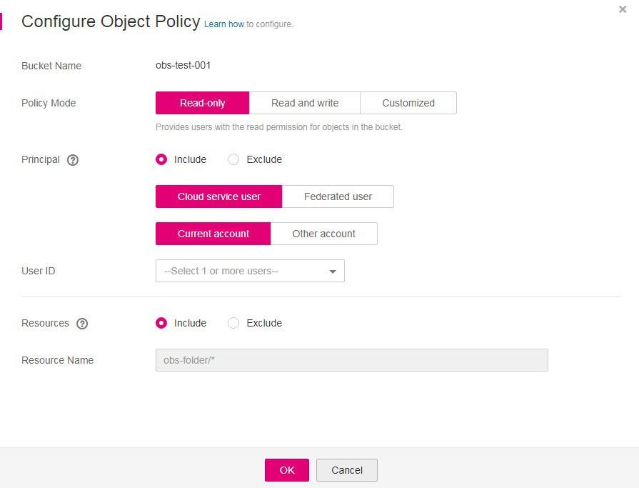
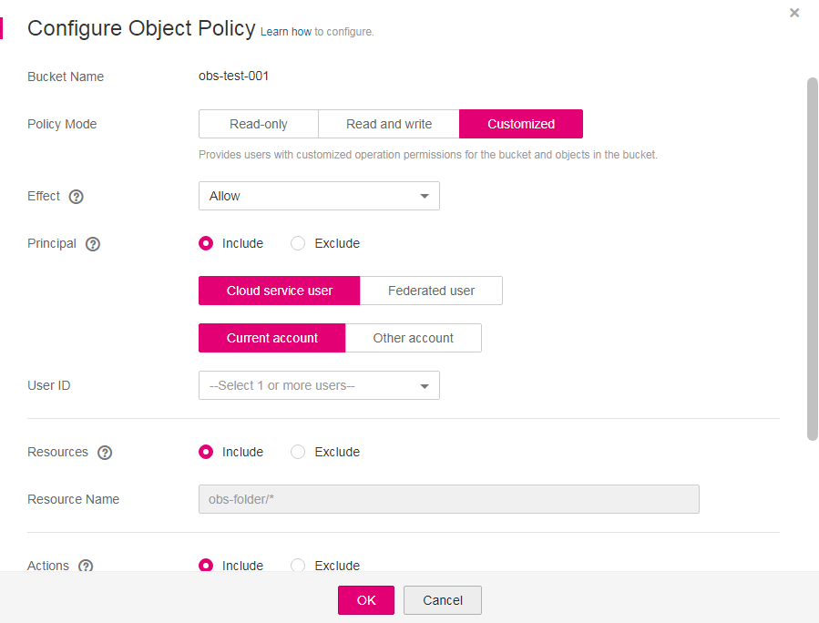

# Configuring an Object Policy

An object policy applies to a specific object, which is also part of a bucket policy. The resource of an object policy is the selected object, and the actions and conditions are the object related actions and conditions configured in the bucket policy.

## Procedure

1.  In the bucket list, click the bucket to be operated. The  **Overview**  page of the bucket is displayed.
2.  In the navigation pane on the left, click  **Objects**.
3.  On the right of the object to be operated, choose  **More**  \>  **Configure Object Policy**. The  **Configure Object Policy**  dialog box is displayed.
4.  Select a proper policy mode as required. Valid options are as follows:

    -   Read-only mode: The authorized user has the read permission to the object. For follow-up procedure, see  [5](#li3552175452220).
    -   Read and write mode: The authorized user has the read and write permissions to the object. For follow-up procedure, see  [5](#li3552175452220).
    -   Customized: The authorized user will be granted with customized permissions to the object. For detailed configuration, see  [6](#li588503161565).

    > **NOTE:** 
    >You can configure only one object policy at a time.

5.  For read-only and read and write modes, enter information about the authorized user in the following format and click  **OK**.

    **Figure  1**  Parameter settings of an object policy in the read-only or read and write mode  
    

    **Table  1**  Object policy parameters in read-only or read and write mode

    
    <table><thead align="left"><tr id="row27504174239"><th class="cellrowborder" valign="top" width="15.151515151515152%" id="mcps1.2.4.1.1">
Parameter

    </th>
    <th class="cellrowborder" valign="top" width="37.37373737373738%" id="mcps1.2.4.1.2">
Value

    </th>
    <th class="cellrowborder" valign="top" width="47.474747474747474%" id="mcps1.2.4.1.3">
Description

    </th>
    </tr>
    </thead>
    <tbody><tr id="row8783617122317"><td class="cellrowborder" valign="top" width="15.151515151515152%" headers="mcps1.2.4.1.1 ">
Principal

    </td>
    <td class="cellrowborder" valign="top" width="37.37373737373738%" headers="mcps1.2.4.1.2 "><ul id="ul278810179232"><li><strong id="b1499114720199">Include</strong> or <strong id="b195001647151916">Exclude</strong></li><li>Cloud service user, Federated user<ul id="ul103531411807"><li>If you select <strong id="b12681481385">Cloud service user</strong>, you can specify the user to be the <strong id="b1826984853817">Current account</strong> or <strong id="b52702048203815">Other account</strong>.
If you select <strong id="b12744659724">Other account</strong>, enter the account ID, which is the <strong id="b574555913216">Domain ID</strong> on the <strong id="b5745159926">My Credential</strong> page.

    </li><li>If you select <strong id="b452255323811">Federated user</strong>, you can specify the user to be an <strong id="b1252315303814">Identity provider</strong> or a <strong id="b15523155393814">User group</strong>.</li></ul>
    </li></ul>
    </td>
    <td class="cellrowborder" valign="top" width="47.474747474747474%" headers="mcps1.2.4.1.3 ">
Indicates the user that the object policy applies to.

    <ul id="ul25601236173218"><li><strong id="obs_03_0049_b9396124819353">Include</strong>: Specifies the user on whom the bucket policy statement takes effect.</li><li><strong id="obs_03_0049_b13188853163520">Exclude</strong>: Specifies that on all users except the specified user the bucket policy statement takes effect.</li></ul>
    </td>
    </tr>
    <tr id="row081741752319"><td class="cellrowborder" valign="top" width="15.151515151515152%" headers="mcps1.2.4.1.1 ">
Resources

    </td>
    <td class="cellrowborder" valign="top" width="37.37373737373738%" headers="mcps1.2.4.1.2 ">
<strong id="b5961111282010">Include</strong> or <strong id="b796319127204">Exclude</strong>

    </td>
    <td class="cellrowborder" valign="top" width="47.474747474747474%" headers="mcps1.2.4.1.3 ">
Resources on which the object policy takes effect.

    <ul id="ul1441045823718"><li><strong id="obs_03_0118_b184419873610">Include</strong>: Indicates that the policy takes effect only on the specified OBS resources.</li><li><strong id="obs_03_0118_b171841311113612">Exclude</strong>: Indicates that the bucket policy takes effect on all OBS resources except the specified ones.</li></ul>
    </td>
    </tr>
    </tbody>
    </table>

6.  For the customized mode, set parameters based on the site requirements and click  **OK**.

    **Figure  2**  Parameter settings of an object policy in the customized mode  
    

    **Table  2**  Object policy parameters in the custom mode

    
    <table><thead align="left"><tr id="row20874365144542"><th class="cellrowborder" valign="top" width="20.202020202020204%" id="mcps1.2.4.1.1">
Parameter

    </th>
    <th class="cellrowborder" valign="top" width="34.343434343434346%" id="mcps1.2.4.1.2">
Value

    </th>
    <th class="cellrowborder" valign="top" width="45.45454545454546%" id="mcps1.2.4.1.3">
Description

    </th>
    </tr>
    </thead>
    <tbody><tr id="row10774617144542"><td class="cellrowborder" valign="top" width="20.202020202020204%" headers="mcps1.2.4.1.1 ">
Effect

    </td>
    <td class="cellrowborder" valign="top" width="34.343434343434346%" headers="mcps1.2.4.1.2 ">
<strong id="b0711135462019">Allow</strong> or <strong id="b1771213544202">Deny</strong>

    </td>
    <td class="cellrowborder" valign="top" width="45.45454545454546%" headers="mcps1.2.4.1.3 ">
Effect of the object policy.

    <ul id="ul415919103710"><li><strong id="obs_03_0115_b1391852611270">Allow</strong>: Indicates that access requests are allowed, if they match the configurations of the bucket policy.</li><li><strong id="obs_03_0115_b1037794816276">Deny</strong>: Indicates that access requests are denied, if they match the configurations of the bucket policy.</li></ul>
    </td>
    </tr>
    <tr id="row46881427144542"><td class="cellrowborder" valign="top" width="20.202020202020204%" headers="mcps1.2.4.1.1 ">
Principal

    </td>
    <td class="cellrowborder" valign="top" width="34.343434343434346%" headers="mcps1.2.4.1.2 "><ul id="ul19561211185417"><li><strong id="b57446226218">Include</strong> or <strong id="b1745222142115">Exclude</strong></li><li>Cloud service user, Federated user<ul id="ul16810162511812"><li>If you select <strong id="b664717160398">Cloud service user</strong>, you can specify the user to be the <strong id="b1064741663914">Current account</strong> or <strong id="b1164861613399">Other account</strong>.
If you select <strong id="b1024981319313">Other account</strong>, enter the account ID, which is the <strong id="b1024916132316">Domain ID</strong> on the <strong id="b32507131339">My Credential</strong> page.

    </li><li>If you select <strong id="b9859208399">Federated user</strong>, you can specify the user to be an <strong id="b286102013393">Identity provider</strong> or a <strong id="b168619207395">User group</strong>.</li></ul>
    </li></ul>
    </td>
    <td class="cellrowborder" valign="top" width="45.45454545454546%" headers="mcps1.2.4.1.3 ">
Specifies users on whom this object policy takes effect, including cloud service users and federated users. A cloud service user is the one who accesses the cloud services through registration with the cloud services. A federated user is the one who accesses the cloud services through federated identity authentication.

    <ul id="ul119112314313"><li><strong id="obs_03_0049_b9396124819353_1">Include</strong>: Specifies the user on whom the bucket policy statement takes effect.</li><li><strong id="obs_03_0049_b13188853163520_1">Exclude</strong>: Specifies that on all users except the specified user the bucket policy statement takes effect.</li></ul>
    </td>
    </tr>
    <tr id="row26311294144542"><td class="cellrowborder" valign="top" width="20.202020202020204%" headers="mcps1.2.4.1.1 ">
Resources

    </td>
    <td class="cellrowborder" valign="top" width="34.343434343434346%" headers="mcps1.2.4.1.2 "><ul id="ul151711055754"><li><strong id="b188441334211">Include</strong> or <strong id="b19845133132113">Exclude</strong></li></ul>
    </td>
    <td class="cellrowborder" valign="top" width="45.45454545454546%" headers="mcps1.2.4.1.3 ">
Resources on which the object policy takes effect.

    <ul id="ul98281632306"><li><strong id="obs_03_0118_b184419873610_1">Include</strong>: Indicates that the policy takes effect only on the specified OBS resources.</li><li><strong id="obs_03_0118_b171841311113612_1">Exclude</strong>: Indicates that the bucket policy takes effect on all OBS resources except the specified ones.</li></ul>
    </td>
    </tr>
    <tr id="row461371117754"><td class="cellrowborder" valign="top" width="20.202020202020204%" headers="mcps1.2.4.1.1 ">
Actions

    </td>
    <td class="cellrowborder" valign="top" width="34.343434343434346%" headers="mcps1.2.4.1.2 "><ul id="ul732518295298"><li><strong id="b4794124413212">Include</strong> or <strong id="b479513445217">Exclude</strong></li><li>For details about the actions, see <a href="actions.md#section387654045518">Actions Related to Objects</a>.</li></ul>
    </td>
    <td class="cellrowborder" valign="top" width="45.45454545454546%" headers="mcps1.2.4.1.3 ">
Operation stated in the object policy.

    <ul id="ul13161219203711"><li><strong id="obs_03_0051_b125261325103613">Include</strong>: Specifies the actions on which the bucket policy takes effect.</li><li><strong id="obs_03_0051_b2084382816362">Exclude</strong>: Specifies that on all except the specified actions the bucket policy takes effect.</li></ul>
    </td>
    </tr>
    <tr id="row8998688144542"><td class="cellrowborder" valign="top" width="20.202020202020204%" headers="mcps1.2.4.1.1 ">
Conditions

    </td>
    <td class="cellrowborder" valign="top" width="34.343434343434346%" headers="mcps1.2.4.1.2 "><ul id="ul63480483323"><li>Condition operator: For details, see <a href="conditions.md#table16670126115713">Table 1</a>.</li><li><strong id="b115271075253">Key</strong>: For details, see <a href="conditions.md#table6707152645718">Table 2</a> and <a href="conditions.md#table14742526145718">Table 4</a>.</li><li><strong id="b799974262210">Value</strong>: The entered value is associated with the key.</li></ul>
    </td>
    <td class="cellrowborder" valign="top" width="45.45454545454546%" headers="mcps1.2.4.1.3 ">
Condition for an object policy to take effect.

    </td>
    </tr>
    </tbody>
    </table>

7.  Click  **OK**.

    After the object policy is configured successfully, it is displayed in the list under  **Custom Bucket Policies**.

