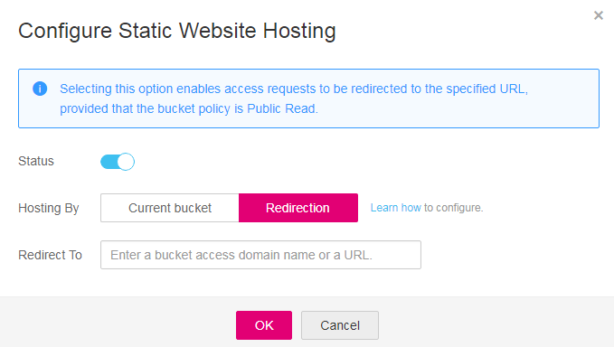

# Configuring Redirection

You can configure static website hosting by redirecting all requests for a bucket to another bucket or URL.

## Prerequisites

Web page files of the static website have been uploaded to a bucket.

If the web page files are in the Cold storage class, restore them first. For more information, see  [Restoring a Cold File Stored in OBS](restoring-a-cold-file-stored-in-obs.md).

> **NOTICE:** 
>If the hosted static website needs to be accessed by anyone, authorize anonymous users the permission to access static website files in the bucket. The configuration of static website hosting takes effect within two minutes after the configuration.

## Procedure

1.  In the bucket list, click the bucket to be operated. The  **Overview**  page of the bucket is displayed.
2.  In the  **Basic Configurations**  area, click the  **Static Website Hosting**  label. The  **Static Website Hosting**  page is displayed.

    Alternatively, you can choose  **Basic Configurations**  \>  **Static Website Hosting**  from the navigation pane on the left.

3.  Click  **Configure Static Website Hosting**. The  **Configure Static Website Hosting**  dialog box is displayed.
4.  Enable it by turning on the status switch.
5.  Set  **Hosting By**  to  **Redirection**. See  [Figure 1](#fig1131112528711)  for details. Enter a bucket access domain name or URL in the text box of  **Redirect To**.

    **Figure  1**  Configuring redirection  
    

6.  Click  **OK**.
7.  In the bucket list, click the bucket to which requests for the static website are redirected.
8.  **Optional**: To ensure that a hosted static website can be accessed by all users, configure the object ACL or bucket policy as follows, so that all static website files in the bucket can be accessed publicly.

    Authorize anonymous users the permission to read files on the static website. For details, see  [Authorizing Access Permissions to Anonymous Users](authorizing-access-permissions-to-anonymous-users.md).

    If the bucket contains only static website files, configure the  **Public Read**  policy for the bucket so that all files in the bucket can be accessed publicly.

    1.  Choose  **Permissions**  \>  **Bucket Policies**.
    2.  In the  **Standard Bucket Policies**  area, select the  **Public Read**  policy for the bucket.
    3.  Click  **Public Read**. For details, see  [Figure 2](#en-us_topic_0045853755_fig15186794193556). In the confirmation dialog box that is displayed, click  **Yes**.

        **Figure  2**  Configuring the public read permission  
        

9.  **Verification**: Input the access domain name of the bucket in the web browser and press  **Enter**. The bucket or URL to which requests are redirected will be displayed.

    > **NOTE:** 
    >In some conditions, you may need to clear the browser cache before the expected results are displayed.

