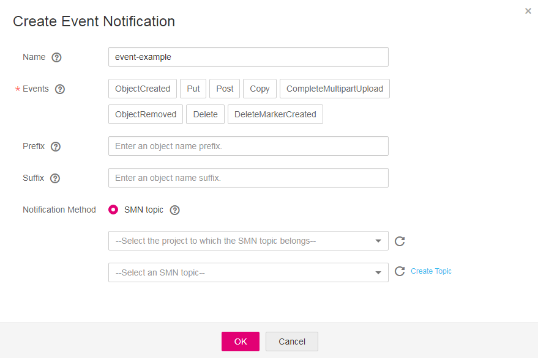

# Configuring SMN-Enabled Event Notification

This topic describes how to configure an SMN-enabled event notification rule on OBS Console.

## Background Information

For details, see  [SMN-Enabled Event Notification](smn-enabled-event-notification.md).

## Procedure

1.  In the bucket list, click the bucket to be operated. The  **Summary**  page of the bucket is displayed.
2.  In the  **Basic Configurations**  area, click the  **Event Notification**  label. The  **Event Notification**  page is displayed.

    Alternatively, you can choose  **Basic Configurations**  \>  **Event Notification**  in the navigation pane on the left.

3.  Click  **Create**. The  **Create Event Notification**  dialog box is displayed. See  [Figure 1](#fig17847723015)  for details.

    **Figure  1**  Creating an event notification rule  
    

4.  Configure parameters.  [Table 1](#aobs_console_0039_mmccppss_table01)  describes the parameters.

    **Table  1**  Event notification parameters

    
    <table><thead align="left"><tr id="row2055942"><th class="cellrowborder" valign="top" width="34%" id="mcps1.2.3.1.1">
Parameter

    </th>
    <th class="cellrowborder" valign="top" width="66%" id="mcps1.2.3.1.2">
Description

    </th>
    </tr>
    </thead>
    <tbody><tr id="row12616447"><td class="cellrowborder" valign="top" width="34%" headers="mcps1.2.3.1.1 ">
Name

    </td>
    <td class="cellrowborder" valign="top" width="66%" headers="mcps1.2.3.1.2 ">
Name of the event. If the event name is left blank, the system will automatically generate a unique ID as the event name.

    </td>
    </tr>
    <tr id="row13110201"><td class="cellrowborder" valign="top" width="34%" headers="mcps1.2.3.1.1 ">
Events

    </td>
    <td class="cellrowborder" valign="top" width="66%" headers="mcps1.2.3.1.2 ">
Various types of events. Currently, OBS supports event notification for the following event types:

    <ul id="ul43540403"><li><strong id="b1048514225810">ObjectCreated</strong>: Indicates all kinds of object creation operations, including PUT, POST, and COPY of objects, as well as the merging of parts.</li><li><strong id="b161475022395327">Put</strong>: Uploads an object using the PUT method.</li><li><strong id="b63719940162134">Post</strong>: Uploads an object using the POST method.</li><li><strong id="b1614216482110">Copy</strong>: Uploads an object using the COPY method.</li><li><strong id="b157561432376">CompleteMultipartUpload</strong>: Merges parts of multipart tasks.</li><li><strong id="b1247145233716">ObjectRemoved</strong>: Deletes an object.</li><li><strong id="b102321594591">Delete</strong>: Deletes an object with a specified version ID.</li><li><strong id="b146469154595">DeleteMarkerCreated</strong>: Deletes an object without specifying a version ID.</li></ul>
    
Multiple event types are applicable to the same object. For example, if you have selected <strong id="b2091313193599">Put</strong>, <strong id="b1691461905913">Copy</strong>, and <strong id="b1591591955916">Delete</strong> in an event notification rule, a notification message will be sent to you when the specified object is uploaded to, copied to, or deleted from the bucket. <strong id="b10982172711591">ObjectCreated</strong> contains <strong id="b9983132755917">Put</strong>, <strong id="b15984827185911">Post</strong>, <strong id="b11984927175910">Copy</strong>, and <strong id="b79851127195916">CompleteMultipartUpload</strong>. If you select <strong id="b9986132712595">ObjectCreated</strong>, the others are automatically selected and cannot be deselected. Similarly, if you select <strong id="b918816366592">ObjectRemoved</strong>, <strong id="b818911360595">Delete</strong> and <strong id="b91901136185910">DeleteMarkerCreated</strong> are automatically selected and cannot be deselected.

    </td>
    </tr>
    <tr id="row47353991"><td class="cellrowborder" valign="top" width="34%" headers="mcps1.2.3.1.1 ">
Prefix

    </td>
    <td class="cellrowborder" valign="top" width="66%" headers="mcps1.2.3.1.2 ">
Object name prefix. The event notification rule applies to objects that have the same name prefix.

    
 NOTE: 

If neither the <strong id="b11129141033217">Prefix</strong> nor the <strong id="b3429101412321">Suffix</strong> is configured, the event notification rule applies to all objects in the bucket.

    

    </td>
    </tr>
    <tr id="row16547757"><td class="cellrowborder" valign="top" width="34%" headers="mcps1.2.3.1.1 ">
Suffix

    </td>
    <td class="cellrowborder" valign="top" width="66%" headers="mcps1.2.3.1.2 ">
Object name suffix. The event notification rule applies to objects that have the same name suffix.

    
 NOTE: 
<ul id="ul75801343183518"><li>A folder path ends with a slash (/). Therefore, if you want to configure the event notification for operations on folders and you need to filter folders by suffix, the suffix must also end with a slash (/).</li><li>If neither the <strong id="b14649194213219">Prefix</strong> nor the <strong id="b16651104273212">Suffix</strong> is configured, the event notification rule applies to all objects in the bucket.</li></ul>
    

    </td>
    </tr>
    <tr id="row16019620144324"><td class="cellrowborder" rowspan="2" valign="top" width="34%" headers="mcps1.2.3.1.1 ">
SMN Topic

    </td>
    <td class="cellrowborder" valign="top" width="66%" headers="mcps1.2.3.1.2 ">
Project: The project that contains the SMN topic you want to select.

    
Projects are used to manage and classify cloud resources, including SMN topics. Each project contains different SMN topics. Select a project first and then a topic.

    </td>
    </tr>
    <tr id="row13603062"><td class="cellrowborder" valign="top" headers="mcps1.2.3.1.1 ">
Topic: specifies the SMN topic that authorizes OBS to publish messages. You can create such topics on the SMN management console.
 NOTE: 
<ul id="ul290173585413"><li class="NotesTextinTable">Once SMN topics are selected for pushing OBS event notifications, do not delete them or cancel their authorizations to OBS.</li><li class="NotesTextinTable">If the topics are deleted or their authorizations to OBS are canceled, the following conditions may occur:
a. The subscriber of the topic cannot receive messages.

    
b. Event notifications associated with unavailable topics are automatically cleared.

    </li><li>For details, see sections "Creating a Topic", "Adding a Subscription to the Topic", and "Configuring a Topic Policy" in the <em id="i028282204217">Simple Message Notification User Guide</em>.</li></ul>
    

    

    </td>
    </tr>
    </tbody>
    </table>

5.  Click  **OK**.

## Related Operations

You can click  **Edit**  under the  **Operation**  column of an event notification rule, to edit the notification rule. Also you can click  **Delete**  to delete it.

If you want to delete more than one event notification rules at a time, select them and click  **Delete**  above the list.

