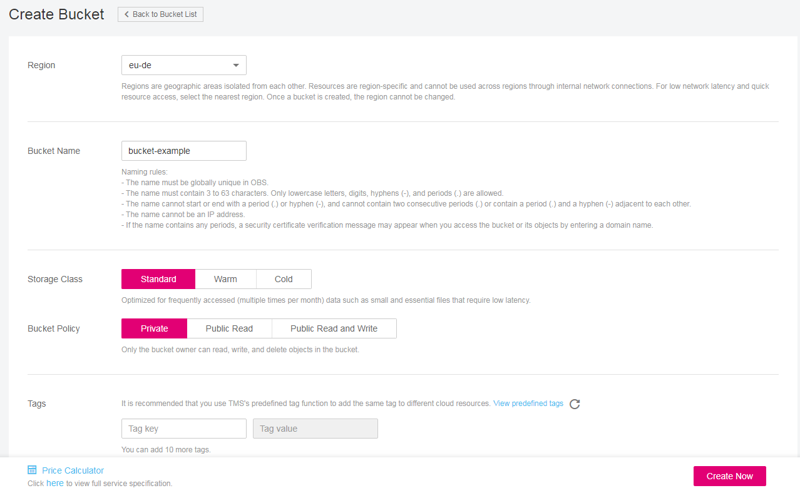

# Creating a Bucket

This section describes how to create a bucket on OBS Console. A bucket is a container that stores objects in OBS. Before you store data in OBS, you need to create a bucket first.

> **NOTE:**   
>On OBS Console, an account can have 100 buckets.  

## Procedure

1.  In the upper right corner of the OBS Console homepage, click  **Create Bucket**. The  **Create Bucket**  dialog box is displayed. See  [Figure 1](#obs_03_0306_fig30207295194414).

    **Figure  1**  Creating a bucket  
    

2.  Set  **Region**  and  **Storage Class**, and then enter a name for the bucket.

    **Table  1**  Creating a bucket

    
    <table><thead align="left"><tr id="row1830066594432"><th class="cellrowborder" valign="top" width="24.752475247524753%" id="mcps1.2.3.1.1">
Parameter

    </th>
    <th class="cellrowborder" valign="top" width="75.24752475247524%" id="mcps1.2.3.1.2">
Description

    </th>
    </tr>
    </thead>
    <tbody><tr id="row3883582794432"><td class="cellrowborder" valign="top" width="24.752475247524753%" headers="mcps1.2.3.1.1 ">
Region

    </td>
    <td class="cellrowborder" valign="top" width="75.24752475247524%" headers="mcps1.2.3.1.2 ">
Indicates the region where the bucket to be created resides. The specified region cannot be changed after the bucket is created.

    </td>
    </tr>
    <tr id="row174311157152314"><td class="cellrowborder" valign="top" width="24.752475247524753%" headers="mcps1.2.3.1.1 ">
Bucket Name

    </td>
    <td class="cellrowborder" valign="top" width="75.24752475247524%" headers="mcps1.2.3.1.2 ">
A bucket must be named according to the globally applied DNS naming regulations as follows:

    <ul id="ul5989254594432"><li>The name must be globally unique in OBS.</li><li>The name must contain 3 to 63 characters. Only lowercase letters, digits, hyphens (-), and periods (.) are allowed.</li><li>The name cannot start or end with a period (.) or hyphen (-), and cannot contain two consecutive periods (.) or contain a period (.) and a hyphen (-) adjacent to each other.</li><li>The name cannot be an IP address.</li><li>If the name contains any periods (.), a security certificate verification message may appear when you access the bucket or its objects by entering a domain name.</li></ul>
    </td>
    </tr>
    <tr id="row3976981194432"><td class="cellrowborder" valign="top" width="24.752475247524753%" headers="mcps1.2.3.1.1 ">
Storage Class

    </td>
    <td class="cellrowborder" valign="top" width="75.24752475247524%" headers="mcps1.2.3.1.2 ">
OBS provides the following storage classes: Standard, Warm, and Cold. With diversified storage classes, OBS caters to customer requirements on both storage performance and costs.

    <ul id="ul183524551845"><li>Standard storage class: applies to storing frequently accessed (multiple times per month) hot or small files that require quick response.</li><li>Warm storage class: applies to storing semi-frequently accessed (less than 12 times a year) data requiring quick response.</li><li>Cold storage class: applies to archiving rarely-accessed (once a year) data without high requirements on response speed.</li></ul>
    
For details about the storage classes, see <a href="storage-classes-overview-(console).md">Storage Classes Overview</a>.

    </td>
    </tr>
    </tbody>
    </table>

    > **NOTE:**   
    >-   When a URL is used to access a bucket, the bucket name will become a part of the URL. According to the DNS rule, URLs do not support uppercase letters and cannot be used to access a bucket whose name contains uppercase letters. Therefore, a bucket name can contain only lowercase letters, digits, hyphens \(-\), and periods \(.\) For example, if you attempt to access bucket  **MyBucket**  using the URL, bucket  **mybucket**  will be accessed instead, causing an access error.  
    >-   DNS naming can standardize the bucket naming globally, facilitating the resolution when accessing a bucket. Users can benefit from new functions and optimized features, and static website hosting is then applicable to buckets.  
    >-   Once a bucket is created, you cannot change its name. Make sure that the bucket name you set is appropriate.  

3.  Bucket policy: You can select the  **Private**,  **Public Read**, or  **Public Read and Write**  policy for a bucket.
4.  Tags: Tags are used to identify and classify OBS buckets. Each tag has only one pair of key-value. Each tag is represented by one key-value pair. For more information, see  [Tag Overview](tag-overview.md).
5.  Click  **Create Now**.

## Follow-up Procedure

You can specify its storage class when creating a bucket or change its storage class after bucket creation.

1.  In the bucket list on OBS Console, select the target bucket and click  **Change Storage Class**  on the right.
2.  Select the desired storage class and click  **OK**.

    > **NOTE:**   
    >-   Changing the storage class of a bucket does not change the storage class of existing objects in the bucket.  
    >-   When uploading an object, you can select a storage class for the object, which is the same as the bucket storage class by default. If the bucket storage class changes, the default object storage class changes accordingly.  

