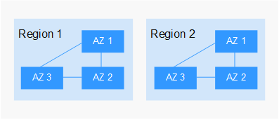

# Region and AZ

## Concept

A region and availability zone \(AZ\) identify the location of a data center. You can create resources in a specific region and AZ.

-   A region is a physical data center. Each region is completely independent, improving fault tolerance and stability. After a resource is created, its region cannot be changed.
-   An AZ is a physical location using independent power supplies and networks. Faults in an AZ do not affect other AZs. A region can contain multiple AZs, which are physically isolated but interconnected through internal networks. This ensures the independence of AZs and provides low-cost and low-latency network connections.

[Figure 1](#fig8747114281212)  shows the relationship between the regions and AZs.

**Figure  1**  Regions and AZs  

## How to Select a Region?

You are advised to select a region close to you or your target users. This reduces network latency and improves access rate.

## How to Select an AZ?

When determining whether to deploy resources in the same AZ, consider your applications' requirements for disaster recovery \(DR\) and network latency.

-   For high DR capability, deploy resources in different AZs in the same region.
-   For low network latency, deploy resources in the same AZ.

## Regions and Endpoints

Before using an API to call resources, specify its region and endpoint. For details about public cloud regions and endpoints, see  [Regions and Endpoints](https://docs.otc.t-systems.com/en-us/endpoint/index.html).

