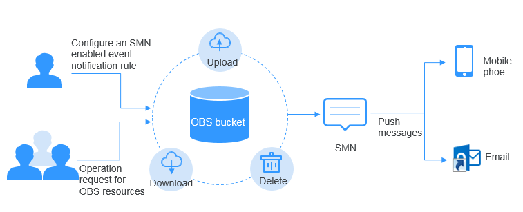

# SMN-Enabled Event Notification<a name="en-us_topic_0045853816"></a>

Simple Message Notification \(SMN\) is a reliable and extensible message notification service that can handle a huge number of messages. SMN significantly simplifies system coupling. It can automatically push messages to subscribers through emails and text messages.

OBS leverages SMN to provide the event notification function. In OBS, you can use SMN to send event notifications to specified subscribers, so that you will be informed of any critical operations \(such as upload and deletion\) that occur on specified buckets in real time. For example, you can configure an event notification rule to send messages through SMN to the specified email address whenever an upload operation occurs on the specified bucket.

You can configure the event notification rule to filter objects by the object name prefix or suffix. For example, you can add an event notification rule to send notifications whenever an object with the  **.jpg**  suffix is uploaded to the specified bucket. You can also add an event notification rule to send notifications whenever an object with the  **images/**  prefix is uploaded to the specified bucket.

For details about events supported by SMN and how to configure an SMN-enabled event notification rule, see  [Configuring SMN-Enabled Event Notification](configuring-smn-enabled-event-notification.md).

**Figure  1**  SMN-enabled event notification<a name="fig9778481781"></a>  


The message structure of an SMN notification is as follows:

```
{
    "Records":[
        {
            "eventVersion":"", //Version number. The current version is 2.0.
            "eventSource":"", //Message source. The value is fixed to aws:s3.
            "awsRegion":"", //Region where the event occurs
            "eventTime":"", //Time when an event occurs, in the ISO-8601 format, for example, 2020-07-10T09:24:11.418Z
            "eventName":"", //Name of the event that triggers the notification
            "userIdentity":{
                "principalId":"" //Billing ID of the user who triggers the event
            },
            "requestParameters":{
                "sourceIPAddress":"" //Source IP address of the request
            },
            "responseElements":{
                "x-amz-request-id":"", //ID of the request
                "x-amz-id-2":"" ///Special characters for locating problems
            },
            "s3":{
                "s3SchemaVersion":"1.0",
                "configurationId":"", //Name of the event notification rule in OBS that matches the event
                "bucket":{
                    "name":"", //Bucket name
                    "ownerIdentity":{
                        "PrincipalId":"" //Domain ID of the bucket owner
                    },
                    "arn":"" //Unique identifier of a bucket. The format is arn:aws:s3:::bucketname.
                },
                "object":{
                    "key":"", //Object name
                    "eTag":"", //ETag of the object
                    "size": , //Object size
                    "versionId":"", //Version ID of the object
                    "sequencer":""  //Identifier that defines the event sequence of a specific object
                }
            }
        }
    ]
}
```

