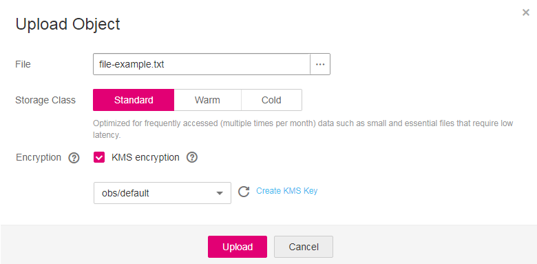

# Uploading a File with Server-Side Encryption

OBS allows users to encrypt objects using server-side encryption so that the objects can be securely stored in OBS.

## Limitations and Constraints

-   The object encryption status cannot be changed.
-   A key in use cannot be deleted. Otherwise, the object encrypted with this key cannot be downloaded.

## Prerequisites

In the region where OBS is deployed, the  **KMS Administrator**  permission has been added to the user group. For details about how to add permissions, see the  _IAM User Guide_.

## Procedure

1.  In the bucket list, click the bucket to be operated. The  **Summary**  page of the bucket is displayed.
2.  In the navigation pane on the left, click  **Objects**.
3.  Click  **Upload Object**. The  **Upload Object**  dialog box is displayed.
4.  Select the file that you want to upload and click  **Open**.
5.  Select  **KMS encryption**  and select a key that you have created in Data Encryption Workshop \(DEW\).

    After  **KMS encryption**  is selected,  **obs/default**  is selected by default as the key for the encryption. You can also click  **Create KMS Key**  to switch to the management console of KMS and create customer master keys. Then back to OBS Console and select the key from the drop-down list box for KMS encryption.

    **Figure  1**  Encrypting an object to be uploaded  
    

6.  Click  **Upload**.

    After the object is uploaded successfully, you can view its encryption status in the object list.

