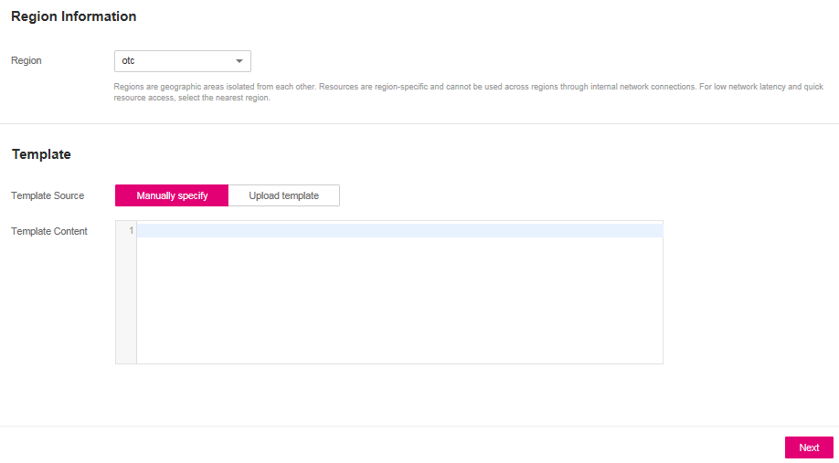
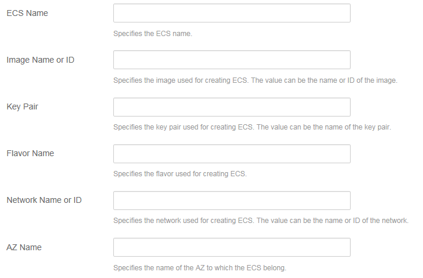

# Creating Resources Using a Template \(Using the Console\)<a name="EN-US_TOPIC_0101683908"></a>

With RTS, you can orchestrate a stack that contains a collection of resources using a template and maintain these resources by managing stacks on the console. This section describes how to orchestrate a complex application with RTS by creating an example Elastic Cloud Server \(ECS\). After the operations in this section are complete, you can view a created ECS on the ECS console.

The required operations are as follows:

1.  [Create a Key Pair](#section14934257541): Create a key pair for logging in to an ECS through SSH. If you already have a key pair, skip this step.
2.  [Create an ECS Stack](#section955894365412): Compile a template for creating an ECS.

## Create a Key Pair<a name="section14934257541"></a>

To create an ECS using RTS, you need to create a key pair first for identity authentication during SSH login.

> **NOTE:**   
>If you already have a key pair, skip this step.  

1.  Log in to the management console.
2.  Click    in the upper left corner to select the desired region and project.
3.  Under  **Computing**, click  **Elastic Cloud Server**.
4.  In the navigation tree on the left, choose  **Key Pairs**  and click  **Create Key Pair**.
5.  Enter a key pair name and click  **OK**.

    A key pair name consists of two parts:  **KeyPair**  and four random digits. You can enter an easy-to-remember name, for example,  **KeyPair-xxxx\_ecs**.

6.  Manually or automatically download the private key file. The file name is a specified key pair name with a suffix of .pem. Securely store the private key file. In the displayed dialog box, click  **OK**.

    > **NOTICE:**   
    >This is the only opportunity for you to save the private key file. Keep it secure. When creating an ECS stack, provide the name of your desired key pair. Each time you log in to the ECS using SSH, provide the private key.  


## Create an ECS Stack<a name="section955894365412"></a>

1.  Log in to the management console.
2.  Click    in the upper left corner to select the desired region and project.
3.  Under  **Management & Deployment**, click  **Resource Template Service**.
4.  Click  **Create Stack**.

    **Figure  1**  Create Stack<a name="fig34781623458"></a>  
    

5.  Confirm the desired region and project.

    If the region or project is incorrect, click the drop-down list for correction.

6.  Select  **Manually specify**  to enter the template content.

    The details of an example ECS template are as follows:

    ```
    heat_template_version: 2014-10-16
    
    description: Create a simple ECS instance.
    
    parameters:
      name:
        type: string
        label: ECS Name
        description: Specifies the ECS name.
      image:
        type: string
        label: Image Name or ID
        description: Specifies the image used for creating ECS. The value can be the name or ID of the image.
        constraints:
          - custom_constraint: glance.image
      key_name:
        type: string
        label: Key Pair
        description: Specifies the key pair used for creating ECS. The value can be the name of the key pair.
        constraints:
          - custom_constraint: nova.keypair
      flavor:
        type: string
        label: Flavor Name
        description: Specifies the flavor used for creating ECS.
        constraints:
          - custom_constraint: nova.flavor
      networks:
        type: string
        label: Network Name or ID
        description: Specifies the network used for creating ECS. The value can be the name or ID of the network.
        constraints:
          - custom_constraint: neutron.network
      availability_zone:
        type: string
        label: AZ Name
        description: Specifies the name of the AZ to which the ECS belong.
    
    parameter_groups:
      - label: ECS
        parameters:
          - name
          - image
          - key_name
          - flavor
          - networks
          - availability_zone
    
    resources:
      nova_serer:
        type: OS::Nova::Server
        properties:
          name: { get_param: name } 
          image: { get_param: image }
          flavor: { get_param: flavor }
          key_name: { get_param: key_name }
          networks:
            - network: { get_param: networks }
          availability_zone: { get_param: availability_zone }
    ```

    This YAML file contains five first-level fields:

    -   **heat\_template\_version**: indicates the template version.
    -   **description**: provides a description for the template.
    -   **parameters**: defines template parameters. In this example template, this field defines the ECS name, image name or ID, key pair, specifications, VPC, and AZ. All of these can be used by function  **get\_param**  in  **resources**.
    -   **parameter\_groups**: indicates the parameter groups and the parameter sequence.
    -   **resources**: defines resources to be created by the template. In this example, the resources is an ECS.  **type**  defines the resource type. Function  **get\_param**  in  **properties**  directly uses parameters defined in  **parameters**.

    > **NOTE:**   
    >For more information about resource templates, see  [Template Structure](template-structure.md).  

    Enter and verify template content and click  **Next**.

7.  Specify details. Enter the stack name, ECS name, image, key pair, specifications, VPC, and AZ. Click  **Next**.

    **Figure  2**  Specifying details<a name="fig10711329161816"></a>  
    

8.  Confirm the information and create  **Next**.

    It takes some time to complete the creation. After the stack is created, click  **Stack Management**  in the left pane to view the stack status. You can also access the ECS console to view the created ECS.


For more information about stack management and templates, see  [Stack Management](stack_management)  and  [Example Templates](example_templates).

