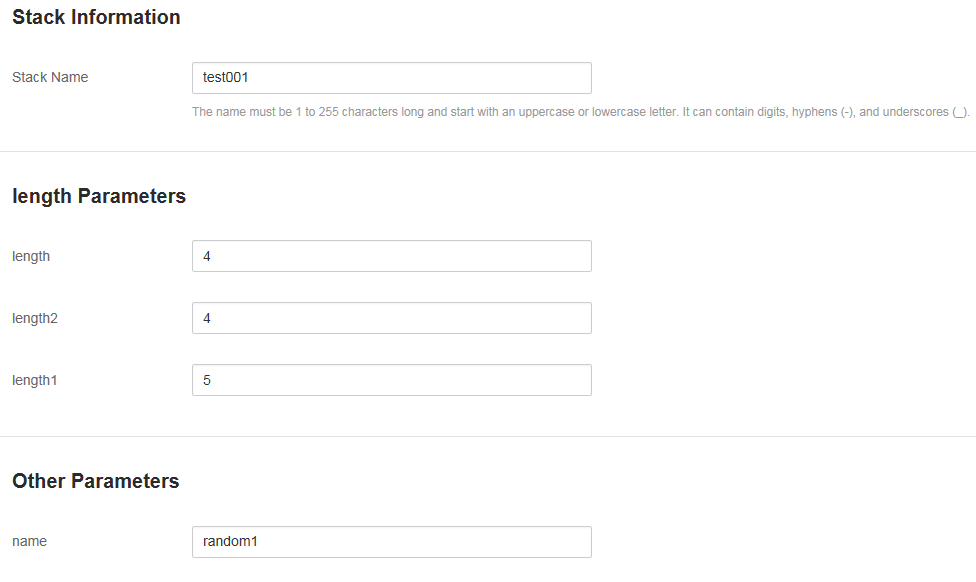

# Parameters<a name="EN-US_TOPIC_0076468585"></a>

## Parameters<a name="section8544263274"></a>

Parameters are specified in the  **parameters**  field. Using parameters improves template flexibility and reusability. Some parameters in the template can be replaced as needed during stack creation.

You can use defined parameters in  **resources**  and  **outputs**  fields by invoking internal function  **get\_param**.

The following provides an example:

```
parameters:
  name:
    type: string
    label:
    description: 
    default: Parameter default value
```

Description:

-   **type**: indicates the value type of a parameter, including string and number.
-   **label**: indicates the name of the parameter label displayed on the console.
-   **description**: indicates an explanation of this parameter.
-   **default**: indicates the default value of the parameter.

## Parameter Groups<a name="section27616456270"></a>

A parameter group is specified in the  **parameter\_groups**  field. This field is used to group entered parameters and specify their sequence. This field is optional.

The following provides an example:

```
heat_template_version: 2014-10-16
description: Create a serious of random strings
parameters:
  name:
    type: string
    default: random1
  length:
    type: number
    default: 4
  length1:
    type: number
    default: 5
  length2:
    type: number
    default: 4
parameter_groups:
  - label: length
    parameters:
      - length
      - length2
      - length1
resources:
  random1:
    type: OS::Heat::RandomString
    properties:
      length: 5
  random2:
    type: OS::Heat::RandomString
    properties:
      length: 5
```

The parameter group includes three parameters:  **length**,  **length1**, and  **length2**. Set  **label**  to  **length**  and define these parameters in the  **Parameters**  area. After a template is uploaded, parameters are classified into two types:  **length Parameters**  and  **Other Parameters**  on the  **Specify Details**  page.

**Figure  1**  Parameter information<a name="fig13333585294"></a>  


## Parameter Constraints<a name="section128051566282"></a>

When compiling a template, you can configure  **custom\_constraint**  to obtain the list of values on the  **Specify Details**  page. You only need to select a value from the drop-downlist, reducing configuration time.

The  **custom\_constraint**  attribute currently supports the following types:

-   glance.image
-   cinder.volume
-   neutron.network
-   neutron.router
-   neutron.subnet
-   nova.flavor
-   nova.keypair

For example,  **custom\_constraint**  is configured for parameters  **image**,  **key\_name**,  **flavor**, and  **networks**  in the template for creating an ECS. The list of values of four parameters on the  **Specify Details**  page. For details, see  [Creating Resources Using a Template \(Using the Console\)](creating-resources-using-a-template-(using-the-console).md).

## Valid Parameter Values<a name="section21341848717"></a>

Valid-value constraints can be applied to numeric or string-type parameters, which specify a set of parameter values that a parameter may have. During the deployment, user-supplied values must match an element in the list of valid values.

The syntax is as follows:

```
allowed_values: [<value 1>, <value 2>, ...]
```

Or the following format:

```
allowed_values:
- <value 1>
- <value 2>
  - ...
```

