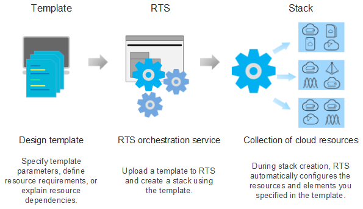

# RTS

Resource Template Service \(RTS\) helps you simplify cloud computing resource management and automate O&M. You can compile a template file and define a collection of cloud computing resources, dependencies between resources, and resource configurations based on the template specifications defined in the RTS service. Then you can automatically create and configure all resources in the template using the orchestration engine to simplify deployment and O&M. The RTS service supports most APIs of the native OpenStack Heat component and templates in the HOT \(Heat Orchestration Template\) format.

**Figure  1**  Resource template  

You can use the RTS service with methods in  [Table 1](#table1162712315426).

**Table  1**  Methods of using RTS

<table><thead align="left"><tr id="row186271832429"><th class="cellrowborder" valign="top" width="26.97%" id="mcps1.2.3.1.1">
<strong id="b64557423570">Method</strong>

</th>
<th class="cellrowborder" valign="top" width="73.03%" id="mcps1.2.3.1.2">
<strong id="b59668775720">Description</strong>

</th>
</tr>
</thead>
<tbody><tr id="row14628163124218"><td class="cellrowborder" valign="top" width="26.97%" headers="mcps1.2.3.1.1 ">
Management console

</td>
<td class="cellrowborder" valign="top" width="73.03%" headers="mcps1.2.3.1.2 ">
The management console is a web-based visualized user interface, which is helpful for beginners to learn.

</td>
</tr>
<tr id="row2062810364213"><td class="cellrowborder" valign="top" width="26.97%" headers="mcps1.2.3.1.1 ">
Heat client

</td>
<td class="cellrowborder" valign="top" width="73.03%" headers="mcps1.2.3.1.2 ">
The Heat client is a subproject of OpenStack Client, functioning as a command line client targeted for Heat. You can use this client to access cloud services by running commands.

For details, see <a href="heat-client.md">Heat Client</a>.

</td>
</tr>
<tr id="row196288354215"><td class="cellrowborder" valign="top" width="26.97%" headers="mcps1.2.3.1.1 ">
API

</td>
<td class="cellrowborder" valign="top" width="73.03%" headers="mcps1.2.3.1.2 ">
The API (Application Programming Interface) management mode is based on HTTPS requests. If you need to integrate RTS into a third-party system for secondary development, use APIs to access the RTS service.

For details, see the <em id="i1799812574266">Resource Template Service API Reference</em>.

</td>
</tr>
</tbody>
</table>

## Basic Concepts

-   Templates

    An RTS template is a user-readable, easy-to-write file that describes how to deploy a set of resources and install the required software. Templates specify the resources to use, the attributes to set, and the parameters required for automatic deployment of a specific application. Template files can be in the YAML or JSON format.

-   Resources

    Resources are objects that are orchestrated by Heat. Currently, multiple cloud services are supported, such as Elastic Cloud Server \(ECS\), Elastic Volume Service \(EVS\), Elastic Load Balance \(ELB\), Cloud Eye, Relational Database Service \(RDS\), Scalable File Service \(SFS\), and Virtual Private Cloud \(VPC\).

-   Stacks

    A stack is a collection of resources, which may include multiple ECSs, networks, and EVS disks. You can use a template to create a stack that includes a set of resources to accommodate the specified application framework or components included in the templates. A stack is actually a running instance of a template, namely, you can deploy, update, and delete a collection of resources by creating, updating, and deleting stacks.

-   Regions and AZs

    A region is a geographic area where resources used by your RTS are located.

    An availability zone \(AZ\) is the physical location where resources use independent power supplies and networks. AZs are isolated from each other. An AZ can provide an economical, low-latency network connection for other AZs in the same region. A region can have multiple AZs. AZs are physically isolated from each other and communicate with each other over an internal network.

## Product Functions

-   Stack management: A stack is a cloud application based on a template. Stack management allows you to create, update, and delete stacks and manage resources, events, and templates in the stack.
-   Resource orchestration: You only need to create a resource configuration template in the JSON or YAML format. RTS analyzes resource dependencies based on your template and orchestrates resources on clouds in the sequence of resources, for example, if A depends on B and B depends on C, RTS will create C first, then B, and finally create A.

