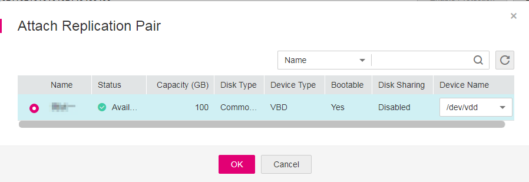

# Attaching a Replication Pair

## Scenarios

You can perform steps provided in this section to attach a replication pair to a protected instance. Then, the production site disk is attached to the production site server, and the DR site disk is attached to the DR site server.

After protection is enabled for a protection group, when data is written into the production site disk, the same data is written into the DR site disk synchronously.

## **Prerequisites**

-   The protection group is in the  **Available**  or  **Protecting**  state.
-   The protected instance is in the  **Available**  or  **Protecting**  state.
-   The replication pair is in the  **Available**  or  **Protecting**  state.
-   The non-shared replication pair has not been attached to any protected instance.

## Procedure

1.  Log in to the management console.
2.  Click  **Service List**  and choose  **Storage**  \>  **Storage Disaster Recovery Service**.

    The  **Storage Disaster Recovery Service**  page is displayed.

3.  In the pane of the protection group for which the replication pair is to be attached to the protected instance, click  **Protected Instances**.

    The operation page for the protection group is displayed.

4.  On the  **Protected Instances**  tab, locate the row containing the desired protected instance and click  **Attach**  in the  **Operation**  column.

    The  **Attach Replication Pair**  page is displayed.

    **Figure  1**  Attaching a replication pair  
    

5.  Select the replication pair to be attached and a desired device name, and click  **OK**. 

    The replication pair is attached to the specified protected instance.

