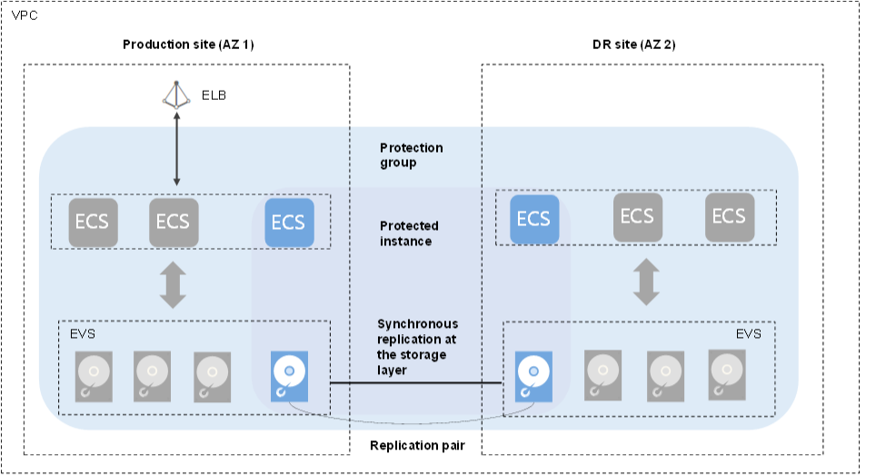

# SDRS Introduction

## Storage DR

Storage Disaster Recovery Service \(SDRS\) provides disaster recovery \(DR\) services for many cloud services, such as Elastic Cloud Server \(ECS\) and Elastic Volume Service \(EVS\). SDRS uses multiple technologies, such as storage replication, data redundancy, and cache acceleration, to provide high data reliability and service continuity for users.

SDRS protects service applications by replicating the server data and configurations to a DR site. It allows service applications to start at the DR site in the event that servers at the production site stop. This improves service availability and continuity.

**Figure  1**  Storage DR  

## DR and Backup

Differences between disaster recovery \(DR\) and backup are as follows:

-   DR is used to prevent impacts on the systems caused by natural disasters, such as fires and earthquakes. A production site and its DR site must be located with a certain secure distance. Backup is to prevent impacts on the systems caused by inappropriate manual operations, virus infection, and logic errors. It is used to restore the service system data. Usually, a system and its backup are deployed in the same data center.
-   A DR system protects data but more focuses on protecting service continuity. A data backup system only ensures that data generated at different time points can be restored. Generally, the system performs the full backup for the first time, which takes a long period of time. The subsequent backup is incremental and can be completed within a short period of time.
-   The highest DR standard is to implement zero RPO. You can set a maximum of 24 automatic backup policies at different time points in one day to restore data to different backup points.
-   If a disaster occurs, such as earthquakes or fires, a DR system takes only several minutes to perform a failover, but a backup system takes several hours or even dozens of hours to restore the data.

