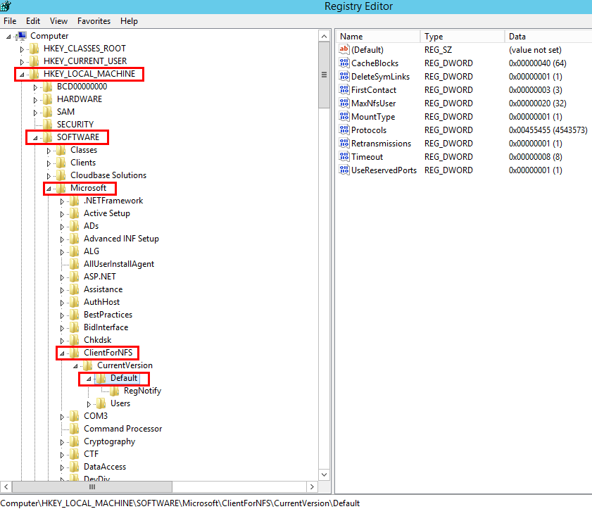
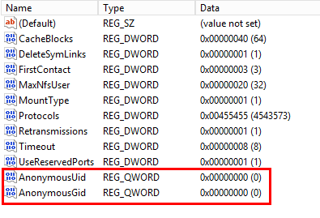

# Data Fails to Be Written to a File

## Symptom

If a file system is mounted to an ECS running Linux and an ECS running Windows, on the ECS running Windows, data cannot be written to the files created on the ECS running Linux.

## Possible Causes

A shared NFS file system belongs to the root user and cannot be modified. The write permission is granted to a user only when both the values of UID and GID of the user are  **0**. You can check your UID using Windows commands. If the value of UID is, for example,  **-2**, you do not have the write permission.

## Fault Diagnosis

To address this problem, you need to modify the registry and change both values of UID and GID of the Windows user accessing NFS to  **0**.

## Solution

1.  Choose  **Start**  \>  **Run**  and enter  **regedit**  to open the registry.
2.  Enter the  **HKEY\_LOCAL\_MACHINE\\SOFTWARE\\Microsoft\\ClientForNFS\\CurrentVersion\\Default**  directory.  [Figure 1](#fig103481655182917)  shows an example of the directory.

    **Figure  1**  Entering the directory  
    

3.  Right-click the blank area and choose  **New**  \>  **QWORD Value**  from the shortcut menu. Set  **AnonymousUid**  and  **AnonymousGid**  to  **0**.  [Figure 2](#fig56963212379)  shows a successful operation.

    **Figure  2**  Adding values  
    

