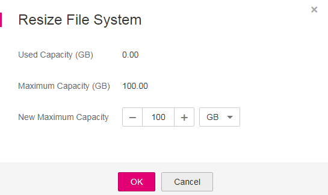

# Resizing a File System

You can expand or shrink the capacity of a file system when needed.

## Rules for Resizing

-   Expanding a file system

    Total capacity of a file system after expansion ≤ \(Capacity quota of the cloud account - Total capacity of all the other file systems owned by the cloud account\)

    For example, cloud account A has a quota of 500 TB. This account has already created three file systems: SFS1 \(350 TB\), SFS2 \(50 TB\), and SFS3 \(70 TB\). If this account needs to expand SFS2, the new capacity of SFS2 cannot be greater than 80 TB. Otherwise, the system will display a message indicating an insufficient quota and the expansion operation will fail.

-   Shrinking a file system
    -   When a shrink error or failure occurs on a file system, it takes approximately five minutes for the file system to restore to the available state.
    -   After a shrink operation fails, you can only reattempt to shrink the file system storage capacity but cannot expand it directly.
    -   Total capacity of a file system after shrinking ≥ Used capacity of the file system

        For example, cloud account B has created a file system, SFS1. The total capacity and used capacity of SFS1 are 50 TB and 10 TB respectively. When shrinking SFS1, the user cannot set the new capacity to be smaller than 10 TB.

## Procedure

1.  Log in to SFS Console.
2.  In the file system list, click  **Resize**  in the row of the file system you want to resize. The  **Resize File System**  dialog box is displayed. See  [Figure 1](#fig50999458171929).

    **Figure  1**  Resizing a file system  
    

3.  Enter a new maximum capacity of the file system based on service requirements, and click  **OK**.  [Table 1](#table1834202713541)  describes the parameters.

    **Table  1**  Parameter description

    
    <table><thead align="left"><tr id="row134242765411"><th class="cellrowborder" valign="top" width="50%" id="mcps1.2.3.1.1">
Parameter

    </th>
    <th class="cellrowborder" valign="top" width="50%" id="mcps1.2.3.1.2">
Description

    </th>
    </tr>
    </thead>
    <tbody><tr id="row172041324557"><td class="cellrowborder" valign="top" width="50%" headers="mcps1.2.3.1.1 ">
Used Capacity (GB)

    </td>
    <td class="cellrowborder" valign="top" width="50%" headers="mcps1.2.3.1.2 ">
Used capacity of the current file system

    </td>
    </tr>
    <tr id="row20398205885419"><td class="cellrowborder" valign="top" width="50%" headers="mcps1.2.3.1.1 ">
Maximum Capacity (GB)

    </td>
    <td class="cellrowborder" valign="top" width="50%" headers="mcps1.2.3.1.2 ">
Maximum capacity of the current file system

    </td>
    </tr>
    <tr id="row311311253562"><td class="cellrowborder" valign="top" width="50%" headers="mcps1.2.3.1.1 ">
New Maximum Capacity (GB)

    </td>
    <td class="cellrowborder" valign="top" width="50%" headers="mcps1.2.3.1.2 ">
Target maximum capacity of the file system after expanding or shrinking. The value ranges from <strong id="b4809751457">1 GB</strong> to <strong id="b10681155658">512,000 GB</strong>.

    
 NOTE: 

The new maximum capacity cannot be smaller than the used capacity.

    

    </td>
    </tr>
    </tbody>
    </table>

4.  In the dialog box that is displayed, confirm the information and click  **Yes**.
5.  In the file system list, check the capacity information after resizing.

