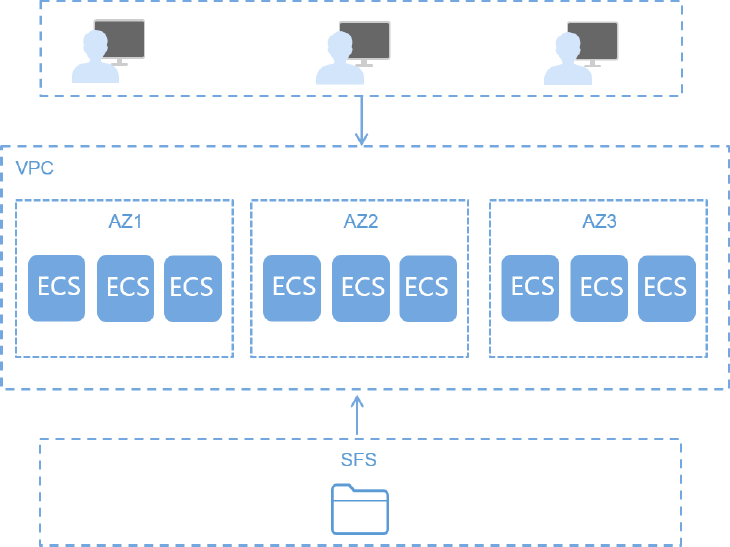

# SFS

Scalable File Service \(SFS\) is a network attached storage \(NAS\) service that provides scalable high-performance file storage. With the service, shared access can be achieved among multiple Elastic Cloud Servers \(ECSs\), Bare Metal Servers \(BMSs\), and containers created on Cloud Container Engine \(CCE\). See  [Figure 1](#fig1762807410259).

**Figure  1**  Accessing SFS  

Compared with traditional file sharing storage, SFS has the following advantages:

-   File sharing

    ECSs in multiple availability zones \(AZs\) of a same region can access the same file system concurrently and share files.

-   Elastic scaling

    Storage can be scaled up or down on demand to dynamically adapt to service changes without interrupting applications. You can complete resizing with a few clicks.

-   Superior performance

    The service enables file system performance to increase as capacity grows, and delivers a high data durability to support rapid service growth.

-   Seamless integration

    SFS supports Network File System \(NFS\). With this standard protocol, a broad range of mainstream applications can read and write data in the file system.

-   Easy operation and low costs

    In an intuitive graphical user interface \(GUI\), you can create and manage file system with ease. 

