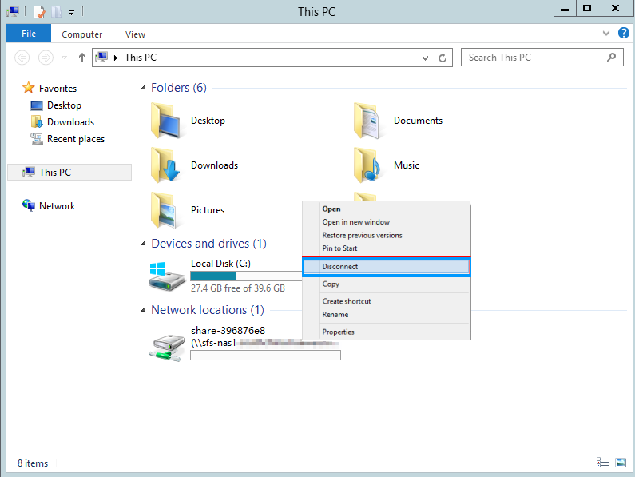

# Step 3: Unmount a File System

If a file system is no longer used and needs to be deleted, you are advised to unmount the file system and then delete it.

## Linux OS

1.  Log in to the ECS.
2.  Run the following command:

    **umount** _Local path_

    _Local path_: Local path used to mount the file system on the ECS, for example,  **/local\_path**.

    > **NOTE:**   
    >Before running the  **umount**  command, stop all read and write operations related to the file system and exit from the local path. Otherwise, the unmounting fails.  

## Windows OS

1.  Log in to the ECS.
2.  Right-click the file system to be unmounted and choose  **Disconnect**.

    **Figure  1**  Unmounting  
    

3.  If the mounted file system does not exist in the network location anymore, the file system is successfully unmounted.

