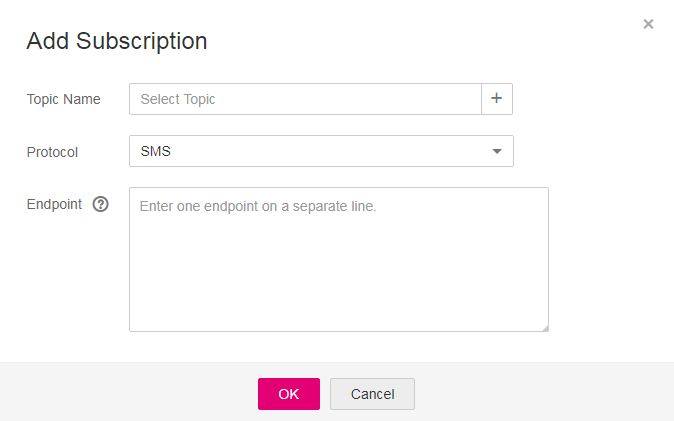

# Adding a Subscription

## Scenario

To deliver messages published to a topic to endpoints, you must add the subscription endpoints to the topic. Endpoints can be email addresses, phone numbers, message queues, and HTTP/HTTPS URLs. After you add endpoints to the topic and the subscribers confirm the subscription, they are able to receive messages published to the topic.

You can add multiple subscriptions to each topic. This section describes how to add subscriptions to a topic you created or one to which you have been granted permissions and how to delete subscriptions.

## To Add a Subscription

1.  Log in to the management console.
2.  Click    on the upper left to select the desired region and project.
3.  In the  **Application**  category, click  **Simple Message Notification**.

    The SMN console is displayed.

4.  In the navigation pane, choose  **Subscriptions**.

5.  Click  **Add Subscription**.

    The  **Add Subscription**  box is displayed.

    **Figure  1**  Add Subscription  
    

6.  Specify the required subscription information.
    1.  Click    beside the  **Topic Name**  box to select a topic.
    2.  Specify the subscription protocol and endpoints.

        **Table  1**  Required subscription information

        
        <table><thead align="left"><tr id="row4550804216264"><th class="cellrowborder" valign="top" width="18.990000000000002%" id="mcps1.2.3.1.1">
<strong id="b5030070116264">Parameter</strong>

        </th>
        <th class="cellrowborder" valign="top" width="81.01%" id="mcps1.2.3.1.2">
<strong id="b2777129716264">Description</strong>

        </th>
        </tr>
        </thead>
        <tbody><tr id="row9669750155910"><td class="cellrowborder" valign="top" width="18.990000000000002%" headers="mcps1.2.3.1.1 ">
Topic Name

        </td>
        <td class="cellrowborder" valign="top" width="81.01%" headers="mcps1.2.3.1.2 ">
Name of the topic to subscribe to

        </td>
        </tr>
        <tr id="row153044716264"><td class="cellrowborder" valign="top" width="18.990000000000002%" headers="mcps1.2.3.1.1 ">
Protocol

        </td>
        <td class="cellrowborder" valign="top" width="81.01%" headers="mcps1.2.3.1.2 ">
Protocol the subscription endpoints support. The available options include <strong id="b2041793552202137">SMS</strong>, <strong id="b842352706202512">DMS</strong>, <strong id="b84235270610165">Email</strong>, <strong id="b842352706101613">HTTP</strong>, and <strong id="b842352706101618">HTTPS</strong>.

        </td>
        </tr>
        <tr id="row3620920716264"><td class="cellrowborder" valign="top" width="18.990000000000002%" headers="mcps1.2.3.1.1 ">
Endpoint

        </td>
        <td class="cellrowborder" valign="top" width="81.01%" headers="mcps1.2.3.1.2 ">
Subscription endpoint. You can enter up to 10 SMS, email, HTTP, or HTTPS endpoints, one in each line.

        <ul id="ul4684327816264"><li><strong id="b979883229152813">SMS</strong>: Enter one or more valid phone numbers.
The phone number is preceded by a plus sign (+) and a country code.

        
Example:

        
<strong id="b84235270614502">+4900000000</strong>

        
<strong id="b84235270614505">+4900000001</strong>

        
<strong id="b84235270614509">+4900000002</strong>

        
<strong id="b842352706145012">+4900000003</strong>

        </li><li><strong id="b213535384154035">Email</strong>: Enter one or more valid email addresses.
Example:

        
<strong id="b842352706145031">username1@example.com</strong>

        
<strong id="b842352706145038">username2@example.com</strong>

        </li><li><strong id="b84235270691358">HTTP</strong> or <strong id="b8423527069146">HTTPS</strong>: Enter one or more public network URLs.
Example:

        
<strong id="b842352706145047">http://example1.com/notification/action</strong>

        
<strong id="b842352706145051">http://example2.com/notification/action</strong>

        </li><li><strong id="b842352706203344">DMS</strong>: Click  to select a message queue. Ensure that the queue policy grants the <strong id="b8423527061693">DMS:ProduceMessages</strong> permission to SMN. For details, see "Managing Queue Policies" in the <em id="i842352697152551">Distributed Message Service User Guide</em>.</li></ul>
        </td>
        </tr>
        </tbody>
        </table>

7.  Click  **OK**.

    The subscription you added is displayed in the subscription list.

    > **NOTE:**   
    >-   To prevent malicious users from attacking subscription endpoints, SMN limits the number of confirmation messages that can be sent to an endpoint within a specified period of time. For details, see section  [Control on Subscription Confirmation Traffic](control-on-subscription-confirmation-traffic.md).  
    >-   SMN does not check whether subscription endpoints exist when you add subscriptions. However, subscribers will not receive notification messages until they confirm their subscriptions.  
    >-   The token is valid only for 48 hours. Therefore, subscribers must confirm subscriptions within that time.  

