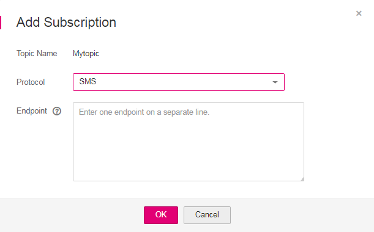

# Adding a Subscription

## Scenario

To deliver messages published to a topic to subscription endpoints, you must add the endpoints to the topic.

## To Add a Subscription

1.  Log in to the management console.
2.  Click    on the upper left to select the desired region and project.
3.  In the  **Application**  category, click  **Simple Message Notification**.

    The SMN console is displayed.

4.  In the navigation pane, choose  **Topics**.

    The  **Topics**  page is displayed.

5.  Locate the topic to which you want to add a subscription, click  **More**  under  **Operation**, and select  **Add Subscription**.

    The  **Add Subscription**  box is displayed.

    **Figure  1**  Add Subscription  
    

6.  Specify the subscription protocol and endpoints. You can enter 10 endpoints at most, each on a separate line.
    -   Email

        Enter a valid email address, for example,  **username@example.com**.

        Subscribers will receive a subscription confirmation email valid in 48 hours and must confirm the subscription to receive messages published to the topic.

    -   HTTP/HTTPS

        Enter a public network URL, for example,  **http://example.com/notification/action**. HTTP/HTTPS subscribers must confirm their subscriptions. For details about HTTP/HTTPS messages, see section  [Introduction](introduction-3.md).

    -   SMS

        Enter a valid mobile number preceded by a plus sign \(+\) and a country code, for example,  **+4900000000**.

        Subscribers will receive a subscription confirmation message valid in 48 hours and must confirm the subscription to receive messages published to the topic.

    -   DMS

        Subscription endpoints are message queues. This type of subscriptions does not need confirmation. Click    to select subscription endpoints. Ensure that the queue policy grants the  **DMS:ProduceMessages**  permission to SMN. For details, see "Managing Queue Policies" in the  _Distributed Message Service User Guide_.

7.  Click  **OK**.

    The subscription you added is displayed in the subscription list.

    > **NOTE:**   
    >-   To prevent malicious users from attacking subscription endpoints, SMN limits the number of confirmation messages that can be sent to an endpoint within a specified period of time. For details, see section  [Control on Subscription Confirmation Traffic](control-on-subscription-confirmation-traffic.md).  
    >-   SMN does not check whether subscription endpoints exist when you add subscriptions. However, subscribers will not receive notification messages until they confirm their subscriptions.  
    >-   The token is valid only for 48 hours. Therefore, subscribers must confirm subscriptions within that time.  

