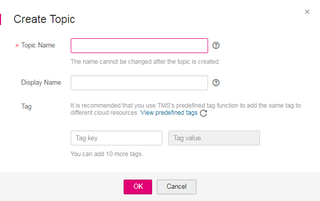

# Creating a Topic

## Scenario

A topic is a specified event to publish messages and subscribe to notifications. It serves as a message sending channel, where publishers and subscribers can interact with each other.

## To Create a Topic

1.  Log in to the management console.
2.  Click    on the upper left to select the desired region and project.
3.  In the  **Application**  category, click  **Simple Message Notification**.

    The SMN console is displayed.

4.  In the navigation pane, choose  **Topics**.

    The  **Topics**  page is displayed.

5.  Click  **Create Topic**.

    The  **Create Topic**  box is displayed.

    **Figure  1**  Create Topic  
    

6.  Enter a topic name and display name.

    **Table  1**  Information required for creating a topic

    
    <table><thead align="left"><tr id="en-us_topic_0043394871_row46643153153632"><th class="cellrowborder" valign="top" width="21%" id="mcps1.2.3.1.1">
<strong id="en-us_topic_0043394871_b4942326616041">Parameter</strong>

    </th>
    <th class="cellrowborder" valign="top" width="79%" id="mcps1.2.3.1.2">
<strong id="en-us_topic_0043394871_b4386163916041">Description</strong>

    </th>
    </tr>
    </thead>
    <tbody><tr id="en-us_topic_0043394871_row15993813153632"><td class="cellrowborder" valign="top" width="21%" headers="mcps1.2.3.1.1 ">
Topic Name

    </td>
    <td class="cellrowborder" valign="top" width="79%" headers="mcps1.2.3.1.2 ">
Topic name, which:

    <ul id="en-us_topic_0043394871_ul40971925153757"><li>Contains only letters, numerals, hyphens (-), and underscores (_) and starts with a letter or numeral.</li><li>Is a string of 1 to 255 characters.</li><li>Must be unique and cannot be modified once the topic is created.</li></ul>
    </td>
    </tr>
    <tr id="row1798615142421"><td class="cellrowborder" valign="top" width="21%" headers="mcps1.2.3.1.1 ">
Display Name

    </td>
    <td class="cellrowborder" valign="top" width="79%" headers="mcps1.2.3.1.2 ">
Message sender name, which must be less than 192 bytes.

    
 NOTE: 

After you specify a display name, the sender in email messages will be presented as <em id="i1306384680">Display name</em><strong id="b1698617597">&lt;username@example.com&gt;</strong>. Otherwise, the sender will be <strong id="b1444431809">username@example.com</strong>.

    

    </td>
    </tr>
    <tr id="row101210019315"><td class="cellrowborder" valign="top" width="21%" headers="mcps1.2.3.1.1 ">
Tag

    </td>
    <td class="cellrowborder" valign="top" width="79%" headers="mcps1.2.3.1.2 ">
Tags consist of keys and values. They identify cloud resources so that you can easily categorize and search for your resources.

    <ul id="ul584116317458"><li>A key or value is composed of letters, numerals, special characters -_@ and cannot start or end with a space. A key contains 36 characters at most, and a value contains 43 characters at most.</li><li>You can add up to 10 tags for each topic.</li></ul>
    </td>
    </tr>
    </tbody>
    </table>

7.  Click  **OK.**

    The topic you created is displayed in the topic list. The system generates a topic URN, which is the unique resource identifier of the topic and cannot be changed.

8.  Click the name of the topic to view its details, including the subscriptions, URN, and display name.

