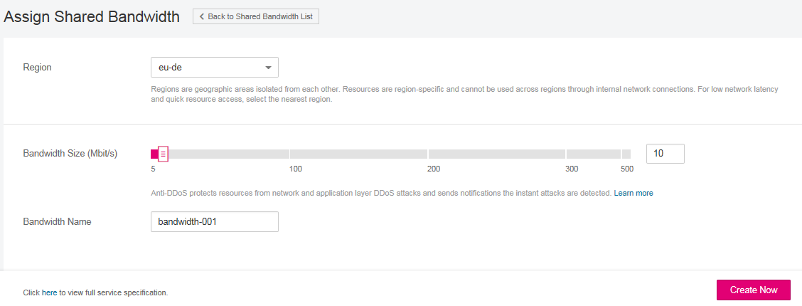

# Assigning Shared Bandwidth

## Scenarios

Assign a shared bandwidth for use with EIPs.

## Procedure

1.  Log in to the management console.
2.  Click    in the upper left corner and select the desired region and project.
3.  On the console homepage, under  **Network**, click  **Elastic IP**.
4.  In the navigation pane on the left, choose  **Elastic IP and Bandwidth**  \>  **Shared Bandwidths**.
5.  In the upper right corner, click  **Assign Shared Bandwidth**. On the displayed page, configure parameters as prompted.

    **Figure  1**  Assign Shared Bandwidth  
    

    **Table  1**  Parameter description

    
    <table><thead align="left"><tr id="row961717321403"><th class="cellrowborder" valign="top" width="19.24%" id="mcps1.2.4.1.1">
<strong id="b842352706143750">Parameter</strong>

    </th>
    <th class="cellrowborder" valign="top" width="55.7%" id="mcps1.2.4.1.2">
<strong id="b842352706222458">Description</strong>

    </th>
    <th class="cellrowborder" valign="top" width="25.06%" id="mcps1.2.4.1.3">
<strong id="b842352706225749">Example Value</strong>

    </th>
    </tr>
    </thead>
    <tbody><tr id="row1561719325016"><td class="cellrowborder" valign="top" width="19.24%" headers="mcps1.2.4.1.1 ">
Region

    </td>
    <td class="cellrowborder" valign="top" width="55.7%" headers="mcps1.2.4.1.2 ">
Specifies the desired region. Regions are geographic areas isolated from each other. Resources are region-specific and cannot be used across regions through internal network connections. For low network latency and quick resource access, select the nearest region.

    </td>
    <td class="cellrowborder" valign="top" width="25.06%" headers="mcps1.2.4.1.3 ">
eu-de

    </td>
    </tr>
    <tr id="row46178321702"><td class="cellrowborder" valign="top" width="19.24%" headers="mcps1.2.4.1.1 ">
Bandwidth Size

    </td>
    <td class="cellrowborder" valign="top" width="55.7%" headers="mcps1.2.4.1.2 ">
Specifies the shared bandwidth size starting with 5 Mbit/s. The maximum bandwidth can be 300 Mbit/s.

    </td>
    <td class="cellrowborder" valign="top" width="25.06%" headers="mcps1.2.4.1.3 ">
10

    </td>
    </tr>
    <tr id="row11956314313"><td class="cellrowborder" valign="top" width="19.24%" headers="mcps1.2.4.1.1 ">
Bandwidth Name

    </td>
    <td class="cellrowborder" valign="top" width="55.7%" headers="mcps1.2.4.1.2 ">
Specifies the name of the shared bandwidth.

    </td>
    <td class="cellrowborder" valign="top" width="25.06%" headers="mcps1.2.4.1.3 ">
Bandwidth-001

    </td>
    </tr>
    </tbody>
    </table>

6.  Click  **Create Now**.

