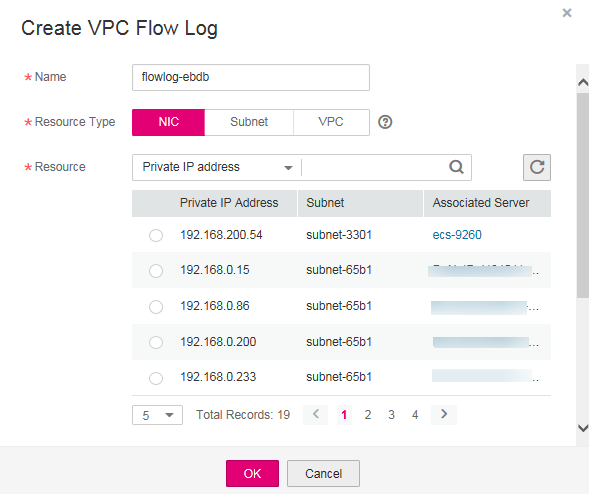

# Creating a VPC Flow Log

## Scenarios

A VPC flow log records information about the traffic going to and from a VPC.

## Prerequisites

Ensure that the following operations have been performed on the LTS console:

-   Create a log group.
-   Create a log topic.

For more information about the LTS service, see the  _Log Tank Service User Guide_.

## Procedure

1.  Log in to the management console.
2.  Click    in the upper left corner and select the desired region and project.
3.  On the console homepage, under  **Network**, click  **Virtual Private Cloud**.
4.  In the navigation pane on the left, choose  **VPC Flow Logs**.
5.  In the upper right corner, click  **Create VPC Flow Log**. On the displayed page, configure parameters as prompted.

    **Figure  1**  Create VPC Flow Log  
    

    **Table  1**  Parameter description

    
    <table><thead align="left"><tr id="row1434717171627"><th class="cellrowborder" valign="top" width="19.24%" id="mcps1.2.4.1.1">
<strong id="b729481085112">Parameter</strong>

    </th>
    <th class="cellrowborder" valign="top" width="55.7%" id="mcps1.2.4.1.2">
<strong id="b761217124516">Description</strong>

    </th>
    <th class="cellrowborder" valign="top" width="25.06%" id="mcps1.2.4.1.3">
<strong id="b9956614115118">Example Value</strong>

    </th>
    </tr>
    </thead>
    <tbody><tr id="row2034718171526"><td class="cellrowborder" valign="top" width="19.24%" headers="mcps1.2.4.1.1 ">
Name

    </td>
    <td class="cellrowborder" valign="top" width="55.7%" headers="mcps1.2.4.1.2 ">
Specifies the VPC flow log name.

    
The VPC flow log name can contain a maximum of 64 characters, which may consist of letters, digits, underscores (_), hyphens (-), and periods (.). The name cannot contain spaces.

    </td>
    <td class="cellrowborder" valign="top" width="25.06%" headers="mcps1.2.4.1.3 ">
flowlog-495d

    </td>
    </tr>
    <tr id="row183478171729"><td class="cellrowborder" valign="top" width="19.24%" headers="mcps1.2.4.1.1 ">
Resource Type

    </td>
    <td class="cellrowborder" valign="top" width="55.7%" headers="mcps1.2.4.1.2 ">
Specifies the type of resources whose traffic is to be logged. Currently, <strong id="b1451420710532">Resource Type</strong> can be <strong id="b319411435314">NIC</strong>, <strong id="b99451145134910">Subnet</strong>, and <strong id="b13946194519492">VPC</strong>.

    </td>
    <td class="cellrowborder" valign="top" width="25.06%" headers="mcps1.2.4.1.3 ">
NIC

    </td>
    </tr>
    <tr id="row83477171628"><td class="cellrowborder" valign="top" width="19.24%" headers="mcps1.2.4.1.1 ">
Resource

    </td>
    <td class="cellrowborder" valign="top" width="55.7%" headers="mcps1.2.4.1.2 ">
Specifies the specific NIC whose traffic is to be logged.

    
 NOTE: 

We recommend that you select an ECS that is in the running state. If an ECS in the stopped state is selected, restart the ECS after creating the VPC flow log for accurately recording information about the traffic going to and from a NIC.

    

    </td>
    <td class="cellrowborder" valign="top" width="25.06%" headers="mcps1.2.4.1.3 ">
N/A

    </td>
    </tr>
    <tr id="row734713175216"><td class="cellrowborder" valign="top" width="19.24%" headers="mcps1.2.4.1.1 ">
Filter

    </td>
    <td class="cellrowborder" valign="top" width="55.7%" headers="mcps1.2.4.1.2 "><ul id="ul1934716177219"><li><strong id="b934111133020">All traffic</strong>: specifies that both accepted and rejected traffic of the specified resource will be logged.</li><li><strong id="b918513514319">Accepted traffic</strong>: specifies that only accepted traffic of the specified resource will be logged. Accepted traffic refers to the traffic permitted by the security group or firewall.</li><li><strong id="b16278316812">Rejected traffic</strong>: specifies that only rejected traffic of the specified resource will be logged. Rejected traffic refers to the traffic not permitted by the firewall.</li></ul>
    </td>
    <td class="cellrowborder" valign="top" width="25.06%" headers="mcps1.2.4.1.3 ">
All

    </td>
    </tr>
    <tr id="row143475171327"><td class="cellrowborder" valign="top" width="19.24%" headers="mcps1.2.4.1.1 ">
Log Group

    </td>
    <td class="cellrowborder" valign="top" width="55.7%" headers="mcps1.2.4.1.2 ">
Specifies the log group created in LTS.

    </td>
    <td class="cellrowborder" valign="top" width="25.06%" headers="mcps1.2.4.1.3 ">
lts-group-wule

    </td>
    </tr>
    <tr id="row63479171326"><td class="cellrowborder" valign="top" width="19.24%" headers="mcps1.2.4.1.1 ">
Log Topic

    </td>
    <td class="cellrowborder" valign="top" width="55.7%" headers="mcps1.2.4.1.2 ">
Specifies the log topic created in LTS.

    </td>
    <td class="cellrowborder" valign="top" width="25.06%" headers="mcps1.2.4.1.3 ">
LogTopic1

    </td>
    </tr>
    <tr id="row1834761720219"><td class="cellrowborder" valign="top" width="19.24%" headers="mcps1.2.4.1.1 ">
Description

    </td>
    <td class="cellrowborder" valign="top" width="55.7%" headers="mcps1.2.4.1.2 ">
Provides supplementary information about the VPC flow log. This parameter is optional.

    
The VPC flow log description can contain a maximum of 255 characters and cannot contain angle brackets (&lt; or &gt;).

    </td>
    <td class="cellrowborder" valign="top" width="25.06%" headers="mcps1.2.4.1.3 ">
N/A

    </td>
    </tr>
    </tbody>
    </table>

    > **NOTE:**   
    >Only two flow logs, each with a different filter, can be created for a single resource under the same log group and log topic. Each VPC flow log must be unique.  

6.  Click  **OK**.

