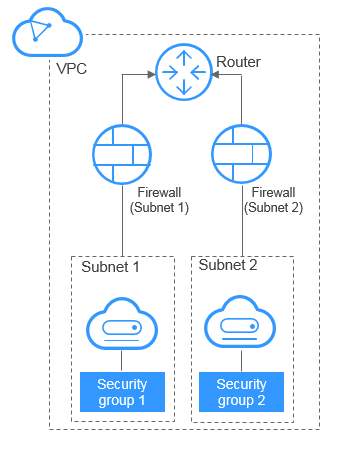
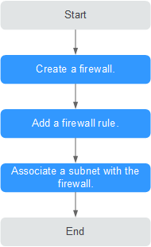

# Firewall Overview

A firewall is an optional layer of security for your subnets. You associate one or more subnets with a firewall. The firewall can help control traffic in and out of the subnets.

[Figure 1](#fig9582182315479)  shows how a firewall works.

**Figure  1**  Security groups and firewalls  

Similar to security groups, firewalls control access to the network. They add an additional layer of defense to your VPC. Security groups only have the "allow" rules, but firewalls have both "allow" and "deny" rules. You can use firewalls together with security groups to implement access control that is both comprehensive and fine-grained.

[Differences Between Security Groups and Firewalls](differences-between-security-groups-and-firewalls.md)  summarizes the basic differences between security groups and firewalls.

## Firewall Basics

-   Your VPC does not come with a default firewall, but you can create one and associate it with a subnet if required. By default, each firewall denies all inbound traffic to and outbound traffic from the associated subnet until you add rules.
-   You can associate a firewall with multiple subnets. However, a subnet can only be associated with one firewall at a time.
-   Each newly created firewall is in the  **Inactive**  state until you associate subnets with it.

## Default Firewall Rules

By default, each firewall has preset rules that allow the following packets:

-   Packets whose source and destination are in the same subnet
-   Broadcast packets with the destination 255.255.255.255/32, which is used to configure host startup information.
-   Multicast packets with the destination 224.0.0.0/24, which is used by routing protocols.
-   Metadata packets with the destination 169.254.169.254/32 and TCP port number 80, which is used to obtain metadata.
-   Packets from CIDR blocks that are reserved for public services \(for example, packets with the destination 100.125.0.0/16\)
-   A firewall denies all traffic in and out of a subnet excepting the preceding ones.  [Table 1](#table1034601475112)  shows the default firewall rules. The default rules cannot be modified or deleted.

    **Table  1**  Default firewall rules

    
    <table><thead align="left"><tr id="row1267171445118"><th class="cellrowborder" valign="top" width="11.918808119188078%" id="mcps1.2.8.1.1">
<strong id="b12656727141516">Direction</strong>

    </th>
    <th class="cellrowborder" valign="top" width="6.05939406059394%" id="mcps1.2.8.1.2">
Priority

    </th>
    <th class="cellrowborder" valign="top" width="7.0892910708929096%" id="mcps1.2.8.1.3">
<strong id="b16601851131517">Action</strong>

    </th>
    <th class="cellrowborder" valign="top" width="8.25917408259174%" id="mcps1.2.8.1.4">
<strong id="b14117145217158">Protocol</strong>

    </th>
    <th class="cellrowborder" valign="top" width="14.198580141985797%" id="mcps1.2.8.1.5">
<strong id="b42971979165">Source</strong>

    </th>
    <th class="cellrowborder" valign="top" width="12.568743125687428%" id="mcps1.2.8.1.6">
<strong id="b32151116131617">Destination</strong>

    </th>
    <th class="cellrowborder" valign="top" width="39.90600939906009%" id="mcps1.2.8.1.7">
<strong id="b84235270694155">Description</strong>

    </th>
    </tr>
    </thead>
    <tbody><tr id="row167117147516"><td class="cellrowborder" valign="top" width="11.918808119188078%" headers="mcps1.2.8.1.1 ">
Inbound

    </td>
    <td class="cellrowborder" valign="top" width="6.05939406059394%" headers="mcps1.2.8.1.2 ">
*

    </td>
    <td class="cellrowborder" valign="top" width="7.0892910708929096%" headers="mcps1.2.8.1.3 ">
Deny

    </td>
    <td class="cellrowborder" valign="top" width="8.25917408259174%" headers="mcps1.2.8.1.4 ">
All

    </td>
    <td class="cellrowborder" valign="top" width="14.198580141985797%" headers="mcps1.2.8.1.5 ">
0.0.0.0/0

    </td>
    <td class="cellrowborder" valign="top" width="12.568743125687428%" headers="mcps1.2.8.1.6 ">
0.0.0.0/0

    </td>
    <td class="cellrowborder" valign="top" width="39.90600939906009%" headers="mcps1.2.8.1.7 ">
Denies all inbound traffic.

    </td>
    </tr>
    <tr id="row11671414155113"><td class="cellrowborder" valign="top" width="11.918808119188078%" headers="mcps1.2.8.1.1 ">
Outbound

    </td>
    <td class="cellrowborder" valign="top" width="6.05939406059394%" headers="mcps1.2.8.1.2 ">
*

    </td>
    <td class="cellrowborder" valign="top" width="7.0892910708929096%" headers="mcps1.2.8.1.3 ">
Deny

    </td>
    <td class="cellrowborder" valign="top" width="8.25917408259174%" headers="mcps1.2.8.1.4 ">
All

    </td>
    <td class="cellrowborder" valign="top" width="14.198580141985797%" headers="mcps1.2.8.1.5 ">
0.0.0.0/0

    </td>
    <td class="cellrowborder" valign="top" width="12.568743125687428%" headers="mcps1.2.8.1.6 ">
0.0.0.0/0

    </td>
    <td class="cellrowborder" valign="top" width="39.90600939906009%" headers="mcps1.2.8.1.7 ">
Denies all outbound traffic.

    </td>
    </tr>
    </tbody>
    </table>

## Rule Priorities

-   Each firewall rule has a priority value where a smaller value corresponds to a higher priority. Any time two rules conflict, the one with the higher priority is the one that get applied. The rule whose priority value is an asterisk \(\*\) has the lowest priority.
-   If multiple firewall rules conflict, the rule with the highest priority takes effect. If you need a rule to take effect before or after a specific rule, you can insert that rule before or after the specific rule.

## Application Scenarios

-   If the application layer needs to provide services for users, traffic must be allowed to reach the application layer from all IP addresses. However, you also need to prevent illegal access from malicious users.

    Solution: You can add firewall rules to deny access from suspect IP addresses.

-   How can I isolate ports with identified vulnerabilities? For example, how do I isolate port 445 that can be exploited by WannaCry worm?

    Solution: You can add firewall rules to deny access traffic from specific port and protocol, for example, TCP port 445.

-   No defense is required for the east-west traffic between subnets, but access control is required for north-south traffic.

    Solution: You can add firewall rules to protect north-south traffic.

-   For frequently accessed applications, a security rule sequence may need to be adjusted to improve performance.

    Solution: A firewall allows you to adjust the rule sequence so that frequently used rules are applied before other rules.

## Firewall Configuration Procedure

[Figure 2](#fig1643183218163)  shows the procedure for configuring a firewall.

**Figure  2**  Firewall configuration procedure  

1.  Create a firewall by following the steps described in  [Creating a Firewall](creating-a-firewall.md).
2.  Add firewall rules by following the steps described in  [Adding a Firewall Rule](adding-a-firewall-rule.md).
3.  Associate subnets with the firewall by following the steps described in  [Associating Subnets with a Firewall](associating-subnets-with-a-firewall.md). After subnets are associated with the firewall, the subnets will be protected by the configured firewall rules.

