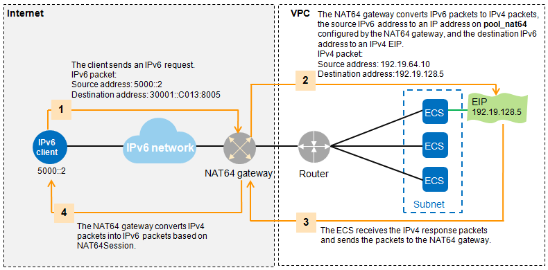

# How Does an IPv6 Client on the Internet Access the ECS That Has an EIP Bound in a VPC?

Users who use IPv6 clients can call the required API to obtain an IPv6 EIP and bind this EIP to an ECS in the VPC. Then, the users can use the EIP to access the ECSs in the VPC over the Internet.

For details, see  **Floating IP Address \(IPv6\)**  \>  **Creating a Floating IP Address**  in the  _[Virtual Private Cloud API Reference](https://docs.otc.t-systems.com/en-us/api/vpc/en-us_topic_0050065465.html)___. The NAT64 gateway in the data center will convert the IPv6 EIP to the IPv4 address. \(The last 32 bits of the obtained IPv6 EIP is the IPv4 EIP.\)

After users who use IPv6 clients bind an IPv6 EIP to an ECS, the data flow is shown in  [Figure 1](#fig1038524023539).

**Figure  1**  IPv6 data flow  

The IPv6 service has the following restrictions:

-   ECSs use IPv4 addresses and cannot directly access public IPv6 addresses. Therefore, only public IPv6 addresses can access ECSs. That means ECSs cannot use IPv4 EIPs that are converted from IPv6 address to access the Internet. To enable the ECSs to access the Internet, you must bind IPv4 EIPs in the public cloud system to them.
-   Data packets from an IPv6 network on the Internet are converted to IPv4 packets on the NAT64 gateway. Both the source IP address and port number will be converted. \(The source IP address is invisible.\)
-   The IPv6 client can access only the EIP and the ELB service.
-   Only one EIP can be bound to each NIC, and the EIP can be an IPv6 or IPv4 address.
-   You can only make API calls to use an EIP to obtain the IPv6 address. The management console displays only IPv4 addresses.
-   The security group function provided by the public cloud does not apply to IPv6 clients.
-   Resources in internal networks of the public cloud can access IPv4 addresses converted by NAT64 gateway.
-   The public cloud does not provide IP spoofing protection for IPv6 traffic from the Internet.
-   Currently, the Anti-DDoS service does not allow protection of IPv6 addresses.

