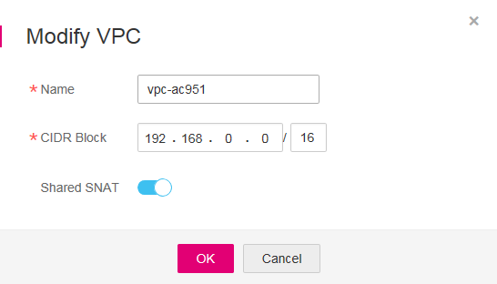

# Modifying a VPC

## Scenarios

Change the VPC name and CIDR block.

If the VPC CIDR block conflicts with the CIDR block of a VPN created in the VPC, you can modify the VPC to change its CIDR block.

Ensure the following points when modifying the VPC CIDR block:

-   The VPC CIDR block to be modified must be in the supported CIDR blocks. The VPC service supports the following CIDR blocks: 10.0.0.0 – 10.255.255.255, 172.16.0.0 – 172.31.255.255, and 192.168.0.0 – 192.168.255.255
-   If the VPC has subnets, the VPC CIDR block to be modified must contain all subnet CIDR blocks.

## Procedure

1.  Log in to the management console.
2.  Click    in the upper left corner and select the desired region and project.
3.  On the console homepage, under  **Network**, click  **Virtual Private Cloud**.
4.  In the navigation pane on the left, click  **Virtual Private Cloud**.
5.  On the  **Virtual Private Cloud**  page, locate the row that contains the VPC to be modified and click  **Modify**  in the  **Operation**  column.
6.  In the displayed dialog box, modify parameters as prompted. You can change the VPC name, shared SNAT setting, and VPC CIDR block.  [Figure 1](#fig5327465021362)  shows the page for you to modify a VPC.

    **Figure  1**  Modifying a VPC  
    

7.  Click  **OK**.

