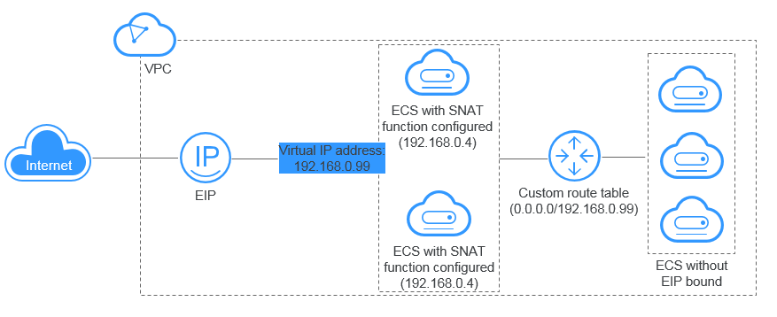

# Route Table

A route table contains a set of rules that are used to determine where network traffic is directed. You can add routes to a route table to enable other ECSs in a VPC to access the Internet through the ECS that has a bound EIP.

You can use a route table configured in standalone or active/standby mode.

-   [Figure 1](#fig15091812119)  shows the route table configured in standalone mode.

    **Figure  1**  Route table configured in standalone mode  
    

    In standalone mode, ECSs in a VPC that do not have EIPs bound access the Internet through an ECS that has an EIP bound and has SNAT function configured.

    You can create a route table for the VPC used by ECSs that do not have EIPs bound to enable these ECSs to access the Internet. The next hop in the route table is the private IP address of the ECS that has an EIP bound \(the private IP address of the SNAT server\).

-   [Figure 2](#fig1588016299143)  shows the route table configured in active/standby mode.

    **Figure  2**  Route table configured in active/standby mode  
    

    In active/standby mode, ECSs in a VPC that do not have EIPs bound access the Internet through two ECSs that have EIPs bound and have the SNAT function configured.

    In active/standby mode, you can add a route table for the VPC used by ECSs that do not have EIPs bound to enable these ECSs to access the Internet. The next hop in the route table is the virtual IP address of the two ECSs that have EIPs bound.

In both the standalone and active/standby modes, the ECSs that have EIPs bound must have the SNAT function. For details about the SNAT function, see  [SNAT](snat.md). For details about how to configure an ECS as the SNAT server, see  [Configuring an SNAT Server](configuring-an-snat-server.md).

> **NOTICE:**   
>-   Before using the route table function, you need to deploy the SNAT server. For details, see section  [Configuring an SNAT Server](configuring-an-snat-server.md).  
>-   The ECS providing SNAT can have only one network interface card \(NIC\).  
>-   The ECS providing SNAT must have the source/destination check function disabled.  

